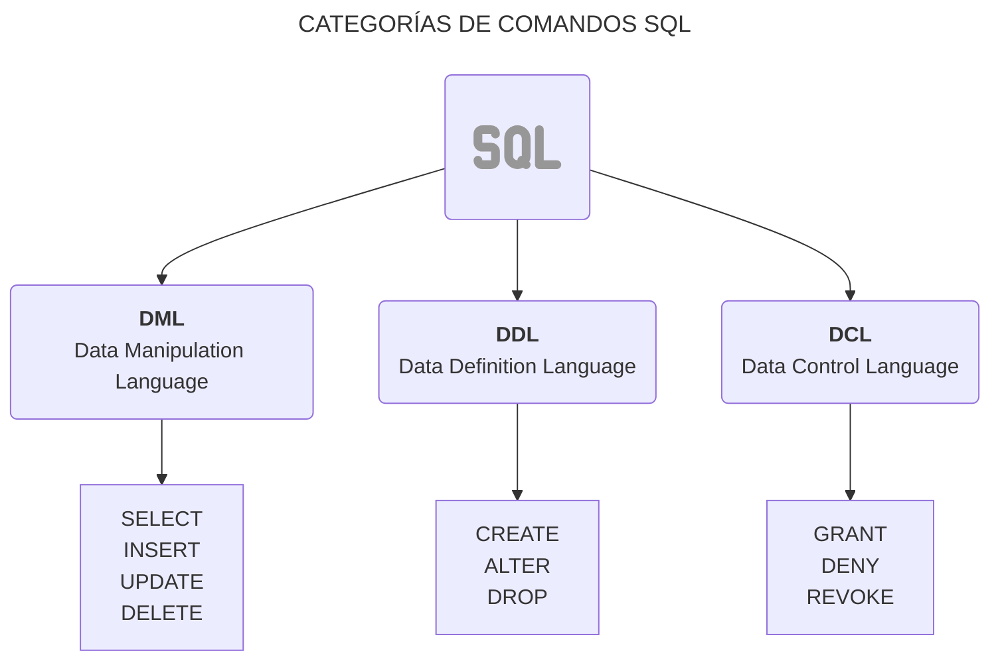

Como sabemos, [**SQL**](https://es.wikipedia.org/wiki/SQL "Ir a definición"){: target="_blank" } es un lenguaje estándar para gestionar bases de datos. SQL permite realizar diversas operaciones sobre bases de datos, como la creación, manipulación, consulta y control de los datos. Existen diferentes **grupos de comandos** dentro SQL, los cuales se organizan en distintos **sub-lenguajes** que cumplen roles específicos y nos ayudan a realizar tareas de forma más eficiente. Cada sub-lenguaje tiene un próposito determinado, desde la definición de estructuras de bases de datos hasta la manipulación de datos y la gestión de permisos.

A continuación tenemos un diagrama que nos muestra esos **sublenguajes**:



## **Comandos de Definición de Datos (DDL)**

Los comandos de definición de datos nos permiten crear y modificar la estructura de las base de datos y las tablas.

### **Crear una Base de Datos**

Para empezar a trabajar con una base de datos, lo primero que necesitamos es crear una. Esto se puede hacer con el comando `CREATE DATABASE`:

```sql
CREATE DATABASE tienda;
```
{: .nolineno }

Este comando crea una base de datos llamada `tienda`, donde podemos almacenar los datos relacionados con una tienda.

**Nota Importante: Seleccionar la Base de Datos**

Después de crear una base de datos, debemos seleccionarla para comenzar a trabajar en ella. Para hacerlo, usamos el comando `USE`:

```sql
USE tienda;
```
{: .nolineno }

> Para que el **prompt de MySQL** muestre el nombre de la base de datos a la que estás conectado, puedes ejecutar el siguiente comando en el cliente mysql (terminal): `prompt \u@\h [\d]>\_`.
{: .prompt-tip }

{: .light }
{: .dark }

### **Crear una Tabla**

Después de crear la base de datos y seleccionarla, podemos definir las tablas que contendrán los datos. Aquí usamos el comando `CREATE TABLE`:

```sql
CREATE TABLE productos (
    id INT AUTO_INCREMENT PRIMARY KEY,
    nombre VARCHAR(255),
    precio INT,
    cantidad INT
);
```
{: .nolineno }

Este comando crea una tabla llamada `productos` con las columnas `id`, `nombre`, `precio` y `cantidad`.

**Nota sobre el Tipo de Dato para Precios**

Si bien usamos `INT` para almacenar precios en este ejemplo, considerando que en **Chile** los valores monetarios se suelen manejar sin decimales porque es una manera más sencilla de representarlos (por ejemplo, representando $10.000 como 10000). Es importante tener en cuenta que, dependiendo del formato de la moneda en un país, podrías necesitar ajustar el tipo de datos. Por ejemplo el tipo de dato `DECIMAL(10, 2)` se usa para almacenar valores monetarios con dos decimales, lo cual es útil para la mayoría de las monedas que manejan centavos.

**Ver la Estructura de una Tabla**

Después de crear una tabla, es común querer revisar su estructura para asegurarte de que las columnas y tipos de datos estén correctos. Para ello, podemos utilizar el comando `DESCRIBE`. Este comando te muestra información detallada sobre la estructura de una tabla, incluyendo el nombre de las columnas, los tipos de datos y otros detalles importantes:

```sql
DESCRIBE productos
```
{: .nolineno }

{: .light }
{: .dark }

### **Modificar una Tabla**

El comando `ALTER` se utiliza para modificar la estructura de una tabla ya existente. Con `ALTER`, podemos agregar, eliminar columnas existentes, o cambiar el tipo de datos de las columnas.

**Agregar una Columna a una Tabla**

Si necesitamos agregar una nueva columna a una tabla, como por ejemplo, agregar una columna `descripcion` para detallar el producto, lo podemos hacer de la siguiente manera:

```sql
ALTER TABLE productos
ADD descripcion TEXT;
```
{: .nolineno }

**Modificar el Tipo de Dato de una Columna**

Si deseamos cambiar el tipo de datos de una columna (por ejemplo, cambiar el tipo de una columna `precio` de `INT` a `DECIMAL`), usamos el siguiente comando:

```sql
ALTER TABLE productos
MODIFY precio DECIMAL(10, 2);
```
{: .nolineno }

Este comando cambia el tipo de la columna `precio` a `DECIMAL(10, 2)` para permitir decimales en los precios.

**Eliminar una Columna de una Tabla**

Si decides que ya no necesitas una columna específica, puedes eliminarla con el siguiente comando:

```sql
ALTER TABLE productos
DROP COLUMN descripcion;
```
{: .nolineno }

Este comando elimina la columna `descripcion` de la tabla `productos`.

**Renombrar una Tabla**

Si deseas cambiar el nombre de una tabla, podemos usar el comando `RENAME TABLE`:

```sql
RENAME TABLE productos TO productos_nuevos;
```
{: .nolineno }

Este comando renombra la tabla `productos`a `productos_nuevos`.

### **Eliminar una Tabla**

Si necesitas eliminar una tabla que ya no se usa, puedes hacerlo con el comando `DROP TABLE`:

```sql
DROP TABLE productos;
```
{: .nolineno }


## **Comandos de Manipulación de Datos (DML)**

Los comandos de manipulación de datos se utilizan para realizar operaciones sobre los datos que se encuentran dentro de las tablas de la base de datos. Las operaciones principales en este grupo son el **CRUD**, un acrónimo que representa:

- **C**: Create (Crear): Insertar nuevos registros en la base de datos.
- **R**: Read (Leer): Consultar los datos existentes en la base de datos.
- **U**: Update (Actualizar): Modificar los datos existentes.
- **D**: Delete (Eliminar): ELiminar datos de la base de datos.

Estas operaciones permiten gestionar y manipular los datos almacenados en las tablas, desde agregar nuevos registros hasta modificarlos o eliminarlos según sea necesario.

### **Insertar Datos en una Tabla**

Para agregar información a una tabla, usamos el comando `INSERT INTO`:

```sql
INSERT INTO productos (nombre, precio, cantidad)
VALUES ('Camiseta', 19990, 100);
```
{: .nolineno }

Este comando agrega un producto llamado `'Camiseta'` con un precio de `19990` (en el caso de que estemos usando un tipo `INT` para los precios) y una cantidad de `100` unidades en la tabla `productos`.

**Insertar Varios Registros de una Vez**

En lugar de insertar registros uno a uno, podemos insertar múltiples registros al mismo tiempo:

```sql
INSERT INTO productos (nombre, precio, cantidad)
VALUES 
    ('Polerón', 23990, 100),
    ('Pantalón', 24990, 50),
    ('Zapatos', 39990, 75);
```
{: .nolineno }

### **Consultar Datos de una Tabla**

Para leer los datos almacenados, usamos el comando `SELECT`. Podemos consultar todos los productos de la siguiente forma:

```sql
SELECT * FROM productos;
```
{: .nolineno }

Este comando muestra todos los registros de la tabla `productos`, es decir, todos los productos con `id`, `nombre`, `precio` y `cantidad`.

{: .light }
{: .dark }

### **Actualizar Información de Registros**

Para actualizar información de un producto o registro, podemos usar el comando `UPDATE`. Por ejemplo, para actualizar la cantidad de camisetas disponibles:

```sql
UPDATE productos
SET cantidad = 120
WHERE id = 1;
```
{: .nolineno }

Este comando cambia la cantidad del producto con `id` igual a `1` a `120`unidades.

**Nota importante: Tener Cuidado con el `WHERE`**

Es muy importante el uso de la cláusula `WHERE` al realizar una actualización en una tabla. Si olvidas incluir el `WHERE`, el comando **actualizará todos los registros de la tabla**.

### **Eliminar Datos de una Tabla**

Si queremos eliminar un producto o registro, usamos el comando `DELETE`:

```sql
DELETE FROM productos WHERE id = 1;
```
{: .nolineno }

> Nunca olvides el `WHERE` en este tipo de operaciones.
{: .prompt-danger }

## **Comandos de Control de Datos (DCL)**

Los comandos de control de datos se utilizan para gestionar los permisos de los usuarios y la seguridad de la base de datos. En MySQL, los permisos (privilegios) determinan qué operaciones puede realizar un usuario en una base de datos. Administrar correctamente los privilegios es esencial para un administrador de base datos (DBA).

### **Conceder Privilegios a un Usuario**

Antes de conceder privilegios, asegúrate de crear un usuario:

```sql
CREATE USER 'mcherrera'@'localhost' IDENTIFIED BY '_user123';
```
{: .nolineno }

En MySQL, para ver los privilegios de un usuario, se puede ejecutar el siguiente comando:

```sql
SHOW GRANTS FOR 'mcherrera'@'localhost';
```
{: .nolineno }

Para otorgar privilegios a un usuario, usamos el comando `GRANT`. Por ejemplo, para darle a un usuario acceso completo a la base de datos `tienda`, puedes ejecutar el siguiente comando:

```sql
GRANT ALL PRIVILEGES ON tienda.* TO 'mcherrera'@'localhost';
```
{: .nolineno }

Este comando concede todos los privilegios sobre la base de datos `tienda` al usuario `mcherrera`.

{: .dark }
{: .light }

### **Revocar Permisos de un Usuario**

Para revocar los privilegios de un usuario, se puede utilizar el comando `REVOKE` de la siguiente manera:

```sql
REVOKE ALL PRIVILEGES ON tienda.* FROM 'mcherrera'@'localhost';
```
{: .nolineno }

### **Aplicar Cambios de Privilegios**

Después de otorgar o revocar privilegios, es recomendable ejecutar el siguiente comando para que los cambios surtan efecto:

```sql
FLUSH PRIVILEGES;
```
{: .nolineno }

Este comando recarga los privilegios y asegura que se apliquen correctamente.

Si deseas eliminar al usuario y sus privilegios, usamos el comando `DROP USER`:

```sql
DROP USER 'mcherrera'@'localhost';
```
{: .nolineno }


#### **Resumen de Comandos**

| Acción|Comando SQL|
|:------|:----------|
|Crear usuario|`CREATE USER 'usuario'@'host' IDENTIFIED BY 'pass';`|
|Ver privilegios de un usuario|`SHOW GRANTS FOR 'usuario'@'host';`|
|Otorgar privilegios|`GRANT ALL PRIVILEGES ON base_de_datos.* TO 'usuario'@'host';`|
|Revocar privilegios|`REVOKE SELECT ON base_de_datos.* FROM 'usuario'@'host';`|
|Aplicar cambios|`FLUSH PRIVILEGES;` |
|Eliminar usuario|`DROP USER 'usuario'@'host';`|
