Como sabemos **SQL** (Structured Query Language) es un lenguaje estándar para gestionar bases de datos. Existen diferentes **grupos de comandos** dentro **SQL** que se organizan en diferentes **sublenguajes** que cumplen roles específicos.

A continuación tenemos un diagrama que nos muestra esos **sublenguajes**:

```mermaid
---
title: CATEGORÍAS DE COMANDOS SQL
---
graph TD
    B(<img src="data:image/svg+xml;base64,PHN2ZyB4bWxucz0iaHR0cDovL3d3dy53My5vcmcvMjAwMC9zdmciIHdpZHRoPSIyNCIgaGVpZ2h0PSIyNCIgdmlld0JveD0iMCAwIDI0IDI0Ij48cGF0aCBmaWxsPSJub25lIiBzdHJva2U9IiM5Nzk3OTciIHN0cm9rZS1saW5lY2FwPSJyb3VuZCIgc3Ryb2tlLWxpbmVqb2luPSJyb3VuZCIgc3Ryb2tlLXdpZHRoPSIyIiBkPSJNMTIgOGEyIDIgMCAwIDEgMiAydjRhMiAyIDAgMSAxLTQgMHYtNGEyIDIgMCAwIDEgMi0ybTUgMHY4aDRtLTgtMWwxIDFNMyAxNWExIDEgMCAwIDAgMSAxaDJhMSAxIDAgMCAwIDEtMXYtMmExIDEgMCAwIDAtMS0xSDRhMSAxIDAgMCAxLTEtMVY5YTEgMSAwIDAgMSAxLTFoMmExIDEgMCAwIDEgMSAxIi8+PC9zdmc+" width="70" />)
    B-->C(<strong class="fs-3">DML</strong><br />Data Manipulation Language)
    B-->D(<strong class="fs-3">DDL</strong><br />Data Definition Language)
    B-->E(<strong class="fs-3">DCL</strong><br />Data Control Language)
    C-->CD[SELECT<br />INSERT<br />UPDATE<br />DELETE]
    D-->DD[CREATE<br />ALTER<br />DROP]
    E-->ED[GRANT<br />DENY<br />REVOKE]
```




## **Comandos de Definición de Datos (DDL)**

Los comandos de definición de datos nos permiten crear y modificar la estructura de las base de datos y las tablas.

### **Crear una Base de Datos**

Para empezar a trabajar con una base de datos, lo primero que necesitamos es crear una. Esto se puede hacer con el comando `CREATE DATABASE`:

```sql
CREATE DATABASE tienda;
```
{: .nolineno }

Este comando crea una base de datos llamada `tienda`, donde podemos almacenar los datos relacionados con una tienda.

**Nota Importante: Seleccionar la Base de Datos**

Después de crear una base de datos, debemos seleccionarla para comenzar a trabajar en ella. Para hacerlo, usamos el comando `USE`:

```sql
USE tienda;
```
{: .nolineno }


> Para que el **prompt de MySQL** muestre el nombre de la base de datos a la que estás conectado, puedes ejecutar el siguiente comando en el cliente mysql en la terminal `prompt \u@\h [\d]>\_`.
{: .prompt-tip }

### **Crear una Tabla**

Después de crear la base de datos y seleccionarla, podemos definir las tablas que contendrán los datos. Aquí usamos el comando `CREATE TABLE`:

```sql
CREATE TABLE productos (
    id INT AUTO_INCREMENT PRIMARY KEY,
    nombre VARCHAR(255),
    precio INT,
    cantidad INT
);
```
{: .nolineno }

Este comando crea una tabla llamada `productos` con las columnas `id`, `nombre`, `precio` y `cantidad`.

**Nota sobre el Tipo de Dato para Precios**

Si bien usamos `INT` para almacenar precios en este ejemplo, considerando que en **Chile** los valores monetarios se suelen manejar sin decimales porque es una manera más sencilla de representarlos (por ejemplo, representando $10.000 como 10000). Es importante tener en cuenta que, dependiendo del formato de la moneda en un país, podrías necesitar ajustar el tipo de datos. Por ejemplo el tipo de dato `DECIMAL(10, 2)` se usa para almacenar valores monetarios con dos decimales, lo cual es útil para la mayoría de las monedas que manejan centavos.

### **Modificar una Tabla**

El comando `ALTER` se utiliza para modificar la estructura de una tabla ya existente. Con `ALTER`, podemos agregar, eliminar columnas existentes, o cambiar el tipo de datos de las columnas.

**Agregar una Columna a una Tabla**

Si necesitamos agregar una nueva columna a una tabla, como por ejemplo, agregar una columna `descripcion` para detallar el producto, lo podemos hacer de la siguiente manera:

```sql
ALTER TABLE productos
ADD descripcion TEXT;
```
{: .nolineno }

**Modificar el Tipo de Dato de una Columna**

Si deseamos cambiar el tipo de datos de una columna (por ejemplo, cambiar el tipo de una columna `precio` de `INT` a `DECIMAL`), usamos el siguiente comando:

```sql
ALTER TABLE productos
MODIFY precio DECIMAL(10, 2);
```
{: .nolineno }

Este comando cambia el tipo de la columna `precio` a `DECIMAL(10, 2)` para permitir decimales en los precios.

**Eliminar una Columna de una Tabla**

Si decides que ya no necesitas una columna específica, puedes eliminarla con el siguiente comando:

```sql
ALTER TABLE productos
DROP COLUMN descripcion;
```
{: .nolineno }

Este comando elimina la columna `descripcion` de la tabla `productos`.

**Renombrar una Tabla**

Si deseas cambiar el nombre de una tabla, podemos usar el comando `RENAME TABLE`:

```sql
RENAME TABLE productos TO productos_nuevos;
```
{: .nolineno }

Este comando renombra la tabla `productos`a `productos_nuevos`.

**ELiminar una Tabla**

Si necesitas eliminar una tabla que ya no se usa, puedes hacerlo con el comando `DROP TABLE`:

```sql
DROP TABLE productos;
```
{: .nolineno }

## **¿Qué son las operaciones CRUD?**

Las operaciones **CRUD** son los cuatros pilares fundamentales en la gestión de datos en una base de datos. CRUD es un acrónimo de las siguientes acciones:

- **C**reate (Crear): Insertar nuevos datos en una tabla.
- **R**ead (Leer): Consultar y obtener datos de una tabla.
- **U**pdate (Actualizar): Modificar los datos existentes.
- **D**elete (Eliminar): ELiminar datos de una tabla.

Antes de poder realizar cualquier operación CRUD, debemos crear una base de datos y definir la estructura de nuestras tablas.

Para crear una base de datos, usamos el comando `CREATE DATABASE`. A continuación, se muestra el ejemplo:

```sql
CREATE DATABASE empresa;
````
{: .nolineno }

Este comando crea una base de datos llamada `empresa`. Para comenzar a usarla, debemos **seleccionarla** con el comando `USE`:

```sql
USE empresa;
```
{: .nolineno }

> Para que el **prompt de MySQL** muestre el nombre de la base de datos a la que estás conectado, puedes ejecutar el siguiente comando en la terminal `prompt \u@\h [\d]>\_`.
{: .prompt-tip }

Ahora que tenemos nuestra base de datos, podemos crear tablas dentro de ella. Vamos a crear una tabla de empleados, donde almacenaremos información como el nombre, puesto, fecha de ingreso y su estado:

```sql
CREATE TABLE empleados (
    id INT AUTO_INCREMENT PRIMARY KEY,  -- ID único para cada empleado (auto incrementable)
    nombre VARCHAR(100) NOT NULL,       -- Nombre del empleado
    puesto VARCHAR(50),                 -- Puesto o cargo
    fecha_ingreso DATE,                 -- Fecha de ingreso del empleado
    activo BOOLEAN DEFAULT TRUE         -- Estado del empleado (activo o no)
);
```
{: .nolineno }

### **1. Crear Datos (Insertar Registros)**

La operación de **crear** datos en MySQL se realiza mediante el comando `INSERT INTO`. A continuación, tenemos ejemplos de cómo insertar datos en la table `empleados` que creamos previamente.

**Insertar un solo registro**

```sql
INSERT INTO empleados (nombre, puesto, fecha_ingreso)
VALUES ('Juan Pérez', 'Desarrollador', '2022-01-15');
```
{: .nolineno }

En este caso, estamos insertando un registro en la tabla `empleados` con los siguientes valores:

- **nombre**: Juan Pérez
- **puesto**: Desarrollador
- **fecha_ingreso**: 2022-01-15

El campo `id` se autoincrementa automáticamente y el campo `activo` se establece en `TRUE` por defecto.

**Insertar múltiples registros**

También es posible insertar múltiples en una sola consulta:

```sql
INSERT INTO empleados (nombre, puesto, fecha_ingreso)
VALUES
  ('Ana Gómez', 'Gerente', '2019-03-22'),
  ('Luis Díaz', 'Diseñador', '2021-07-10');
```
{: .nolineno }

### **2. Leer Datos**

La operación de **leer** datos se realiza mediante el comando `SELECT`. Podemos usar este comando para consultar toda la tabla o solo una parte de los datos.

**Consultar todos los registros**

Si queremos ver todos los registros de la tabla `empleados`, podemos usar la siguiente consulta:

```sql
SELECT * FROM empleados;
```
{: .nolineno }

> El (`*`) se utiliza para seleccionar todas las columnas de la tabla. El resultado incluirá todas las filas y columnas de la tabla `empleados`.
{: .prompt-info }

**Consultar columnas específicas**

Si solo necesitamos algunos datos, como el nombre y el puesto de los empleados, podemos especificar las columnas que queremos en la consulta:

```sql
SELECT nombre, puesto FROM empleados;
```
{: .nolineno }

**Filtrar resultados con WHERE**

La cláusula `WHERE` nos permite filtrar los resultados según una condición específica. Por ejemplo, si queremos ver solo los empleados que tengas el puesto de "`Desarrollador`", para ello podemos hacer lo siguiente:

```sql
SELECT nombre, puesto FROM empleados WHERE puesto = 'Desarrollador';
```
{: .nolineno }

### **3. Actualizar datos**

Ahora supongamos que queremos actualizar el puesto de **Juan Pérez** para que en vez de de **Desarrollador** sea **Programador**. La consulta sería la siguiente:

```sql
UPDATE empleados 
SET puesto = 'Programador'
WHERE nombre = 'Juan Pérez';
```
{: .nolineno }

### **4. Eliminar Datos**

Si necesitamos eliminar a **Juan Pérez** de la tabla, sería con el comando `delete`, usaríamos la siguiente consulta:

```sql
DELETE FROM empleados WHERE nombre = 'Juan Pérez';
```
{: .nolineno }

> Nunca olvides el `where` en este tipo de operaciones
{: .prompt-danger }
