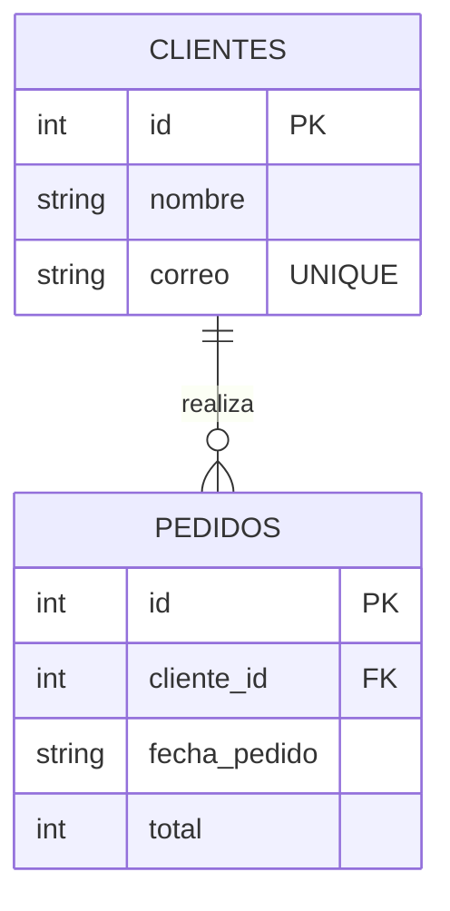

Las relaciones entre las tablas son fundamentales y necesarias en el mundo de las bases de datos SQL, ya que permiten organizar y vincular la información de manera eficiente.

SQLite, a pesar de ser un sistema ge gestión de bases de datos ligero, ofrece soporte para relaciones entre tablas mediante el uso de claves foráneas. Estas claves permiten establecer vínculos entre registros de diferentes tablas, asegurando la integridad referencial y facilitando la gestión de los datos.

***Es importante tener en cuenta que, en SQLite, el soporte para claves foráneas no está habilitado por defecto. Para habilitarla, es necesario activar explícitamente esta funcionalidad mediante la siguiente instrucción:***

```sql
PRAGMA foreign_keys = ON;
```
{: .nolineno }

## __Gestión de Clientes y Pedidos__

Imagina que tienes una tienda en línea y necesitas almacenar **clientes** y **pedidos** que realizan.

### __Estructura de la tabla__

Un cliente puede hacer **muchos pedidos**, pero **cada pedido pertenece** a un solo **cliente**. A continuación tienes el código para crear la estructura de las tablas y también puedes cambiar a la pestaña **ERD** para visualizar la relación entre las tablas:



```sql
CREATE TABLE clientes (
    id INTEGER PRIMARY KEY AUTOINCREMENT,
    nombre TEXT NOT NULL,
    correo TEXT UNIQUE NOT NULL
);

CREATE TABLE pedidos (
    id INTEGER PRIMARY KEY AUTOINCREMENT,
    cliente_id INTEGER,
    fecha_pedido TEXT DEFAULT CURRENT_TIMESTAMP,
    total INTEGER NOT NULL,
    FOREIGN KEY (cliente_id) REFERENCES clientes(id)
);
```
{: .nolineno }






### __Insertando Datos en las Tablas__

Ahora agregamos algunos registros de ejemplos en las tablas:

```sql
-- insertar clientes
INSERT INTO clientes (nombre, correo) VALUES
('Juan Pérez', 'juan@example.com'),
('Ana Gomés', 'ana@example.com');

-- insertar pedidos
INSERT INTO Pedidos (cliente_id, fecha_pedido, total) VALUES 
(1, '2021-03-10', 2500),
(1, '2021-03-13', 3400),
(2, '2021-03-23', 1800);
```
{: .nolineno }

### __Consultando datos relacionados__

Para obtener la información completa de los pedidos junto a la información del cliente:

```sql
SELECT pedidos.id, clientes.nombre, pedidos.fecha_pedido, pedidos.total
FROM pedidos
JOIN cientes
ON pedidos.id = clientes.id;
```
{: .nolineno }