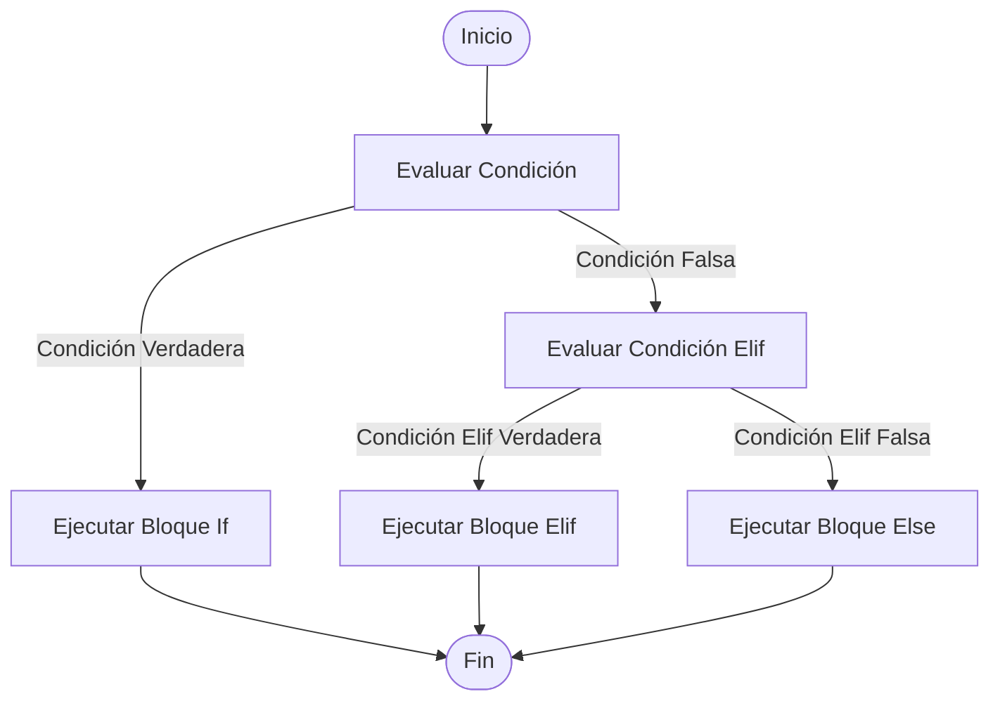

Los condicionales son una piedra angular en la programación, permitiendo que tu código tome decisiones basadas en ciertas condiciones. En Python, los condicionales te permiten controlar el flujo de ejecución de tu programa al decidir qué bloques de código se deben ejecutar bajo determinadas circunstancias. En este artículo, exploraremos en detalle cómo funcionan los condicionales en Python, cómo se utilizan y algunos ejemplos prácticos para ilustrar su uso.

## ¿Qué son los Condicionales?

Los condicionales son estructuras que permiten que un programa ejecute ciertas partes del código solo si se cumple una condición específica. Estas condiciones se evalúan como `True` (verdadero) o `False` (falso). En Python, se utilizan principalmente las declaraciones `if`, `elif` y `else` para gestionar el flujo del programa basado en estas condiciones.

A continuación vemos un diagrama de flujo que ilustra cómo funcionan los condicionales en Python. Este diagrama muestra un flujo de decisión básico usando una estructura `if`, `elif`, y `else`.



### Sintaxis Básica de los Condicionales

La sintaxis básica de una declaración condicional en Python es la siguiente:

```python
if condición:
    # Bloque de código a ejecutar si la condición es verdadera
elif otra_condición:
    # Bloque de código a ejecutar si la otra condición es verdadera
else:
    # Bloque de código a ejecutar si ninguna de las condiciones anteriores es verdadera
```

### Ejemplo Simple

Vamos a comenzar con un ejemplo básico para ilustrar el uso de condicionales en Python:

```python
edad = 20

if edad >= 18:
    print("Eres un adulto.")
else:
    print("Eres menor de edad.")
```

En este ejemplo, se evalúa si la variable `edad` es mayor o igual a 18. Si la condición es verdadera, se imprime "Eres un adulto."; de lo contrario, se imprime "Eres menor de edad."

### Explicación del Código:

1. **Declaración `if`:** `if edad >= 18:` verifica si el valor de `edad` es mayor o igual a 18.
2. **Bloque de Código:** El bloque de código indentado que sigue a la declaración `if` se ejecuta si la condición es verdadera.
3. **Declaración `else`:** Si la condición `if` es falsa, se ejecuta el bloque de código indentado bajo `else`.

### Uso de elif para Múltiples Condiciones

Puedes usar `elif` para verificar múltiples condiciones. Aquí tienes un ejemplo:

```python
nota = 85

if nota >= 90:
    print("Aprobado con distinción")
elif nota >= 70:
    print("Aprobado")
else:
    print("Reprobado")
```

En este ejemplo:

1. **Primera Condición (`if`):** Verifica si `nota` es mayor o igual a 90.
2. **Segunda Condición (`elif`):** Si la primera condición no se cumple, verifica si `nota` es mayor o igual a 70.
3. **Condición Final (`else`):** Si ninguna de las condiciones anteriores es verdadera, se ejecuta el bloque bajo `else`.

### Condiciones Complejas

Puedes combinar múltiples condiciones usando operadores lógicos como `and`, `or` y `not`:

```python
edad = 25
tiene_licencia = True

if edad >= 18 and tiene_licencia:
    print("Puedes conducir.")
else:
    print("No puedes conducir.")
```

En este ejemplo:

- La condición `edad >= 18 and tiene_licencia` se evalúa como verdadera solo si ambas sub-condiciones son verdaderas.

### Operadores Lógicos:

- **`and`:** Ambas condiciones deben ser verdaderas.
- **`or`:** Al menos una de las condiciones debe ser verdadera.
- **`not`:** Invierte el valor de verdad de la condición.

### Condicionales Anidados

Los condicionales también pueden ser anidados, es decir, tener una estructura `if` dentro de otra:

```python
edad = 16
tiene_permiso = True

if edad >= 18:
    print("Eres un adulto.")
else:
    if tiene_permiso:
        print("Eres menor de edad pero tienes permiso.")
    else:
        print("Eres menor de edad y no tienes permiso.")
```

Aquí, si la primera condición `edad >= 18` es falsa, se evalúa una segunda condición dentro del bloque `else`.

### Expresiones Condicionales (Ternarias)

Python permite usar expresiones condicionales en una sola línea para casos simples:

```python
edad = 20
mensaje = "Eres un adulto." if edad >= 18 else "Eres menor de edad."
print(mensaje)
```

En esta expresión condicional, el valor de `mensaje` depende de la condición `edad >= 18`.

### Conclusión

Los condicionales son herramientas poderosas en Python que permiten que tu programa tome decisiones basadas en condiciones específicas. Comprender cómo usar `if`, `elif`, y `else` te permitirá controlar el flujo de tu programa y gestionar diferentes escenarios de manera efectiva. Además, los operadores lógicos, condicionales anidados y expresiones condicionales te ofrecen flexibilidad para abordar problemas más complejos.

Con estos conocimientos, estarás bien equipado para escribir código que responda a diversas condiciones y realice operaciones condicionales de manera eficiente. ¡Feliz codificación!

---

Espero que este artículo te haya proporcionado una comprensión clara de cómo funcionan los condicionales en Python y te inspire a seguir explorando y aplicando estos conceptos en tus propios proyectos de programación.
