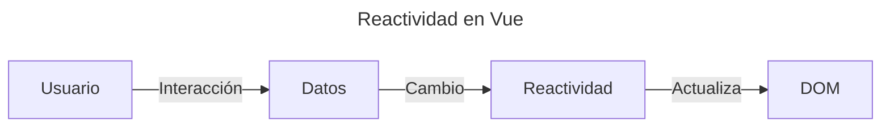

## __¿Qué es Vue.js?__

Vue.js es un **framework** progresivo de JavaScript utilizado para construir interfaces de usuarios interactivas y aplicaciones de una sola página ([SPA](https://en.wikipedia.org/wiki/Single-page_application){:target='_blank'}). Se caracteriza por su facilidad de uso, flexibilidad y alto rendimiento

## __Formas de Comenzar a en Vue.js__

Si queremos hacer un uso muy básico de Vue y crear una aplicación muy sencilla, no hace falta que utilicemos herramientas como Webpack, ni necesitamos instalar un *transpilers* ni nada. Simplemente con importar la librería en el HTML (desde un CDN) ya podemos utilizar Vue. Por ejemplo el siguiente script se puede copiar y pegar directo en tu HTML:

```html
<script src="https://cdnjs.cloudflare.com/ajax/libs/vue/2.4.2/vue.min.js"></script>
```
{: .nolineno }

> Si nuestra aplicación crece y queremos orientarnos a componentes, podemos hacerlo sin cambiar mucho el *workflow*.
{: .prompt-info }

En resumen, si necesitamos algo muy básico, Vue es perfecto y no es necesario instalar nada más. Y si necesitamos desarrollar un proyecto más complejo. Vue cubre esas necesidades y podemos ir ampliando con plugins a medida que nuestra aplicación lo requiera.

## __Historia de Vue.js__

Vue.js fue creado en 2014 por [Evan You](http://x.com/youyuxi?lang=kn){:target='_blank'}, un ex-ingeniero de Google que trabajó en [AngularJS](https://en.wikipedia.org/wiki/AngularJS){:target='_blank'}. Su intención era desarrollar un framework que fuera ligero y flexible. Desde entonces, Vue ha crecido rápidamente y se ha convertido en una de las opciones más populares para el desarrollo frontend.

Algunas versiones importantes incluyen:

- **Vue 1 (2014)**: Introdujo el concepto de reactividad con el Virtual DOM.
- **Vue 2 (2016)**: Mejoró el rendimiento y agregó renderizado basado en Virtual DOM y el sistema de componentes.
- **Vue 3 (2020)**: Introdujo la Composition API, mejor rendimiento y mejor soporte para TypeScript.

## __Características Clave__

### __1. Enfoque Reactivo__

Vue utiliza un sistema de reactividad que permite actualizar automáticamente la interfaz de usuario cuando los datos cambian, sin necesidad de manipular directamente el DOM.

Para explicarlo mejor, el sistema de reactividad en Vue funciona de la siguiente manera:



### __2. Basado en Componentes__

Las aplicaciones en Vue se construyen a partir de componentes reutilizables, lo que facilita la organización y mantenimiento del código.


## __¿Qué es el Virtual DOM?__

El Virtual DOM (VDOM) es una representación ligera del DOM real en memoria. Vue 3 lo usa para detectar cambios en los datos y actualizar la interfaz de manera eficiente, **evitando modificaciones innecesarias en el DOM real**. Funciona se una forma muy sencilla y práctica:

- Se crea una copia del DOM en memoria (Virtual DOM).
- Cuando los datos cambian, Vue genera un nuevo Virtual DOM actualizado.
- Compara el nuevo Virtual DOM con el anterior (diffing).
- Solo las diferencias se aplican al DOM real, optimizando el rendimiento.

### __Ejemplo Básico de Reactividad__

Vamos a ver un ejemplo típico de contador para analizar la reactividad:


```vue
<script setup>
import { ref } from 'vue';

const contador = ref(0);

const incrementar = () => {
  contador.value++;
}
</script>

<template>
  <div>
    <p>Contador: {{ contador }}</p>
    <button @click="incrementar">Incrementar</button>
  </div>
</template>
```
{: .nolineno .bgerr }

- `ref(0)` crea una variable reactiva con un valor inicial de 0.
- `incrementar()` cambia el `contador.value`, la interfaz se actualiza automáticamente.

## __Principales Herramientas de Reactividad en Vue 3__

### __1. Variables Reactivas con ref()__

`ref()` se usa para crear **valores reactivos primitivos** (números, strings, booleanos, etc). Ejemplo:

```vue
<script setup>
import { ref } from 'vue';

const mensaje = ref('¡Hola, esto es Vue 3!');
</script>

<template>
  <p>{{ mensaje }}</p>
</template>
```
{: .nolineno }

> Con `ref()` siempre se accede/modifica con `.value`, por ejemplo: `mensaje.value = 'Nuevo Mensaje'`.
{: .prompt-info }

### __2. Objetos Reactivos con reactive()__

Si queremos trabajar con **objetos** o **arrays**, es mejor usar `reactive()`:

```vue
<script setup>
import { reactive } from 'vue';

const usuario = reactive({
  nombre: 'Marco',
  edad: 33
})

const cambiarNombre = () => {
  usuario.nombre = 'Carlos';
}
</script>

<template>
  <p>Nombre: {{ usuario.nombre }}</p>
  <button @click="cambiarNombre">Cambiar nombre</button>
</template>
```
{: .nolineno .bgerr }

> **No necesita `.value`, se accede directamente a las propiedades (`usuario.nombre`).
{: .prompt-info }

##  __Efectos Reactivos con watch() y watchEffec()__

### __watch() Observa cambios en variables reactivas__

Se usa para cuando queremos **ejecutar una acción específica cuando una variable cambia**. Ejemplo:

```vue
<script setup>
import { ref, watch } from 'vue';

const contador = ref(0);
const contadorAnterior = ref(0);
const contadorActual = ref(0);

watch(contador, (nuevoValor, viejoValor) => {
  console.log(`El contador cambió de ${viejovalor} a ${nuevoValor}`);
});
</script>
```
{: .nolineno .bgerr }

### __watchEffect() Se ejecuta inmediatamente y vuelve a correr si detecta cambios__

Se ejecuta de inmediato y vuelve a ejecutarse cada vez que nombre cambia.

```vue
<script setup>
import { ref, watchEffect } from 'vue';

const nombre = ref('Marco');

watchEffect(() => {
  console.log(`El nombre ahora es: ${nombre.value}`);
});
</script>
```



