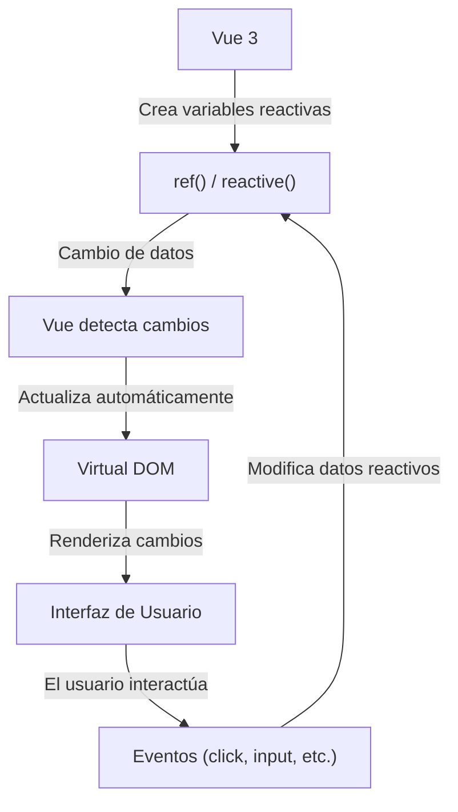

## __¿Qué es la Reactividad?__

La reactividad en Vue significa que los datos y la interfaz de usuario están **vinculados dinámicamente**. Cuando un dato cambia, Vue detecta el cambio y actualiza automáticamente el DOM.

Para explicarlo mejor, el sistema de reactividad en Vue funciona de la siguiente manera:



## __¿Qué es el Virtual DOM?__

El Virtual DOM (VDOM) es una representación ligera del DOM real en memoria. Vue 3 lo usa para detectar cambios en los datos y actualizar la interfaz de manera eficiente, evitando modificaciones innecesarias en el DOM real. Funciona se una forma muy sencilla y práctica:

- Se crea una copia del DOM en memoria (Virtual DOM).
- Cuando los datos cambian, Vue genera un nuevo Virtual DOM actualizado.
- Compara el nuevo Virtual DOM con el anterior (diffing).
- Solo las diferencias se aplican al DOM real, optimizando el rendimiento.

### __Ejemplo Básico de Reactividad__

Vamos a ver un ejemplo típico de contador para analizar la reactividad:


```vue
<script setup>
import { ref } from 'vue';

const contador = ref(0);

const incrementar = () => {
  contador.value++;
}
</script>

<template>
  <div>
    <p>Contador: {{ contador }}</p>
    <button @click="incrementar">Incrementar</button>
  </div>
</template>
```
{: .nolineno .bgerr }

- `ref(0)` crea una variable reactiva con un valor inicial de 0.
- `incrementar()` cambia el `contador.value`, la interfaz se actualiza automáticamente.

## __Principales Herramientas de Reactividad en Vue 3__

### __1. Variables Reactivas con ref()__

`ref()` se usa para crear **valores reactivos primitivos** (números, strings, booleanos, etc). Ejemplo:

```vue
<script setup>
import { ref } from 'vue';

const mensaje = ref('¡Hola, esto es Vue 3!');
</script>

<template>
  <p>{{ mensaje }}</p>
</template>
```
{: .nolineno }

> Con `ref()` siempre se accede/modifica con `.value`, por ejemplo: `mensaje.value = 'Nuevo Mensaje'`.
{: .prompt-info }

### __2. Objetos Reactivos con reactive()__

Si queremos trabajar con **objetos** o **arrays**, es mejor usar `reactive()`:

```vue
<script setup>
import { reactive } from 'vue';

const usuario = reactive({
  nombre: 'Marco',
  edad: 33
})

const cambiarNombre = () => {
  usuario.nombre = 'Carlos';
}
</script>

<template>
  <p>Nombre: {{ usuario.nombre }}</p>
  <button @click="cambiarNombre">Cambiar nombre</button>
</template>
```
{: .nolineno .bgerr }

> **No necesita `.value`, se accede directamente a las propiedades (`usuario.nombre`).
{: .prompt-info }

##  __Efectos Reactivos con watch() y watchEffec()__

### __watch() Observa cambios en variables reactivas__

Se usa para cuando queremos **ejecutar una acción específica cuando una variable cambia**. Ejemplo:

```vue
<script setup>
import { ref, watch } from 'vue';

const contador = ref(0);
const contadorAnterior = ref(0);
const contadorActual = ref(0);

watch(contador, (nuevoValor, viejoValor) => {
  console.log(`El contador cambió de ${viejovalor} a ${nuevoValor}`);
});
</script>
```
{: .nolineno .bgerr }

### __watchEffect() Se ejecuta inmediatamente y vuelve a correr si detecta cambios__

Se ejecuta de inmediato y vuelve a ejecutarse cada vez que nombre cambia.

```vue
<script setup>
import { ref, watchEffect } from 'vue';

const nombre = ref('Marco');

watchEffect(() => {
  console.log(`El nombre ahora es: ${nombre.value}`);
});
</script>
```



