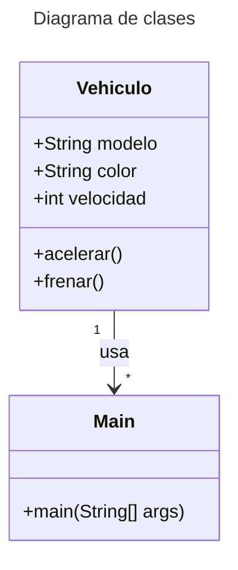

En Java, **las clases** son plantillas para crear objetos, y **los objetos** son instancias de esas clases. En otras palabras, una clase define las propiedades y comportamientos de los objetos, mientras que un objeto es una entidad creada a partir de esa plantilla.

**Definiendo una Clase:**

```java
public class Vehiculo {
  String modelo;
  String color;
  int velocidad;

  public Vehiculo(String modelo, String color, int velocidad) {
    this.modelo = modelo;
    this.color = color;
    this.velocidad = velocidad;
  }

  public void acelerar() {
    velocidad += 10;
    System.out.println("El vehículo acelera. Velocidad: " + velocidad + " km/h");
  }
}
```
{: file="Vehiculo.java" }

**Creando un objeto**

```java
public class Main {
  public static void main(String[] args) {
    // Crear un objeto de la clase Vehiculo
    Vehiculo miObjetoVehiculo = new Vehiculo("Audi", "Negro", 0);

    miObjetoVehiculo.acelerar();
    miObjetoVehiculo.frenar();
  }
}
```
{: file="Main.java" }

Para comprender mejor cómo las clases y objetos se relacionan, visualicemos el siguiente diagrama de clases:



### **El Constructor**

El constructor es un tipo especial de método que se usa para inicializar los objetos. Se llama automáticamente cuando se crea una nueva instancia.

```java
public Vehiculo(String modelo, String color, int velocidad) {
  this.modelo = modelo;
  this.color = color;
  this.velocidad = velocidad;
}
```
{: .nolineno }

> El constructor establece los valores iniciales de los atributos del objeto.
{: .prompt-info }

### **¿Por qué usar Clases y Objetos?**

1. **Modularidad**: Se puede dividir el código en partes más pequeñas y manejables.
2. **Reusabilidad**: Una vez creamos una clase, se pueden crear muchos objetos de esa clase, cada uno con sus propios atributos. Esto permite reutilizar el código sin tener que duplicarlo.
3. **Encapsulación**: Los objetos pueden tener su propio estado (atributos), y puedes definir qué métodos pueden interactuar con ese estado.
4. **Abstracción**: La abstracción se refiere a ocultar detalles complejos de implementación y mostrar solo lo necesario. En otras palabras, permite que los objetos manejen internamente su comportamiento y el usuario solo interactúe con una interfaz simplificada.
5. **Encapsulación**: La encapsulación implica ocultar los datos internos de un objeto y restringir el acceso directo a esos datos. Los atributos de un objeto suelen ser privados, y se accede a ellos a través de métodos públicos (getters y setters). Esto asegura que los datos del objeto solo se modifiquen de manera controlada.
