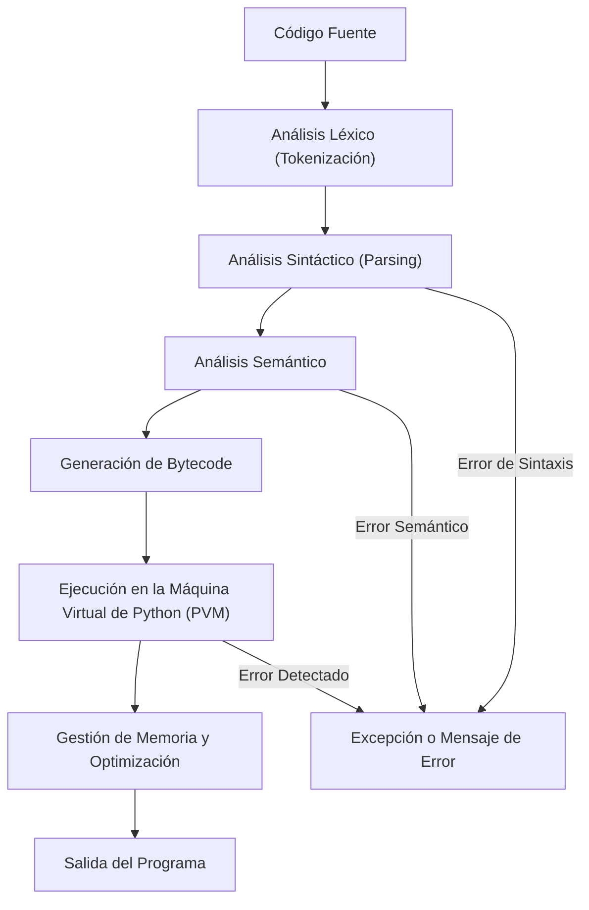

En este post, exploraremos qué es el **intérprete de Python**, cómo funciona y por qué es una pieza clave en la ejecución de programas creados en este lenguaje. También cubriremos (aunque no en profundidad) los diferentes tipos de intérpretes disponibles y cómo usarlos en **modo interactivo** o a través de **scripts**.

## __¿Qué es el Intérprete de Python?__

El intérprete de Python es un software que se encarga de leer y ejecutar el código escrito en Python línea a línea, actúa como un traductor que convierte el código fuente en un formato comprensible para la máquina, pero en lugar de traducir todo el contenido de una vez (como haría un compilador), lo hace por fragmentos conforme se necesita, similar a un intérprete humano que traduce discurso por discurso en una conversación en lugar de todo un libro de una sola vez.

El Intérprete requiere de mayor consumo de recursos para funcionar:

{: .light }
{: .dark }

Un compilador por otra parte, lee el programa y lo traduce al mismo tiempo, antes de ejecutar cualquiera de las instrucciones. En este caso, al programa de alto nivel se le llama el **código fuente**, y al programa traducido el **código de objeto** o el **código ejecutable**. Una vez compilado el programa, puede ejecutarlo repetidamente sin volver a traducirlo.

## __Funcionamiento del Intérprete__

En la sección anterior, observamos una ilustración que describe el funcionamiento de un intérprete en rasgos generales. El intérprete de Python pare funcionar sigue varios pasos para ejecutar un código. Veamos el proceso en el siguiente diagrama:

### __2. Compilación a Bytecode__

Una vez el ecosistema de Python recibe el código fuente, el siguiente paso es **compilar** este código. La compilación no significa que el código se convierta en código máquina directamente (como en otros lenguajes como **C** o **JAVA**). El código es convertido a **bytecode**, que es un formato intermedio.

> El **bytecode** es más cercano al lenguaje máquina, pero aún no es directamente ejecutable.
{: .prompt-info }

### __Modo Interactivo__

En el modo interactivo podemos abrir una sesión para ejecutar instrucciones directamente, realizar operaciones y construir pequeños programas pero una vez que se cierre la sesión interactiva no podemos reutilizar aquellos programas.

