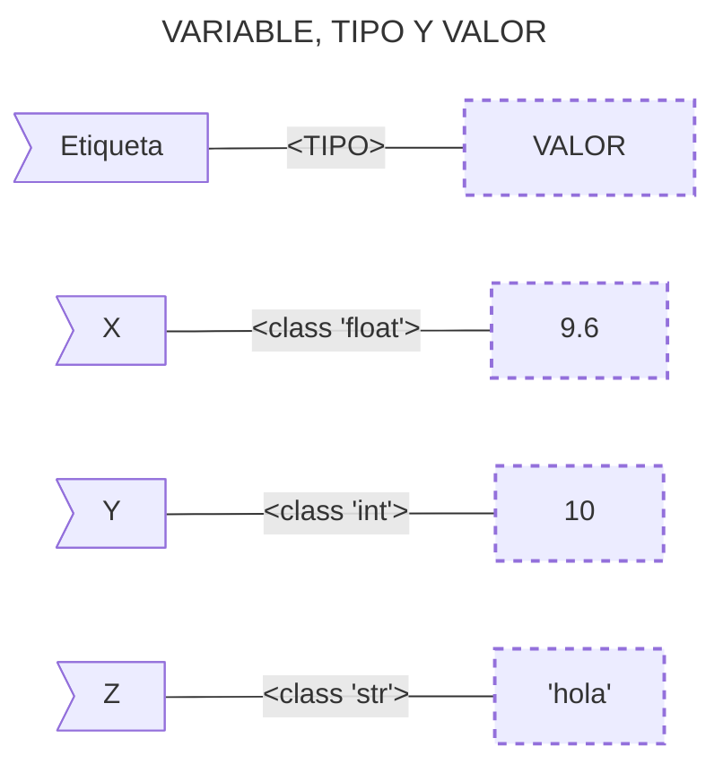

En el mundo de la programación, las variables son conceptos fundamentales que actúan como contenedores para almacenar datos. En Python, las variables son sencillas de usar y entender, lo que hace que sea un lenguaje amigable para quienes están comenzando a programar. En este artículo, exploraremos qué son las variables en Python, cómo se usan, y algunas de las características más interesantes sobre las variables.

## __¿Qué es una Variable?__

Las variables son uno de los conceptos fundamentales tanto en Matemáticas como en programación. __Aunque se usan en distintos contextos__, la idea general es la misma: __una variable es un valor que puede cambiar o variar__.

### __Variables en Matemáticas__

El concepto de "variable" en las matemáticas es usado a través de símbolos que forman parte de una formula. Normalmente las variables se representan mediante letras del alfabeto latino (x, y, z, n, j, etc). Dependiendo del contexto, las variables significan cosas distintas. Por ejemplo en el caso del Álgebra, una variable representa una cantidad desconocida que se relaciona con otras y que en algunos casos podemos averiguar. Consideremos por ejemplo la siguiente ecuación:

$$ x + 3 = 4 $$
{: .fs-1 }

En este caso, la variable `x` representa una cantidad desconocida pero de la que se sabe si se le suma 3 obtiene 4. Resolviendo la ecuación, entendemos inmediatamente que la variable `x` estaba representando realmente el número 1.

### __Variables en Programación__

En programación también existe el concepto de "variable", __parecido pero no idéntico al concepto matemático__. En términos simples, una variable en programación es un nombre que se asocia a un valor y que se almacena en la memoria principal (RAM) de tu computadora mientras el programa esté en ejecución. Este valor puede ser cualquier cosa: un **número**, una **cadena de texto**, una **colección**, y cualquier tipo de dato que sea válido en el lenguaje de programación que usemos.

En algunos lenguajes de programación, las variables se pueden entender como "cajas" en las que se guardan datos, pero cuando estamos aprendiendo Python es mejor pensar en las variables como si fueran __"etiquetas" que le das a los datos para que puedas referenciarlos__ y que se guardan en "cajas" llamadas objetos.



## __Declaración y Asignación de Variables en Python__

En Python, puedes declarar una variable simplemente asignándole un valor. No necesitas especificar el tipo de dato de la variable, ya que Python lo infiere automáticamente. Para asignar un valor a una variable se utiliza el operador de igualdad (`=`). A la izquierda se escribe el nombre de la variable y a la derecha el valor que se quiere dar a la variable.


<span class="hl">$ python3</span>
Python 3.9.1 (main, Dec 27 2022, 14:58:32) [Clang 14.0.0 (clang-1400.0.29.202)] on darwin
Type "help", "copyright", "credits" or "license" for more information.
<span class="hl">&gt;&gt;&gt; edad = 33</span>
<span class="hl">&gt;&gt;&gt; nombre = "Marco"</span>
<span class="hl">&gt;&gt;&gt; altura = 1.80</span>



En el ejemplo anterior ingresamos al intérprete de Python con el comando `python3` y asignamos 3 variables:
- `edad` almacena un número entero.
- `nombre` almacena una cadena de texto.
- `altura` almacena un número de punto flotante.

Si una variable no se ha definido previamente, si tratamos de referenciarla se genera un error:


<span class="hl">&gt;&gt;&gt; peso</span>
Traceback (most recent call last):
  File "&lt;python-input-3&gt;", line 1, in &lt;module&gt;
    peso
<span class="hl">NameError: name 'peso' is not defined</span>



> Siempre debes ser consciente de inicializar las variables antes de usarlas para evitar errores y mantener el código limpio y comprensible.
{: .prompt-tip }

## __Tipos de Datos que Almacenan las Variables__

Python maneja varios tipos de datos básicos que puedes almacenar en variables. Algunos de esos tipos de datos ya fueron definidos en los ejemplos anteriores, entre los tipos de datos más comunes se incluyen:

- **`int` (Números Enteros)**: `5`, `42`, `1000`
- **`float` (Números de Punto Flotante)**: `3.14`, `0.99`, `1.0`
- **`str` (Cadenas de Texto)**: `"Hola"`, `"Python"`, `"123"`
- **`bool` (Booleanos)**: `True`, `False` (En contextos booleanos, Python también trata `1` como `True` y `0` como `False`)

Una variable además puede almacenar estructuras más complicadas (que se verán más adelante). Si se va a almacenar texto, el texto debe escribirse entre comillas simples (`'`) o dobles (`''`). A las variables que almacenan texto se les suele llamar cadenas (de texto).

```python
nombre = "Marco"
apellido = 'Contreras'
```
{: .nolineno }

> **Consejo**: En Python, puedes usar comillas simples o dobles para las cadenas, pero **es recomendable usar comillas simples** por consistencia y facilidad de escritura.
{: .prompt-tip }

Si no se escriben comillas, Python supone que estamos haciendo referencia a otra variable (que, si no está definida, genera un mensaje de error):


<span class="hl">&gt;&gt;&gt; nombre = Javier</span>
Traceback (most recent call last):
  File "&lt;python-input-2&gt;", line 1, in &lt;module&gt;
    <span class="hl">nombre = Javier</span>
             ^^^^^^
<span class="hl">NameError: name 'Javier' is not defined</span>



### __Conocer los Tipos de Datos__

En Python, existen **funciones integradas** como `type()` que permiten conocer el tipo de dato de una variable. Esto es útil en un lenguaje de tipado dinámico como Python, donde no es necesario declarar explícitamente el tipo de una variable. Además de `type()`, otras funciones como `isinstance()` permiten verificar si un objeto es una instancia de tipo específico, proporcionando mayor flexibilidad y control al trabajar con datos.

**Ejemplo de usar `type()`:**


&gt;&gt;&gt; x = 9.6
<span class="hl">&gt;&gt;&gt; type(x)</span>
&lt;class 'float'&gt;
&gt;&gt;&gt; y = 10
<span class="hl">&gt;&gt;&gt; type(y)</span>
&lt;class 'int'&gt;
&gt;&gt;&gt; z = 'hola'
<span class="hl">&gt;&gt;&gt; type(z)</span>
&lt;class 'str'&gt;




Puedes convertir entre estos tipos de datos usando funciones integradas como `int()`, `float()`, y `str()`.
```python
numero = 5
texto = str(numero)  # Convierte el número 5 a la cadena "5"
```
{: .nolineno }


## __Formato para Nombrar Variables__

En Python, existen diferentes estilos para nombrar y otros identificadores. Cada uno tiene su uso recomendado. A continuación te dejo algunos ejemplo de cada estilo.

### __1. snake\_case (recomendado en Python 🏆)__

- Se escribe en minúsculas, separando las palabras con guion bajo.
- Es estándar en Python para variables y funciones.

**💡 Ejemplo:**

```python
nombre_completo = "Marco Contreras"
contador_de_visitas = 103
```
{: .nolineno }

### __2. camelCase__

- La primera palabra va en minúscula y las siguientes comienzan con mayúscula.
- Se usa más en [JavaScript](https://www.w3schools.com/JS/js_conventions.asp){:target='_blank'} y otros lenguajes, pero no es común en Python.

**💡 Ejemplo:**

```python
nombreCompleto = "Marco Contreras"
contadorDeVisitas = 103
```
{: .nolineno }

### __3. PascalCase__

- Todas las palabras inician con mayúscula.
- Se usa en nombres de clases en Python.

```python
class RegistroUsuario():
  pass
```
{: .nolineno }

### __4. UPPER\_CASE__

- Todas las letras en mayúsculas.
- Se usa para definir **constantes** en Python (aunque Python no tiene constantes reales, es una convención).

```python
PI = 3.1416
TASA_DE_CAMBIO = 18.50
```
{: .nolineno }

## __Reglas para Nombres de Variables__

Aunque no es obligatorio, en Python, se recomienda seguir algunas reglas y convenciones para nombrar variables:

**1. Empezar con una letra o un guion bajo**

Los nombres de las variables deben comenzar con una letra (a-z, A-Z) o un guion bajo (`_`). No pueden comenzar con un número. Ej:

```python
_variable = "valor"
variable1 = "valor"
```
{: .nolineno }

**2. Usar solo caracteres alfanuméricos y guiones bajos**

Después del primer carácter, puedes usar letras, números y guiones bajos.

```python
mi_variable = "valor"
variable_2 = "valor"
```
{: .nolineno }

**3. No uses palabras reservadas**

Evita usar palabras que son reservadas por Python (como `if`, `for`, `while`, etc.) como nombres de variables.


<span class="hl">&gt;&gt;&gt; for = "valor"</span>
  File "&lt;python-input-5&gt;", line 1
    for = "valor"
        ^
<span class="hl">SyntaxError: invalid syntax</span>



**4. Usa nombres descriptivos**

Es una buena práctica usar nombres de variables que sean descriptivos para hacer que tu código sea más legible.

```python
usuario = 'john_doe'
autenticado = False
creditos = 99.0
```
{: .nolineno }

## **Actualización y Eliminación de Variables**

Una vez que una variable ha sido creada, puedes actualizar su valor simplemente asignándole un nuevo valor.

```python
edad = 30
edad = 31</span> # Actualiza el valor de la variable edad
```
{: .nolineno }

Si necesitas eliminar una variable, puedes usar la instrucción `del` que borra completamente una variable.


<span class="hl">&gt;&gt;&gt; del edad</span>
&gt;&gt;&gt; edad # Al referenciar 'edad' dará error.
Traceback (most recent call last):
  File "&lt;python-input-14&gt;", line 1, in &lt;module&gt;
    edad
<span class="hl">NameError: name 'edad' is not defined</span>



```python
del edad  # Elimina la variable edad
```
{: .nolineno }

## **Variables Globales y Locales**

En Python, una variable puede ser **global** o **local**. Las variables globales son accesibles desde cualquier parte del código, mientras que las variables locales solo son accesibles dentro de una función o bloque de código en el que se definen.

> Los ejemplos son para demostrar la diferencias entre variables globales y locales, ya pronto veremos más sobre las **funciones**.
{: .prompt-info }


```python
variable_global = "Soy global"

def mi_funcion():
    variable_local = "Soy local"
    print(variable_global)  # Accede a la variable global
    print(variable_local)   # Accede a la variable local

mi_funcion()
print(variable_global)  # Funciona
print(variable_local)   # Esto causará un error, ya que variable_local no está definida fuera de la función
```
{: .nolineno }

```py
Traceback (most recent call last):
  File "main.py", line 10, in <module>
    print(variable_local)
NameError: name 'variable_local' is not defined
```
{: .nolineno .noheader }



Las variables son la base de la programación en Python. Son simples pero poderosas, permitiéndote almacenar y manipular datos de manera eficiente. Entender cómo funcionan las variables y cómo usarlas correctamente es esencial para escribir código limpio y funcional.

¡Ahora que conoces lo básico sobre las variables en Python, estás listo para comenzar a experimentar y a desarrollar tus propios programas! Sigue explorando y practicando, y verás cómo estas pequeñas herramientas se convierten en grandes aliados en tu camino.
