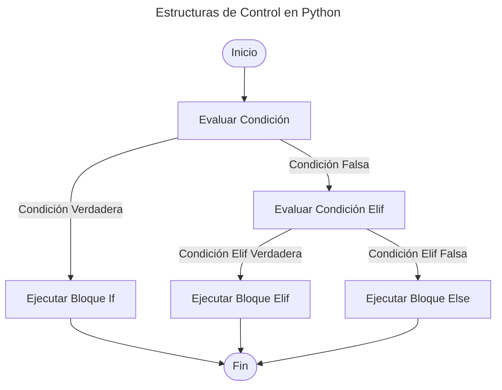

En cualquier lenguaje de programación, las **estructuras de control** son fundamentales. Son las que permiten que un programa tome decisiones, ejecutando diferentes bloques de código según ciertas condiciones. En Python, las **estructuras de control** más comunes son **`if`**, **`else`** y **`elif`**. En este post, exploraremos en detalle cómo funcionan estas estructuras de control en Python, cómo se utilizan y algunos ejemplos prácticos para ilustrar su uso.

## **¿Qué es una estructura de control?**

Como les decía las estructuras de control son instrucciones que le dicen al programa qué hacer en función de una condición. Dependiendo si la condición es **`True`** (verdadera) o **`False`** (falso), el flujo de ejecución del programa cambia.

En Python, se utilizan principalmente las declaraciones `if`, `elif` y `else` para gestionar el flujo del programa basado en estas condiciones. Para ello debemos saber que hace cada una de estas instrucciones:

- **`if`**: Evalúa una condición y ejecuta el bloque de código asociado si la condición es **verdadera**.
- **`else`**: Se ejecuta si la condición del `if` es **false**
- **`elif`**: Se usa para verificar múltiples condiciones, y se ejecuta cuando una de ellas es **verdadera**.


A continuación tenemos un diagrama de flujo que ilustra cómo funcionan las estructuras de control. Este diagrama muestra un flujo de decisión básico usando una estructura `if`, `elif`, y `else`.



## **Sintaxis Básica de estructuras de control**

La sintaxis básica de una declaración condicional en Python es la siguiente:

```python
if expresion_condicional:
    # Bloque de código a ejecutar si la condición es verdadera
elif otra_expresion_condicional:
    # Bloque de código a ejecutar si la otra condición es verdadera
else:
    # Bloque de código a ejecutar si ninguna condición es verdadera
```
{: .nolineno }

**Ejemplo básico**

Vamos a comenzar con un ejemplo básico para ilustrar el uso de condicionales en Python:

```python
edad = 20

if edad >= 18:
    print("Eres un adulto.")
else:
    print("Eres menor de edad.")
```
{: .nolineno }

**Explicación del Código:**

1. **Declaración `if`:** `if edad >= 18:` verifica si el valor de `edad` es mayor o igual a 18.
2. **Bloque de Código:** El bloque de código indentado que sigue a la declaración `if` se ejecuta si la condición es verdadera.
3. **Declaración `else`:** Si la condición `if` es falsa, se ejecuta el bloque de código indentado bajo `else`.

### **Uso de elif para Múltiples Condiciones**

Puedes usar `elif` para verificar múltiples condiciones. Aquí tienes un ejemplo:

```python
nota = 85

if nota >= 90:
    print("Aprobado con distinción")
elif nota >= 70:
    print("Aprobado")
else:
    print("Reprobado")
```
{: .nolineno }

**Explicación del Código:**


1. **Primera Condición (`if`):** Verifica si `nota` es mayor o igual a 90.
2. **Segunda Condición (`elif`):** Si la primera condición no se cumple, verifica si `nota` es mayor o igual a 70.
3. **Condición Final (`else`):** Si ninguna de las condiciones anteriores es verdadera, se ejecuta el bloque bajo `else`.

### **Condiciones Complejas**

Puedes combinar múltiples condiciones usando operadores lógicos como `and`, `or` y `not`:

```python
edad = 25
tiene_licencia = True

if edad >= 18 and tiene_licencia:
    print("Puedes conducir.")
else:
    print("No puedes conducir.")
```
{: .nolineno }

**Explicación del Código:**

- La condición `edad >= 18 and tiene_licencia` se evalúa como verdadera solo si ambas sub-condiciones son verdaderas.

### **Operadores Lógicos**

- **`and`:** Ambas condiciones deben ser verdaderas.
- **`or`:** Al menos una de las condiciones debe ser verdadera.
- **`not`:** Invierte el valor de verdad de la condición.

### **Condicionales Anidados**

Los condicionales también pueden ser anidados, es decir, tener una estructura `if` dentro de otra:

```python
edad = 16
tiene_permiso = True

if edad >= 18:
    print("Eres un adulto.")
else:
    if tiene_permiso:
        print("Eres menor de edad pero tienes permiso.")
    else:
        print("Eres menor de edad y no tienes permiso.")
```
{: .nolineno }

Aquí, si la primera condición `edad >= 18` es falsa, se evalúa una segunda condición dentro del bloque `else`.

### **Expresiones Condicionales (Ternarias)**

Python permite usar expresiones condicionales en una sola línea para casos simples:

```python
edad = 20
mensaje = "Eres un adulto." if edad >= 18 else "Eres menor de edad."
print(mensaje)
```
{: .nolineno }

En esta expresión condicional, el valor de `mensaje` depende de la condición `edad >= 18`.

## **Conclusión**

Los condicionales son herramientas poderosas en Python que permiten que tu programa tome decisiones basadas en condiciones específicas. Comprender cómo usar `if`, `elif`, y `else` te permitirá controlar el flujo de tu programa y gestionar diferentes escenarios de manera efectiva. Además, los operadores lógicos, condicionales anidados y expresiones condicionales te ofrecen flexibilidad para abordar problemas más complejos.
