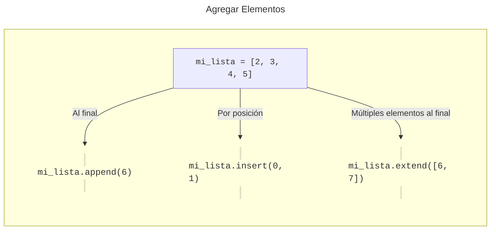
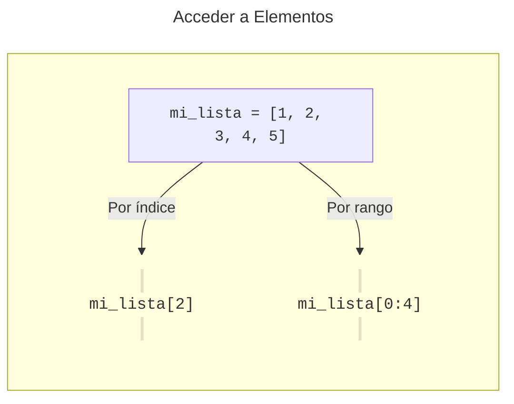
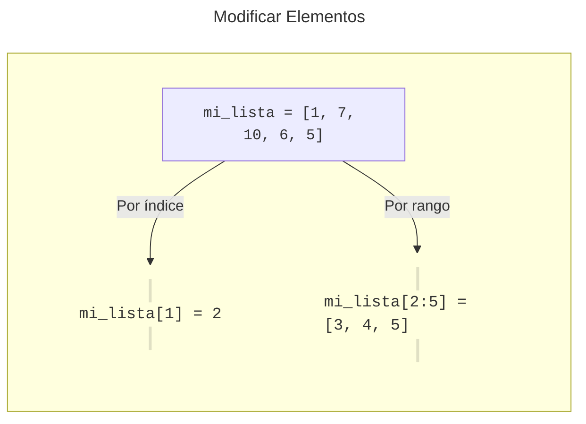
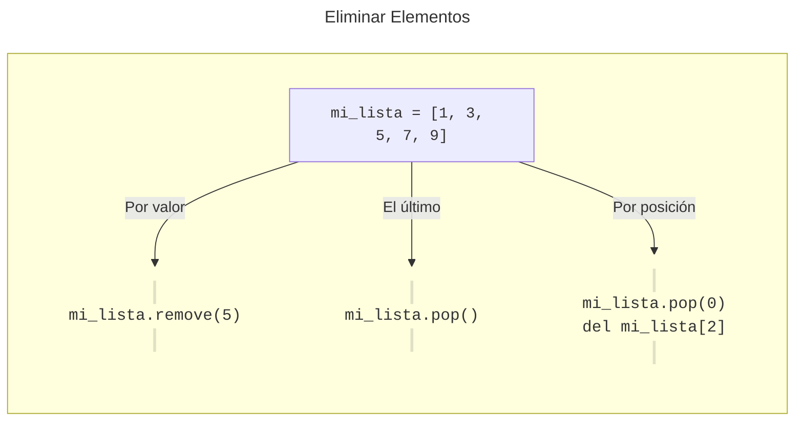
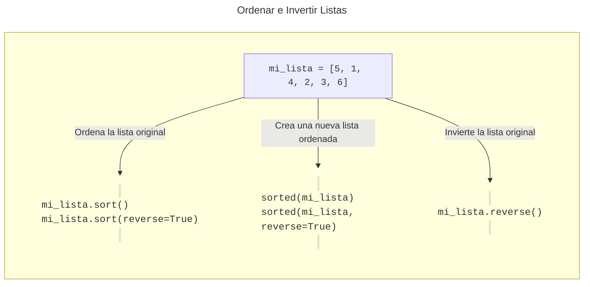
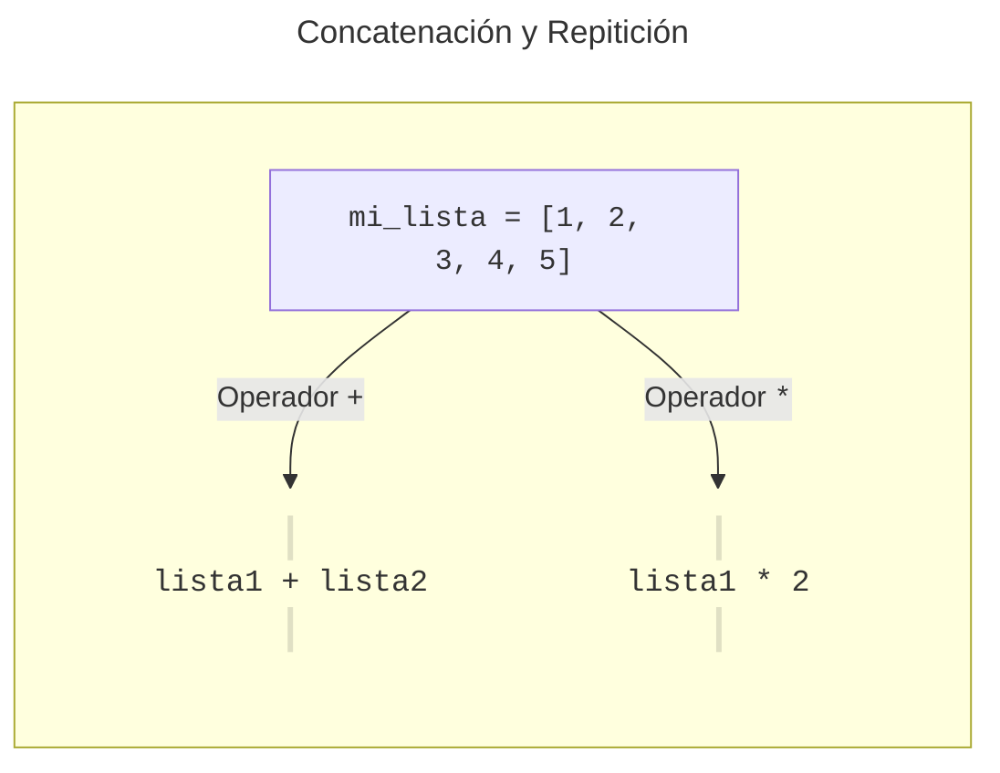
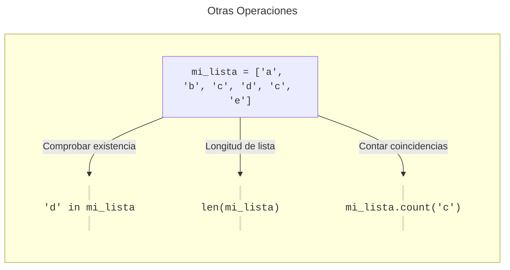
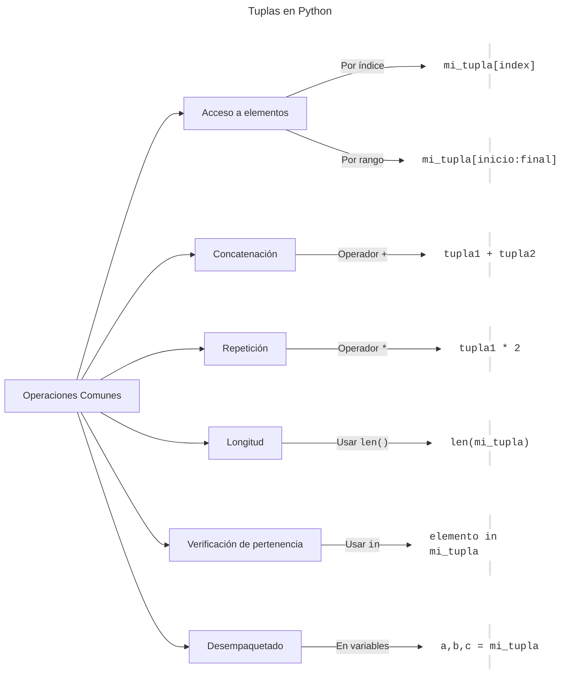

En Python, las **listas** y las **tuplas** son dos de los tipos de datos más fundamentales para almacenar colecciones de elementos. Aunque ambos permiten almacenar múltiples elementos en una sola variable, existen diferencias clave entre ellas que determinan cuándo usar una u otra. En este post, abarcaremos en detalle qué son las listas y tuplas, sus diferencias, y cómo utilizarlas de manera eficientes en nuestros programas.

## __¿Qué son las Lista?__

Las **listas** en Python son estructuras de datos que representan una colección __ordenada__ y __mutable__ (es decir, que se puede modificar) de elementos. Los elementos de una lista pueden ser de **diferentes tipos**, incluyendo números, cadenas de texto, otras listas, o incluso objetos personalizados.

> El tipo de dato `list` es usado para almacenar una colección de valores. Si vienes de otros lenguajes de programación podemos decir que las listas son similares a los **Arrays**. Las listas de Python pueden almacenar valores de diferentes tipos.
{: .prompt-info }

Las listas son ampliamente utilizadas gracias a su capacidad para adaptarse a distintos contextos de programación. Su naturaleza __mutable__ permite modificar su contenido en tiempo de ejecución, lo que las convierte en una herramienta ideal para una gran variedad de tareas.

A continuación, veamos sus principales características.

### __Características de las Listas__

Una lista de Python tiene las siguientes características:

**Es ordenada**
: esto quiere decir que los elementos dentro de ella están indexados y se accede a ellos a través de una locación indexada.

**Es mutable**
: esto significa que los elementos dentro de una lista pueden editarse, añadirse nuevos o eliminar los que ya tiene.

**Es dinámica**
: las listas pueden contener diferentes tipos de datos y hasta de objetos. Esto significa también que puede soportar paquetes multidimensionales de datos, como un array o muchos objetos.

**No es única**
: esencialmente, esto quiere decir que la lista puede contener elementos duplicados sin que nos arroje un error.


### __Crear Listas__

Para crear una lista se deben usar los corchetes `[]` (*brackets*) de apertura y cierre. Cada item o elemento en la lista debe estar separado de otro por comas `,`. 

Veamos el siguiente código donde vamos a almacenar en una variable la lista de Python:

```python
marcas = ['Honda', 'Toyota', 'Audi', 'Ford', 'Susuki', 'Mercedez']
```
{: .nolineno }

Como se puede observar, es muy simple crear una lista usando los corchetes y en su interior poner cada elemento. Sin embargo no es la única forma de crear lista, Python nos provee de una función integrada `list()` para conseguir el mismo objetivo.

En el siguiente código vamos hacer el mismo ejemplo anterior pero usando la función `list()`:


```python
marcas = list(('Honda', 'Toyota', 'Audi', 'Ford', 'Susuki', 'Mercedez'))
```
{: .nolineno }

### __Operaciones comunes con Listas__

Las operaciones sobre **listas** en Python son variadas al tratarse de estructuras de datos **mutables**, lo que significa que sus elementos pueden ser modificados después de haber sido creados. Debido a su mutabilidad, las listas tienen más métodos disponibles, como `append()`, `remove()`, `sort()`, `reverse()`, entre otros, que permiten agregar, eliminar o cambiar los elementos de manera dinámica:


```mermaid
---
title: "Agregar Elementos"
---
graph LR
    subgraph &nbsp;
        C["<code>mi_lista = [2, 3, 4, 5]</code>"]
        C -- "Al final" --> M["<code>mi_lista.append(6)</code>"]
        C -- "Por posición" --> N["<code>mi_lista.insert(0, 1)</code>"]
        C -- "Múltiples elementos al final" --> O["<code>mi_lista.extend([6, 7])</code>"]
    end

    classDef wStroke fill:#fff,fill-opacity:0,text-align:left,stroke-width:0,background:#19191922,font-family:monospace,padding:3px,font-size:17px;
    class M,N,O wStroke;
```


```mermaid
---
title: "Acceder a Elementos"
---
graph LR
    subgraph &nbsp;
        B["<code>mi_lista = [1, 2, 3, 4, 5]</code>"]
        B -- "Por índice" --> M["<code>mi_lista[2]</code>"]
        B -- "Por rango" --> N["<code>mi_lista[0:4]</code>"]
    end

    classDef wStroke fill:#fff,fill-opacity:0,text-align:left,stroke-width:0,background:#19191922,font-family:monospace,padding:3px,font-size:17px;
    class M,N wStroke;
```


```mermaid
---
title: "Modificar Elementos"
---
graph LR
    subgraph &nbsp;
        B["<code>mi_lista = [1, 7, 10, 6, 5]</code>"]
        B -- "Por índice" --> M["<code>mi_lista[1] = 2</code>"]
        B -- "Por rango" --> N["<code>mi_lista[2:5] = [3, 4, 5]</code>"]
    end

    classDef wStroke fill:#fff,fill-opacity:0,text-align:left,stroke-width:0,background:#19191922,font-family:monospace,padding:3px,font-size:17px;
    class M,N wStroke;
```


```mermaid
---
title: "Eliminar Elementos"
---
graph LR
    subgraph &nbsp;
        D["<code>mi_lista = [1, 3, 5, 7, 9]</code>"]
        D -- "Por valor" --> O["<code>mi_lista.remove(5)</code>"]
        D -- "El último" --> P["<code>mi_lista.pop()</code>"]
        D -- "Por posición" --> P1["<code>mi_lista.pop(0)<br>del mi_lista[2]</code>"]
    end

    classDef wStroke fill:#fff,fill-opacity:0,text-align:left,stroke-width:0,background:#19191922,font-family:monospace,padding:3px,font-size:17px;
    class O,P,P1 wStroke;
```


```mermaid
---
title: "Ordenar e Invertir Listas"
---
graph LR
    subgraph &nbsp;
        I["<code>mi_lista = [5, 1, 4, 2, 3, 6]</code>"]
        I -- "Ordena la lista original" --> V["<code>mi_lista.sort()<br>mi_lista.sort(reverse=True)</code>"]
        I -- "Crea una nueva lista ordenada" --> V1["<code>sorted(mi_lista)<br>sorted(mi_lista, reverse=True)</code>"]
        I -- "Invierte la lista original" --> W["<code>mi_lista.reverse()</code>"]
    end

    classDef wStroke fill:#fff,fill-opacity:0,text-align:left,stroke-width:0,background:#19191922,font-family:monospace,padding:3px,font-size:17px;
    class V,V1,W wStroke;
```


```mermaid
---
title: "Concatenación y Repitición"
---
graph LR
    subgraph &nbsp;
        F["<code>mi_lista = [1, 2, 3, 4, 5]</code>"]
        F -- "Operador <code>+</code>" --> R["lista1 + lista2"]
        F -- "Operador <code>*</code>" --> S["lista1 * 2"]
    end

    classDef wStroke fill:#fff,fill-opacity:0,text-align:left,stroke-width:0,background:#19191922,font-family:monospace,padding:3px,font-size:17px;
    class R,S,T wStroke;
```


```mermaid
---
title: "Otras Operaciones"
---
graph LR
    subgraph &nbsp;
    G["<code>mi_lista = ['a', 'b', 'c', 'd', 'c', 'e']</code>"]
    G -- "Comprobar existencia" --> T["<code>'d' in mi_lista</code>"]
    G -- "Longitud de lista" --> V["<code>len(mi_lista)</code>"]
    G -- "Contar coincidencias" --> W["<code>mi_lista.count('c')</code>"]
    end

    classDef wStroke fill:#fff,fill-opacity:0,text-align:left,stroke-width:0,background:#19191922,font-family:monospace,padding:3px,font-size:17px;
    class T,V,W wStroke;
```
{: .nolineno }

> Las **listas** son útiles cuando necesitas una colección de datos que pueda cambiar a lo largo del tiempo
{: .prompt-info }

Como ya sabemos las operaciones comunes que podemos realizar sobre las listas, ahora veamos algunos ejemplos.

#### __Agregar elementos__

Para añadir un nuevo elemento al final de la lista tenemos el método `append()`:

```python
marcas.append("Hyundai")
```
{: .nolineno }

Por otro lado, si quisieramos añadir al principio de la lista, usamos el método `.insert(posicion, elemento)`:

```python
cars.insert(0, "Hummer")
```
{: .nolineno }

#### __Eliminar elementos__

Para eliminar el último elemento de la lista tenemos el método `.pop()`:

```python
marcas.pop()
```
{: .nolineno }

Si queremos eliminar el elemento según su posición, tenemos el mismo método `.pop(posicion)`:

```python
marcas.pop(2)
```
{: .nolineno }

Si queremos eliminar un elemento según su valor, tenemos el método `.remove(elemento)`:

```python
marcas.remove("Honda")
```
{: .nolineno }

#### __Extraer elementos__

Para extraer elementos de una lista indicando sus índeces, en un intervalo **slicing**:

```python
marcas = ['Honda', 'Toyota', 'Audi', 'Ford', 'Susuki', 'Mercedez']
marcas[2:4] # ['Audi', 'Ford']
```
{: .nolineno }

Como podemos observar, indicamos `[start:to]` donde el primer argumento `start` es el elemento inicial (incluido) y el segundo argumento `to` es el elemento final (excluido).

### __Funciones útiles para Listas__

Python también nos provee de funciones útiles para trabajar con listas como las siguientes:


&gt;&gt;&gt; marcas = ['Honda', 'Toyota', 'Audi', 'Ford', 'Susuki', 'Mercedez']
<span class='hl'>&gt;&gt;&gt; sorted(marcas)</span>
['Audi', 'Ford', 'Honda', 'Mercedez', 'Susuki', 'Toyota']
<span class='hl'>&gt;&gt;&gt; sorted(marcas, reverse=True)</span>
['Toyota', 'Susuki', 'Mercedez', 'Honda', 'Ford', 'Audi']
<span class='hl'>&gt;&gt;&gt; max(marcas)</span>
'Toyota'
<span class='hl'>&gt;&gt;&gt; min(marcas)</span>
'Audi'
<span class='hl'>&gt;&gt;&gt; len(marcas)</span>
6



## __¿Qué es una Tupla?__

Una tupla en Python es similar a una lista, pero con una diferencia clave: es **inmutable**, lo que significa que, una vez creada, no puedes modificar, agregar ni eliminar elementos. Esto las hace ideales para representar datos que no deben cambiar a lo largo de la ejecución del programa.

### **Características de las Tuplas**

**Ordenadas**
: Los elementos en una tupla siguen un orden específico.

**Inmutables**
: Una vez que la tupla es creada, no puedes cambiar su contenido.

**Permiten elementos duplicados**
: Al igual que las listas, las tuplas pueden tener elementos repetidos.

**Pueden contener diferentes tipos de datos**
: Al igual que las listas, las tuplas pueden contener diferentes tipos de elementos.


### **Operaciones Comunes con Tuplas**

Las operaciones sobre **tuplas** en Python son limitadas debido a que las tuplas son **inmutables**, es decir, no pueden modificarse después de ser creadas. Sin embargo, se pueden realizar varias operaciones comunes:


```mermaid
---
title: "Tuplas en Python"
---
graph LR;
    A[Operaciones Comunes] --> B[Acceso a elementos]
    A --> C[Concatenación]
    A --> D[Repetición]
    A --> E[Longitud]
    A --> F[Verificación de pertenencia]
    A --> G[Desempaquetado]
    
    B -- "Por índice" --> B1["mi_tupla[index]"]
    B -- "Por rango" --> B2["mi_tupla[inicio:final]"]
    
    C -- "Operador <code>+</code>" --> C1["tupla1 + tupla2"]
    
    D -- "Operador <code>*</code>" --> D1["tupla1 * 2"]
    
    E -- "Usar <code>len()</code>" --> E1["len(mi_tupla)"]
    
    F -- "Usar <code>in</code>" --> F1["elemento in mi_tupla"]
    
    G -- "En variables" --> G1["a,b,c = mi_tupla"]

    classDef wStroke fill:#fff,fill-opacity:0,text-align:left,stroke-width:0,background:#19191922,font-family:monospace,padding:3px,font-size:17px;
    class B1,B2,C1,D1,E1,F1,G1 wStroke;
```
{: .nolineno }

#### **Acceder a un Elemento:**

Al igual que las listas, se puede acceder a los elementos de una tupla mediante su índice:


&gt;&gt;&gt; mi_tupla = (10, 20, 30, 40)
<span class='hl'>&gt;&gt;&gt; mi_tupla[2]</span>
30



#### __Concatenar y Repetir__

Aunque no se puede modificar una tupla directamente, se puede **concatenar** tuplas o **repetir** tuplas para crear nuevas tuplas:


&gt;&gt;&gt; tupla1 = (1, 2, 3, 4)
&gt;&gt;&gt; tupla2 = (5, 6, 7, 8)
<span class='hl'>&gt;&gt;&gt; tupla1 + tupla2</span>
(1, 2, 3, 4, 5, 6, 7, 8)
<span class='hl'>&gt;&gt;&gt; tupla1 * 2</span>
(1, 2, 3, 4, 1, 2, 3, 4)



#### __Comprobar la Existencia de un Elemento__

Podemos verificar si un elemento está presente en una tupla usando el operador `in`:


<span class='hl'>&gt;&gt;&gt; 3 in (1, 2, 3, 4)</span>
True



### __Diferencias entre Listas y Tuplas__

A pesar de que las listas y las tuplas comparten muchas similitudes, hay diferencias clave que debemos tener en cuenta al decidir cúal usar:

|Característica|Listas|Tuplas|
|:-------------|:-----|:-----|
|**Mutabilidad**|Mutable (se pueden modificar)|Inmutable (no se pueden modificar)|
|**Sintaxis**|Corchetes `[]`|Paréntesis `()`|
|**Velocidad**|Más lentas debido a su mutabilidad|Más rápidas debido a su inmutabilidad|
|**Uso**|Ideal cuando los datos cambian|Ideal para datos constantes|
|**Métodos**|Muchos métodos disponibles|Pocos métodos disponibles|