En Python, las **listas** y las **tuplas** son dos de los tipos de datos más fundamentales para almacenar colecciones de elementos. Aunque ambos permiten almacenar múltiples elementos en una sola variable, existen diferencias clave entre ellas que determinan cuándo usar una u otra. En este post, abarcaremos en detalle qué son las listas y tuplas, sus diferencias, y cómo utilizarlas de manera eficientes en nuestros programas.

## **¿Qué es una Lista?**

Una **lista** en Python es un tipo de dato que representa una colección ordenada y **mutable** (es decir, que se puede modificar) de elementos. Los elementos de una lista pueden ser de **diferentes tipos**, incluyendo números, cadenas de texto, otras listas, o incluso objetos personalizados.

> El tipo de dato **Lista** (`list`) es usado para almacenar una colección de valores. Si vienes de otros lenguajes de programación podemos decir que las listas son similares a los **Arrays**. Las listas de Python pueden almacenar valores de diferentes tipos.
{: .prompt-info }

### **Características de las Listas**

Una lista de Python tiene las siguientes características:

**Es ordenada**
: esto quiere decir que los elementos dentro de ella están indexados y se accede a ellos a través de una locación indexada.

**Es mutable**
: esto significa que los elementos dentro de una lista pueden editarse, añadirse nuevos o eliminar los que ya tiene.

**Es dinámica**
: las listas pueden contener diferentes tipos de datos y hasta de objetos. Esto significa también que puede soportar paquetes multidimensionales de datos, como un array o muchos objetos.

**No es única**
: esencialmente, esto quiere decir que la lista puede contener elementos duplicados sin que nos arroje un error.


## **Crear listas**

Para crear una lista se deben usar los corchetes `[]` (*brackets*) de apertura y cierre. Cada item o elemento en la lista debe estar separado de otro por comas `,`. 

Veamos el siguiente código donde vamos almacenar en una variable la lista de Python:

```python
cars = ['Honda', 'Toyota', 'Audi', 'Ford', 'Susuki', 'Mercedez']
```
{: .nolineno }


Como se puede observar, es muy simple crear una lista usando los corchetes y en su interior poner cada elemento. Sin embargo no es la única forma de crear lista, Python nos provee de una función integrada `list()` para conseguir el mismo objetivo.

En el siguiente código vamos hacer el mismo ejemplo anterior pero usando la función `list()`:


```python
cars = list(('Honda', 'Toyota', 'Audi', 'Ford', 'Susuki', 'Mercedez'))
```
{: .nolineno }


## **Operaciones comunes con Listas**

Como ya sabemos como se crean las listas, ahora veamos que podemos hacer con las listas.

### **Agregar elementos**

Para añadir un nuevo elemento al final de la lista tenemos el método `append()`:

```python
cars.append("Hyundai")
```
{: .nolineno }

Por otro lado, si quisieramos añadir un nuevo elemento al principio tenemos el método `insert(index, item)`:

```python
# 0 es el primer elemento en orden indexado sucesivamente en la secuencia
cars.insert(0, "Hummer")
```
{: .nolineno }


### **Eliminar elementos**

Para eliminar el último elemento de la lista tenemos el método `pop()`:

```python
cars.pop()
```
{: .nolineno }

Si queremos eliminar el elemento según su índice tenemos el mismo método `pop(index)`:

```python
cars.pop(2) # Elimina y retorna el elemento con el índice 1
```
{: .nolineno }

Si por otro lado, queremos eliminar elemento según su valor tenemos el método `remove()`:

```python
cars.remove("Honda")
```
{: .nolineno }

### **Extraer elementos**

Para extraer elementos de una lista indicando sus índeces, en un intervalo **slicing**:


```python
cars # ['Honda', 'Toyota', 'Audi', 'Ford', 'Susuki', 'Mercedez']
cars[2:4] # ['Audi', 'Ford']
```
{: .nolineno }

Como podemos observar, indicamos `[start:to]` donde el primer argumento `start` es el elemento inicial (incluido) y el segundo argumento `to` es el elemento final (excluido).

---

## Funciones incorporadas

Python también nos provee de funciones útiles para trabajar con listas como las siguientes:

```python
ordenada = sorted(cars) # ['Audi', 'Ford', 'Honda', 'Mercedez', 'Susuki', 'Toyota']
ordenada_descendente = sorted(cars, reverse=True) # ['Toyota', 'Susuki', 'Mercedez', 'Honda', 'Ford', 'Audi']
maximo = max(cars) # Audi
minimo = min(cars) # Toyota
sum_total = sum(cars) # TypeError solo funciona con números
longitud = len(cars) # 6
```
{: .nolineno }


## **¿Qué es una Tupla?**

Una tupla en Python es similar a una lista, pero con una diferencia clave: es **inmutable**, lo que significa que, una vez creada, no puedes modificar, agregar ni eliminar elementos. Esto las hace ideales para representar datos que no deben cambiar a lo largo de la ejecución del programa.

### **Características de las Tuplas**

**Ordenadas**
: Los elementos en una tupla siguen un orden específico.

**Inmutables**
: Una vez que la tupla es creada, no puedes cambiar su contenido.

**Permiten elementos duplicados**
: Al igual que las listas, las tuplas pueden tener elementos repetidos.

**Pueden contener diferentes tipos de datos**
: Al igual que las listas, las tuplas pueden contener diferentes tipos de elementos.


### **Operaciones Comunes con Tuplas**

```mermaid
graph LR;
    A[Tupla en Python] --> B[Acceso a elementos]
    A --> C[Concatenación]
    A --> D[Repetición]
    A --> E[Longitud]
    A --> F[Verificación de pertenencia]
    A --> G[Desempaquetado]
    
    B --> B1[Acceso por índice]
    B --> B2["Acceso por rango (slice)"]
    
    C --> C1[Unir tuplas]
    
    D --> D1[Multiplicar tupla]
    
    E --> E1["Usar len()"]
    
    F --> F1[Usar in]
    
    G --> G1[Desempaquetar en variables]
```



{: .nolineno }

#### **Acceder a un Elemento:**

Al igual que las listas, se puede acceder a los elementos de una tupla mediante su índice:

```py
mi_tupla = (10, 20, 30, 40)
print(mi_tupla[2])  # Imprime 30
```
{: .nolineno }

#### **Concatenar y Repetir**

Aunque no se puede modificar una tupla directamente, se puede **concatenar** tuplas o **repetir** tuplas para crear nuevas tuplas:

```py
tupla1 = (1, 2, 3)
tupla2 = (4, 5, 6)
tupla3 = tupla1 + tupla2  # Concatenación
tupla4 = tupla1 * 2       # Repetición
```
{: .nolineno }

#### **Comprobar la Existencia de un Elemento**

Podemos verificar si un elemento está presente en una tupla usando el operador `in`:

```py
mi_tupla = (1, 2, 3, 4)
print(3 in mi_tupla)  # Imprime True
```
{: .nolineno }


### **Diferencias entre Listas y Tuplas**

A pesar de que las listas y las tuplas comparten muchas similitudes, hay diferencias clave que debemos tener en cuenta al decidir cúal usar:

|Característica|Listas|Tuplas|
|:-------------|:-----|:-----|
|**Mutabilidad**|Mutable (se pueden modificar)|Inmutable (no se pueden modificar)|
|**Sintaxis**|Corchetes `[]`|Paréntesis `()`|
|**Velocidad**|Más lentas debido a su mutabilidad|Más rápidas debido a su inmutabilidad|
|**Uso**|Ideal cuando los datos necesitan cambiar|Ideal para datos constantes o clave-valor|
|**Métodos**|Muchos métodos disponibles (`append`, `remove`, etc.)|Pocos métodos disponibles (`count`, `index`)|