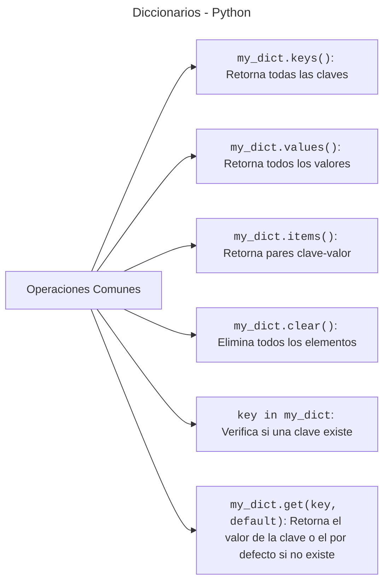

En Python, un **diccionario** (`dict`) es usado para almacenar una colección de valores en la forma de clave-valor (*key-value*). Si vienes de otros lenguajes de programación como JavaScript, podemos decir que los diccionarios son similares a los [objetos](https://developer.mozilla.org/es/docs/Learn_web_development/Core/Scripting/Object_basics){:target='_blank'}. Los diccionarios de Python pueden almacenar tanto su clave como su valor con contenido de diferentes tipos.

## __¿Qué es un Diccionario de Python?__

En Python, un diccionario __es una estructura de datos__ que almacena un conjunto de pares de `clave:valor` y es una colección __no ordenada__, __modificable__ e __indexada__ que __no permite duplicados__. Se define con llaves `{}` y contiene pares de `clave:valor`.

Los diccionarios funcionan de forma análoga a los diccionarios en la vida real, aunque con algunas diferencias. Por ejemplo, un diccionario de idiomas:

| Palabra (clave) | Significado (valor) |
|:----------------|:--------------------|
| "hola"          | Saludo amistoso     |
| "adiós"         | Despedida           |
| "libro"         | Objeto con páginas  |

En Python sería:

```python
diccionario_espanol = {
    "hola": "Saludo amistoso",
    "adiós": "Despedida", 
    "libro": "Objeto con páginas"
}
```
{: .nolineno }

En los diccionarios reales, las palabras están ordenadas alfabéticamente. En Python, desde la versión 3.7+, el orden de inserción se conserva, pero __no están ordenados alfabéticamente__.

En los diccionarios, una definición suele ser una cadena de texto. En Python, los valores pueden ser __cualquier cosa__: números, listas, otros diccionarios, funciones, objetos, etc.

### __Características importantes de los diccionarios__

Un diccionario de Python tiene las siguientes características:

**Mantienen un orden**
: esto quiere decir que se respeta en el orden que se insertan las claves.

**Es mutable**
: esto significa que los diccionarios no tienen un tamaño predefinido y que su contenido puede aumentar o disminuir según las necesidades.

**Son dinámicos**
: los diccionarios pueden contener diferentes tipos de datos tanto el valor como la clave. Esto significa que también pueden soportar paquetes multidimensionales de datos, como una lista o muchos objetos. Sin embargo se recomiendan usar los cadenas (*strings*) como claves.

**Clave única**
: esencialmente, esto quiere decir que los diccionarios no pueden tener claves duplicadas, ya que de lo contrario nos va a sustituir la clave existente.

**Son de rápido acceso**
: esto debido a la forma en la que están implementados internamente.

## __Crear Diccionarios__

Para crear un diccionario en Python se utilizan las llaves `{}` de apertura y cierre. Cada ítem debe estar compuesto por un par `clave:valor`, y cada par debe estar separado de otro par `clave:valor` por comas (`,`). Por ejemplo:

```python
mis_datos = {
    "nombre": "Marco",
    "edad": 32,
    "ciudad": "Coquimbo"
}
```
{: .nolineno }

> Aunque está permitido, **NO** uses nombres como `dict` en variables porque vas a romper la función `dict()` que nos permite crear diccionarios.
{: .prompt-warning }

Sin embargo no es la única forma, ya que Python nos provee la función `dict()` para la creación de diccionarios.

Una forma es pasarle una lista de tuplas a la función `dict()`:


<span class="hl">&gt;&gt;&gt; mis_datos = dict([('nombre', 'Marco'), ('edad', 32), ('ciudad', 'Coquimbo')])</span>
&gt;&gt;&gt; mis_datos
{'nombre': 'Marco', 'edad': 32, 'ciudad': 'Coquimbo'}



Otra forma es pasar la clave como nombre de argumento y asignarle el valor:


<span class="hl">&gt;&gt;&gt; mis_datos = dict(nombre='Marco', edad=32, ciudad='Coquimbo')</span>
&gt;&gt;&gt; mis_datos
{'nombre': 'Marco', 'edad': 32, 'ciudad': 'Coquimbo'}



> Para crear un diccionario vacío, se suele recomendar el uso de `{}` frente a `dict()`, no sólo por ser más pitónico sino por tener ( en promedio ) un mejor rendimiento en tiempos de ejecución.
{: .prompt-tip }

Ahora que sabes cómo crear diccionarios en Python, es momento de ver las operaciones más comunes que puedes hacer con ellos.

## __Operaciones Comunes con Diccionarios__

Trabajar con diccionarios de forma eficiente requiere conocer las operaciones básicas. A continuación, te muestro las operaciones más comunes y útiles:



### __Acceder a valores__

Para acceder a un valor basta con escribir la **clave** entre corchetes `[]`. Por ejemplo:


&gt;&gt;&gt; mis_datos = {"nombre": "Marco", "edad": 32, "ciudad": "Coquimbo"}
<span class="hl">&gt;&gt;&gt; mis_datos["nombre"]</span>
&quot;Marco&quot;



> Cuidado con las claves inexistentes. Si intentamos acceder a una clave que no existe, obtendremos un error tipo [`KeyError`](https://docs.python.org/3/library/exceptions.html#KeyError){:target='_blank'}
{: .prompt-warning }


<span class="hl">&gt;&gt;&gt; mis_datos["apodo"]</span>
Traceback (most recent call last):
  File "&lt;stdin&gt;", line 1, in &lt;module&gt;
<span class="hl">KeyError: 'apodo'</span>



Sin embargo, existe un método muy útil para manejar los posibles errores de accesos por claves inexistentes. Se trata de `.get()` y su comportamiento es el siguiente:

1. Si la clave que buscamos existe, nos retorna su valor.
2. Si la clave que buscamos no existe, nos retorna `None`, salvo que indiquemos otro valor por defecto, pero en ninguno de los casos obtendremos un error.


<span class="hl">&gt;&gt;&gt; mis_datos.get("nombre")</span>
&quot;Marco&quot;
<span class="hl">&gt;&gt;&gt; mis_datos.get("apodo", "No existe esta clave")</span>
&quot;No existe esta clave&quot;



### __Añadir o modificar un elemento__

Para añadir un elemento a un diccionario sólo es necesario hacer referencia a la `clave` y asignarle un `valor`:

- Si la clave **ya existía** en el diccionario, **se remplaza** el valor existente por el nuevo.
- Si la clave **es nueva**, **se añade** al diccionario con su valor.

Partamos con el siguiente diccionario de ejemplo:

```python
usuario = {
  "nombre": "Marco",
  "apodo": "El Marco Polo"
}
```
{: .nolineno }

Si queremos **añadir** el país del usuario a nuestro diccionario, usamos entre corchetes el nombre para la nueva `clave` y le asignamos el `valor`:

```python
usuario['pais'] = 'Chilito'
```
{: .nolineno }

Por otro lado, si queremos __modificar el valor__, usamos el nombre de la clave existente y le asignamos el nuevo valor:

```python
usuario['pais'] = 'Chile'
```
{: .nolineno }

### __Obtener todas las claves de un diccionario__

Mediante el método `.keys()` de un diccionario podemos retornar un objeto de vista. La vista de objetos contiene las **clave** del diccionario en forma de **lista**:


<span class="hl">&gt;&gt;&gt; usuario.keys()</span>
dict_keys(['nombre', 'apodo', 'pais'])



> Este objeto `dict_keys` no es una lista como tal, pero puede convertirse fácilmente en una usando `list(usuarios.keys())`.
{: .prompt-info }

__Ejemplo en Python interactivo para recorrer solo las claves__:


<span class="hl">&gt;&gt;&gt; for clave in usuario.keys()
...    print(clave)</span>
...
nombre
apodo
pais



### __Obtener todos los valores de un diccionario__

De igual forma, con el método `.values()` podemos retornar un objeto de vista. La vista de objetos contiene los **valores** del diccionario en forma de **lista**:


<span class="hl">&gt;&gt;&gt; usuario.values()</span>
dict_values(['Marco', 'El Marco Polo', 'Chile'])



> Este objeto `dict_values` no es una lista como tal, pero puede convertirse fácilmente en una usando `list(usuarios.values())`.
{: .prompt-info }

__Ejemplo en Python interactivo para recorrer solo los valores__:


<span class="hl">&gt;&gt;&gt; for valor in usuario.values()
...    print(clave)</span>
...
Marco
El Marco Polo
Chile



### __Obtener todos los pares clave-valor de un diccionario__

Mediante el método `.items()` de un diccionario podemos retornar un objeto de vista. La vista de objetos contiene __tuplas__ como elementos conpuestas por pares **clave-valor** del diccionario en forma de vista:


<span class="hl">&gt;&gt;&gt; usuario.items()</span>
dict_items([('nombre', 'Marco'), ('apodo', 'El Marco Polo'), ('pais', 'Chile')])



> Al igual que con `.keys()` y `.values()`, el objeto `dict_items` no es una lista directamente, pero puede convertirse en una con `list(usuario.items())`.
{: .prompt-info }

__Ejemplo en Python interactivo para recorrer claves y valores__:


<span class="hl">&gt;&gt;&gt; for clave, valor in usuario.items()
...    print(f"{clave}: {valor}")</span>
...
nombre: Marco
apodo: El Marco Polo
pais: Chile




### __Borrar elementos__

Python nos proporciona, al menos, tres formas de borrar elementos en un diccionario:

**Por su clave**
: Mediante la sentencia `del`:

```python
>>> del usuario['pais']
```
{: .nolineno }

**Por su clave (con extracción)**
: Mediante el método `pop()` podemos extraer un elemento del diccionario por su clave esto retornará el valor de la clave extraida:

```python
>>> usuario.pop('pais')
'Chile'
```
{: .nolineno }

**Borrado completo**
: Mediante el método `clear()` podemos quitar todos los elementos de un diccionario:

```python
>>> usuario.clear()
>>> usuario
{}
```
{: .nolineno }



Los diccionarios en Python son estructuras de datos que almacenan pares de `clave:valor`. Son ideales para almacenar información que requiere acceso rápido mediante una clave única, permitiendo manipular y organizar datos de manera eficiente.