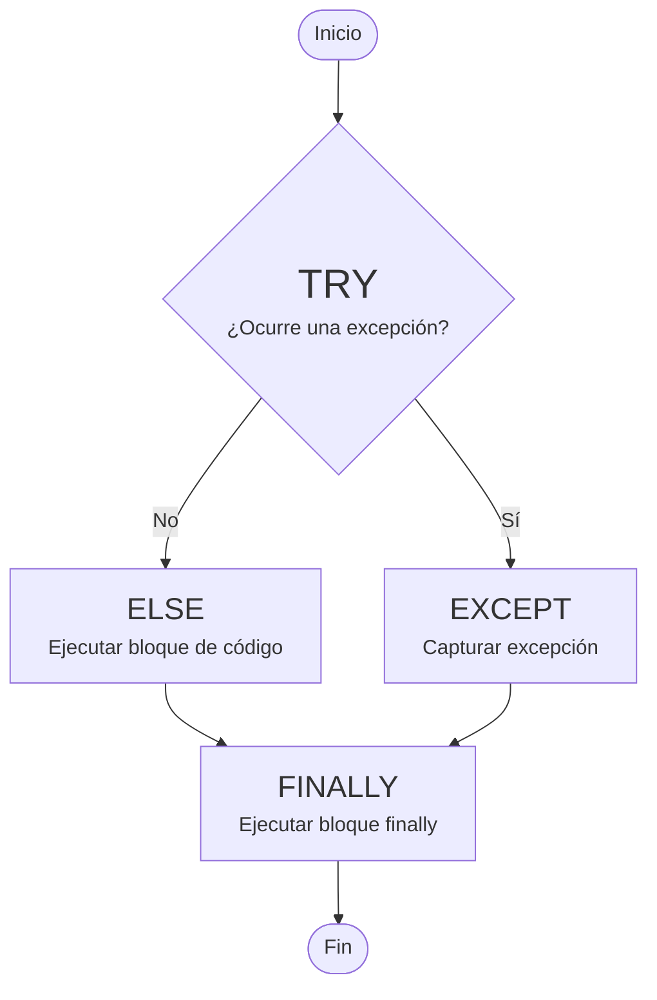

El manejo de errores y excepciones es una parte fundamental en el desarrollo de cualquier software, y Python proporciona una manera eficiente y flexible de gestionar situaciones imprevistas que pueden surgir durante la ejecución de un programa. En este artículo, exploraremos cómo funcionan las excepciones en Python y cómo podemos usarlas para hacer que el código sea más robusto y fácil de depurar.

## **¿Qué es una Excepción?**

En términos sencillos, una excepción es un evento inesperado que interrumpe el flujo normal de ejecución de un programa. En Python, las excepciones se utilizan para manejar errores de forma controlada, permitiendo que el programa no se detenga bruscamente.

Por ejemplo, si intentas dividir por cero, Python lanzará una excepción [`ZeroDivisionError`](https://docs.python.org/3/library/exceptions.html#ZeroDivisionError){: target='_blank' }. En lugar de que el programa se detenga de inmediato, podemos **capturar** y manejar esa excepción para tomar una acción apropiada, como mostrar un mensaje de error o realizar una operación alternativa.


## **Estructura Básica de Manejo de Excepciones**

En Python, el manejo de excepciones se realiza mediante las plabaras claves `try`, `except`, y opcionalmente `else` y `finally`. Y funciona de la siguiente manera:



**Sintaxis Básica**

```py
try:
    # Bloque de código que puede causar una excepción
    resultado = 10 / 0
except ZeroDivisionError as e:
    # Bloque que maneja la excepción
    print(f"Error: {e}")
```
{: .nolineno }

En este ejemplo:

- El bloque `try` contiene el código que podría generar una excepción.
- Si ocurre una excepción, Python salta al bloque `except` donde puedas manejarla. En este caso, capturamos una excepción de tipo `ZeroDivisionError` y mostramos un mensaje de error.

### **Bloque else**

El bloque `else` es opcional y se ejecuta solo si no se ha producido ninguna excepción en el bloque `try`. Es útil en diferentes contextos para ejecutar código que dependa de que no haya errores.

```py
try:
    x = 10 / 2
except ZeroDivisionError:
    print("No se puede dividir por cero.")
else:
    print(f"La operación fue exitosa: {x}")
```
{: .nolineno }

En este caso, si no ocurre ninguna excepción en el bloque `try`, el bloque `else` se ejecutará, mostrando el resultado de la operación.

## **Tipos de Excepciones**

Python tiene muchas excepciones más, pero esta tabla cubre las más comunes y útiles para el manejo de errores. 

| **Excepción**| **Descripción**|
|:-------------|:---------------|
|`BaseException`|La clase base para todas las excepciones.|
|`Exception`|Clase base para todas las excepciones estándar.|
|`ArithmeticError`|Clase base para los errores aritméticos, como `ZeroDivisionError` o `OverflowError`.|
|`ZeroDivisionError`|Se lanza cuando se intenta dividir un número por cero.|
|`OverflowError`|Se lanza cuando un número excede el límite permitido por el sistema.|
|`ValueError`|Se lanza cuando una operación o función recibe un argumento con un valor inapropiado.|
|`IndexError`|Ocurre cuando se intenta acceder a un índice de lista o secuencia fuera de su rango.|
|`KeyError`|Se lanza cuando se intenta acceder a una clave que no existe en un diccionario.|
|`TypeError`|Se lanza cuando una operación o función es aplicada a un objeto de tipo inapropiado.|
|`FileNotFoundError`|Ocurre cuando se intenta abrir un archivo que no existe.|
|`IOError`|Se lanza cuando ocurre un error de entrada/salida, como al leer o escribir archivos.|
|`ValueError`|Se lanza cuando se pasa un valor incorrecto a una función.|
|`ImportError`|Ocurre cuando un módulo o función no se puede.|
|`ModuleNotFoundError`|Se lanza cuando el módulo solicitado no se puede encontrar.|
|`AttributeError`|Se lanza cuando un objeto no tiene el atributo solicitado.|
|`NameError`|Se lanza cuando se hace referencia a una variable que no está definida.|
|`SyntaxError`|Se lanza cuando hay un error de sintaxis en el código, es decir, cuando el código no sigue las reglas del lenguaje.|
|`IndentationError`|Subclase de `SyntaxError` que ocurre cuando hay un error de indentación en el código.|
|`AssertionError`|Se lanza cuando una afirmación (`assert`) falla, es decir, cuando una expresión booleana es falsa.|
|`MemoryError`|Ocurre cuando se agota la memoria disponible.|
|`RecursionError`|Se lanza cuando se excede el límite de recursión en el código.|
|`NotImplementedError`|Se lanza cuando una función o método no está implementado, pero está presente en la interfaz.|
|`TimeoutError`|Ocurre cuando una operación supera el tiempo de espera establecido.|
|`KeyboardInterrupt`|Se lanza cuando el usuario interrumpe la ejecución del programa mediante la pulsación de <kbd>Ctrl</kbd>+<kbd>C</kbd>.|
|`StopIteration`|Se lanza para indicar que no hay más elementos en un iterador.|
|`StopAsyncIteration`|Se lanza para indicar que no hay más elementos en un iterador asíncrono.|
|`ConnectionError`|Clase base para errores relacionados con la red o las conexiones.|
|`TimeoutError`|Se lanza cuando una operación excede el tiempo de espera.|

### **Algunas excepciones adicionales menos comunes**

- `UnicodeDecodeError` – Ocurre cuando falla la decodificación de una cadena Unicode.
- `UnicodeEncodeError` – Ocurre cuando falla la codificación de una cadena Unicode.
- `DeprecationWarning` – Advertencia sobre el uso de características obsoletas.
- `UserWarning` – Advertencia general que puede ser utilizada para notificar al usuario sobre condiciones de advertencia.

### **Excepción Genérica**

Si no sabemos qué tipo de excepción puede ocurrir o si deseas capturar cualquier tipo de error, podemos usar un bloque `except` sin especificar una excepción:

```py
try:
    x = 10 / 0
except Exception as e:
    print(f"Ocurrió un error: {e}")
```
{: .nolineno }

Usar `Exception` es útil cuando no estás seguro de qué tipo de excepción puede ocurrir.

> Se recomienda siempre que sea posible usar excepciones específicas para un manejo de errores más preciso.
{: .prompt-tip }

## **Manejar Múltiples Excepciones**

Podemos manejar diferentes tipos de excepciones con múltiples bloques `except`. Si tenemos varios casos de error posibles, podemos especificarlos de forma individual de la siguiente manera:

```py
try:
    valor = int(input("Introduce un número: "))
    resultado = 10 / valor
except ZeroDivisionError:
    print("No puedes dividir por cero.")
except ValueError:
    print("Eso no es un número válido.")
```
{: .nolineno }

## **Levantar Excepciones Personalizadas**

Python nos permite crear y lanzar nuestras propias excepciones utilizando la palabra clave `raise`. Esto es útil cuando deseamos controlar el flujo de ejecución en situaciones específicas, como validaciones personalizadas.

**Ejemplo de Excepción personalizada**

```py
class MiExcepcion(Exception):
    pass

def dividir(a, b):
    if b == 0:
        raise MiExcepcion("No se puede dividir por cero")
    return a / b

try:
    resultado = dividir(10, 0)
except MiExcepcion as e:
    print(f"Error: {e}")
```
{: .nolineno }

