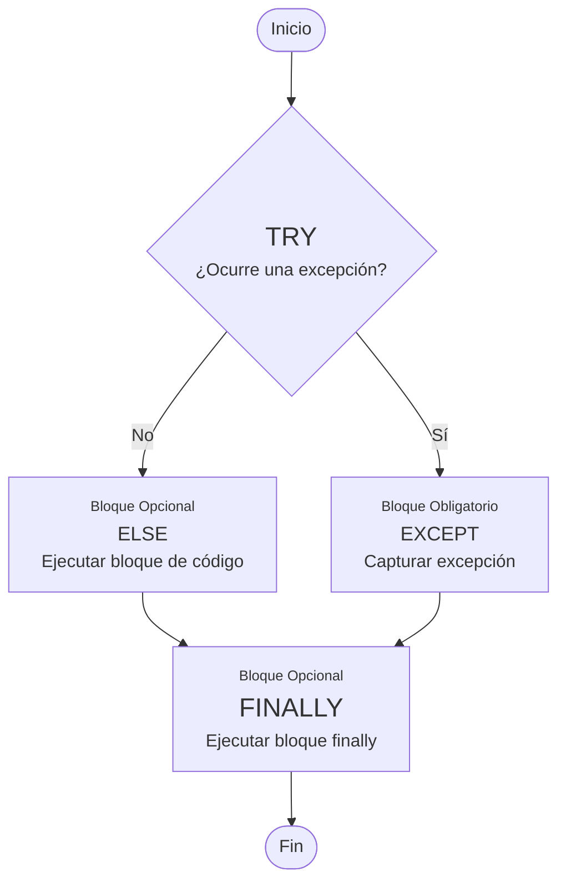

El manejo de errores y excepciones es una parte fundamental en el desarrollo de cualquier software, y Python proporciona una manera eficiente y flexible de __gestionar situaciones imprevistas__ que pueden surgir durante la ejecución de un programa. En este artículo, exploraremos cómo funcionan las excepciones en Python y cómo podemos usarlas para hacer que el código sea más robusto y fácil de depurar.

## __¿Qué es una Excepción?__

En términos sencillos, una excepción __es un evento inesperado que interrumpe el flujo normal de ejecución__ de un programa. Cuando ocurre una excepción, Python detiene ese flujo y busca una manera de manejarla. Si no se maneja, el programa termina con un mensaje de error.

Imagina qe estás en tu cocina preparando café. Estás calentando el agua en una tetera eléctrica (_hervidor_). Todo va bien... hasta que te distraes y el agua hierve tanto que la tetera de desborda, quemándote la mano.

Este es el __evento inesperado__. No lo planeaste, pero ocurrió.

Ahora, si __no hiciste nada para evitarlo__ (como poner una temporizador o usar una tetera con apagado automático), el resultado es que te quemas y dejas de hacer todo lo que estabas haciendo.

Para evitar esto, existe el __manejo de excepciones__, que nos permite anticipar posibles errores, actuar en consecuencia y mantener el control del flujo y evitar que nuestros programas se detengan bruscamente.

Ahora, en otra situación, estás sirviendo café en una taza. Sin querer, lo llenas demasiado y se derrama sobre la mesa.

__¿Qué haces?__

- No te pones a gritar ni abandonas el desayuno (eso sería como dejar que el programa se "rompa").
- Tomas una servilleta, limpias la mesa, quizás cambias de taza y sigues desayunando.

Estás __manejando una excepción__: algo salió mal, pero lo detectaste y tomaste una acción para __continuar con el flujo normal de tu día__.

> El café ☕ es parte de nuestras rutinas, y también está lleno de pequeños imprevistos que ilustran perfectamente cómo funcionan las excepciones en la vida real.
{: .prompt-love }

### __Ejemplo básico de excepción en Python__

Un ejemplo rápido es intentar dividir por cero, Python lanzará una excepción [`ZeroDivisionError`](https://docs.python.org/3/library/exceptions.html#ZeroDivisionError){: target='_blank' }. En lugar de que el programa se detenga de inmediato, podemos **capturar** y manejar esa excepción para tomar una acción apropiada, como mostrar un mensaje de error o realizar una operación alternativa. Puedes ver este ejemplo de excepción en una sesión interactiva:


Python 3.10.2 (main, Feb 14 2024, 23:15:40) [Clang 14.0.0 (clang-1400.0.29.202)] on darwin
Type "help", "copyright", "credits" or "license" for more information.
<span class="hl">&gt;&gt;&gt; 6 / 0 </span>
Traceback (most recent call last):
  File "&lt;python-input-13&gt;", line 1, in &lt;module&gt;
    6 / 0
    ~~^~~
<span class="hl">ZeroDivisionError: division by zero</span>




## __Estructura Básica de Manejo de Excepciones__

En Python, el manejo de excepciones se realiza mediante las palabras claves `try`, `except`, y opcionalmente `else` y `finally`. Y funciona de la siguiente manera:


```mermaid
flowchart TD
    A([Inicio]) --> B{<font size="5">TRY</font><br>¿Ocurre una excepción?}
    B -- No --> C[<font size="2">Bloque Opcional</font><br><font size="4">ELSE</font><br>Ejecutar bloque de código]
    B -- Sí --> D[<font size="2">Bloque Obligatorio</font><br><font size="4">EXCEPT</font><br>Capturar excepción]
    C --> E[<font size="2">Bloque Opcional</font><br><font size="5">FINALLY</font><br>Ejecutar bloque finally]
    D --> E
    E --> F([Fin])
```

__Sintaxis Básica__

```py
try:
    # Bloque de código que puede causar una excepción
    resultado = 10 / 0
except ZeroDivisionError as e:
    # Bloque que maneja la excepción
    print(f"Error: {e}")
```
{: .nolineno }

En este ejemplo:

- El bloque `try` contiene el código que podría generar una excepción.
- Si ocurre una excepción, Python salta al bloque `except` donde puedas manejarla. En este caso, capturamos una excepción de tipo `ZeroDivisionError` y mostramos un mensaje de error.

Si entramos en una sesión interactiva, se obtiene el siguiente resultado:


&gt;&gt;&gt; try:
...    resultado = 10 / 0
... <span class="hl">except ZeroDivisionError as e:</span>
...    print(f"Error: {e}") 
...
<span class="hl">Error: division by zero</span>
&gt;&gt;&gt;




Como vimos anteriormente, los bloques `try` y `except` son __obligatorios__ para manejar excepciones en Python. Por otro lado, los bloques `else` y `finally` son __opcionales__ y se utilizan según las necesidades del contexto. Por ejemplo, al trabajar con recursos como archivos o conexiones a bases de datos, siempre es bueno realizar acciones de limpieza cómo cerrar conexiones y recursos, para evitar __fugas de memoria__ o __recursos no liberados__. Ya veremos esos casos y más ejemplos para ilustrar su uso.

### __Bloque else__

El bloque `else` es opcional y se ejecuta únicamente si no se ha producido ninguna excepción en el bloque `try`. Es útil en diferentes contextos para ejecutar código que dependa de que no haya errores.

```py
try:
    x = 10 / 2
except ZeroDivisionError:
    print("No se puede dividir por cero.")
else:
    print(f"La operación fue exitosa: {x}")
```
{: .nolineno }

En este caso, no ocurre ninguna excepción en el bloque `try`, por ende, el bloque `else` se ejecutará, mostrando el resultado de la operación.

En el siguiente ejemplo, generamos una excepción de tipo `ValueError` al intentar convertir una entrada por teclado:


&gt;&gt;&gt; try:
...    numero = int(input("Introduce un número: "))
... <span class="hl">except ValueError:</span>
...    print(f"Error de conversión") 
... <span class="hl">else:</span>
...    print("Has introducido:", numero)
...
<span style='color: SandyBrown'>Introduce un número: </span>uno
Error de conversión.
&gt;&gt;&gt;




> Puedes seguir probando código fácilmente desde una sesión interactiva de Python, o también usando herramientas en línea como <https://onecompiler.com/embed/python>, donde puedes ejecutar ejemplos rápidamente sin instalar nada.
{: .prompt-info }

### __Bloque finally__

El bloque `finally` es __opcional__ en la estructura de manejo de excepciones de Python, pero resulta muy __necesario en contexto donde se deben liberar recursos__, como cerrar archivos, conexiones a bases de datos o limpiar datos temporales. La principal característica de `finally` es que __siempre se ejecuta__, haya ocurrido una excepción o no.

En este caso, intentemos guardar el resultado de la operación matemática (una división) y __escribimos el resultado o el error en un archivo__. Usamos `finally` para garantizar que el archivo se cierre, sin importar si la operación fue exitosa o no y luego leemos el archivo:

```python
try:
    archivo = open("resultado.txt", "w")
    resultado = 10 / 0
    archivo.write(f"Resultado: {resultado}")
except ZeroDivisionError:
    archivo.write("Error: no se puede dividir entre cero.")
finally:
    archivo.close()
    print("Archivo cerrado.")

print(open('resultado.txt').read())
```
{: .nolineno }

Si ejecutamos lo anterior, deberías ver el mismo resultado:

```
Archivo cerrado.
Error: no se puede dividir entre cero.
```
{: .nolineno .noheader }

Al usar el bloque `finally`, es importante no solo asegurarse de cerrar recursos, sino también aprovechar la oportunidad para registrar información adicional que pueda ser útil. 

> Piensa en `finally` como ese momento final donde puedes realizar una acción útil antes de cerrar todo.
{: .prompt-tip }

## __Tipos de Excepciones__

Python tiene muchas excepciones más, pero esta tabla cubre las más comunes y útiles para el manejo de errores. 

|__Excepción__|__Descripción__|
|:-------------|:---------------|
|`BaseException`|La clase base para todas las excepciones.|
|`Exception`|Clase base para todas las excepciones estándar.|
|`ArithmeticError`|Clase base para errores aritméticos, como `ZeroDivisionError`.|
|`ZeroDivisionError`|Se lanza cuando se intenta dividir un número por cero.|
|`OverflowError`|Se lanza cuando un número excede el límite permitido por sistema.|
|`ValueError`|Se lanza cuando se recibe un argumento con un valor inapropiado.|
|`IndexError`|Ocurre cuando se accede a un índice de la secuencia fuera de rango.|
|`KeyError`|Ocurre cuando se accede a una clave que no existe en el diccionario.|
|`TypeError`|Ocurre cuando una función se aplica a un objeto de tipo inapropiado.|
|`FileNotFoundError`|Ocurre cuando se intenta abrir un archivo que no existe.|
|`IOError`|Ocurre cuando un error de E/S se genera al leer o escribir un archivo.|
|`ValueError`|Se lanza cuando se pasa un valor incorrecto a una función.|
|`ImportError`|Ocurre cuando un módulo no se puede importar correctamente.|
|`ModuleNotFoundError`|Se lanza cuando el módulo solicitado no se puede encontrar.|
|`AttributeError`|Se lanza cuando un objeto no tiene el atributo solicitado.|
|`NameError`|Ocurre cuando se hace referencia a una variable que no está definida.|
|`SyntaxError`|Ocurre cuando el código no sigue las reglas del lenguaje.|
|`IndentationError`|Subclase de `SyntaxError` (error de indentación).|
|`AssertionError`|Ocurre cuando una afirmación (`assert`) falla (evalúa como falsa).|
|`MemoryError`|Ocurre cuando se agota la memoria disponible.|
|`RecursionError`|Se lanza cuando se excede el límite de recursión en el código.|
|`NotImplementedError`|Ocurre cuando una función está declarada pero no implementada.|
|`TimeoutError`|Ocurre cuando una operación excede el tiempo establecido.|
|`KeyboardInterrupt`|Ocurre cuando el usuario interrumpe el programa con <kbd>Ctrl</kbd>+<kbd>C</kbd>.|
|`StopIteration`|Se lanza para indicar que no hay más elementos en un iterador.|
|`StopAsyncIteration`|Indica que un iterador asíncrono no tiene más elementos.|
|`ConnectionError`|Clase base para errores relacionados con la red o las conexiones.|
|`TimeoutError`|Se lanza cuando una operación excede el tiempo de espera.|

### __Algunas excepciones adicionales menos comunes__

|__Excepción__|__Descripción__|
|:-------------|:---------------|
|`UnicodeDecodeError`|Ocurre cuando falla la decodificación de una cadena Unicode.|
|`UnicodeEncodeError`|Ocurre cuando falla la codificación de una cadena Unicode.|
|`DeprecationWarning`|Advertencia sobre el uso de características obsoletas.|
|`UserWarning`|Advertencia general para notificar al usuario sobre algo no crítico.|

### __Excepción Genérica__

Si no sabemos qué tipo de excepción puede ocurrir, o si deseas capturar __cualquier tipo de error__, podemos usar un bloque `except` con la excepción base `Exception`:

```py
try:
    x = 10 / 0
except Exception as e:
    print(f"Ocurrió un error: {e}")
```
{: .nolineno }

Usar `Exception` es útil cuando no estás seguro de qué tipo de error podría lanzarse, como en etapas tempranas del desarrollo.

> Siempre que sea posible, __usa excepciones específicas__ (`ZeroDivisionError`, `FileNotFoundError`, etc.) para un manejo de errores más claro y controlado.
{: .prompt-tip }

> Capturar todas las excepciones genéricas puede __ocultar errores graves__ o hacer más difícil detectar problemas reales. Úsalo con cuidado, __especialmente en entornos de producción__.
{: .prompt-warning }

## **Manejar Múltiples Excepciones**

Podemos manejar diferentes tipos de excepciones con múltiples bloques `except`. Si tenemos varios casos de error posibles, podemos especificarlos de forma individual de la siguiente manera:

```py
try:
    valor = int(input("Introduce un número: "))
    resultado = 10 / valor
except ZeroDivisionError:
    print("No puedes dividir por cero.")
except ValueError:
    print("Eso no es un número válido.")
```
{: .nolineno }

## **Levantar Excepciones Personalizadas**

Python nos permite crear y lanzar nuestras propias excepciones utilizando la palabra clave `raise`. Esto es útil cuando deseamos controlar el flujo de ejecución en situaciones específicas, como validaciones personalizadas.

**Ejemplo de Excepción personalizada**

```py
class MiExcepcion(Exception):
    pass

def dividir(a, b):
    if b == 0:
        raise MiExcepcion("No se puede dividir por cero")
    return a / b

try:
    resultado = dividir(10, 0)
except MiExcepcion as e:
    print(f"Error: {e}")
```
{: .nolineno }



A lo largo de este artículo exploramos cómo Python nos da herramientas poderosas para **anticipar, manejar y registrar errores** sin que nuestro programa se venga abajo. Desde lo básico con `try` y `except`, pasando por los bloques `else` y `finally`, hasta ideas más avanzadas y una lista de las excepciones más y menos comunes, vimos que **las excepciones no son el fin del mundo**, ¡son una oportunidad para construir código más inteligente y resistente!

> ☕ Y como vimos con los ejemplos del café en un principio, en la programación y en la vida real, los errores pasan, pero lo importante es **cómo los enfrentamos**.
{: .prompt-love }

En próximos artículos, vamos a seguir profundizando en:

* Manejo de excepciones personalizadas.
* Integración con bases de datos y archivos reales.

No te detengas aquí. **Prueba los ejemplos** (puedes usar la consola de Python o herramientas como [onecompiler.com](https://onecompiler.com/python)), juega con ellos, rompe cosas y vuelve a armar. Solo así vas a dominar de verdad el arte de escribir código que no solo funcione… sino que **resista el caos**.