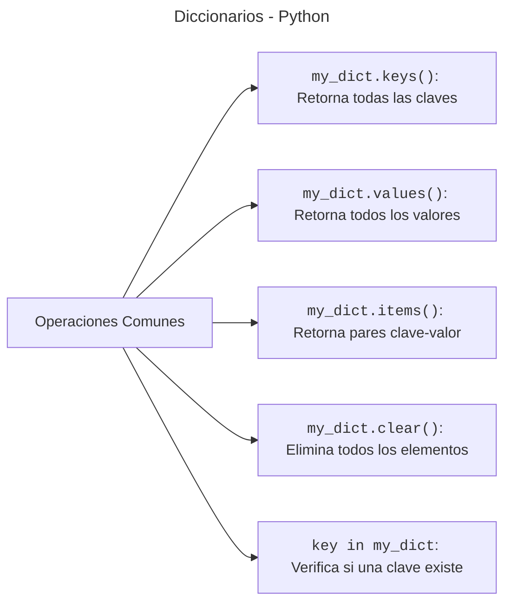

En Python, el tipo de dato **Diccionario** (`dict`) es usado para almacenar una colección de valores en la forma de clave-valor (*key-value*). Si vienes de otros lenguajes de programación como JavaScript, podemos decir que los diccionarios son similares a los objetos **Objects**. Los diccionarios de Python pueden almacenar tanto su clave como su valor con contenido de diferentes tipos.

Un diccionario de Python tiene las siguientes características:

**Mantienen un orden**
: esto quiere decir que se respeta en el orden que se insertan las claves.

**Es mutable**
: esto significa que los diccionarios no tienen un tamaño predefinido y que su contenido puede aumentar o disminuir según las necesidades.

**Son dinámicos**
: los diccionarios pueden contener diferentes tipos de datos tanto el valor como la clave. Esto significa que también pueden soportar paquetes multidimensionales de datos, como una lista o muchos objetos. Sin embargo se recomiendan usar los cadenas (*strings*) como claves.

**Clave única**
: esencialmente, esto quiere decir que los diccionarios no pueden tener claves duplicadas, ya que de lo contrario nos va a sustituir la clave existente.

**Son de rápido acceso**
: esto debido a la forma en la que están implementados internamente.

---

## **Creando diccionarios**

Para crear un diccionario se deben usar las llaves `{}` de apertura y cierre. Cada item `clave:valor` en el diccionario debe estar separado de otro par `clave:valor` por comas `,`. 

Veamos el siguiente código donde vamos a almacenar en una variable el diccionario de Python:

```python
car = { 'name': 'Audi', 'model': 'r8', 'color': 'negro' }
```
{: .nolineno }


Como se puede observar, es muy simple crear diccionarios en Python siempre y cuando usemos las llaves y respetemos el formato de `clave:valor`.

> Aunque está permitido, **NO** uses nombres como `dict` en variables porque vas a romper la función `dict()` que nos permite crear diccionarios.
{: .prompt-warning }

Sin embargo no es la única forma, ya que Python nos provee la función `dict()` para la creación de diccionarios:

```python
# una forma es pasarle una lista de tuplas
car = dict([('name', 'Audi'), ('model', 2012), ('color', 'white')])
# otra forma es pasar un la clave y valor como argumentos
car2 = dict(name='honda', model=2019, color='blue')
```
{: .nolineno }

> Para crear un diccionario vacío, se suele recomendar el uso de `{}` frente a `dict()`, no sólo por ser más pitónico sino por tener (en promedio) un mejor rendimiento en tiempos de ejecución.
{: .prompt-tip }


---


## **Operaciones comunes con Diccionarios**

Como ya sabemos cómo se crean los diccionarios, recordemos que cada tipo de dato tiene sus propios métodos porque están diseñados para cumplir con necesidades específicas y proporcionar funcionalidad adecuada para el tipo de colección que representan. Python es un lenguaje orientado a objetos, lo que significa que cada tipo de dato (como listas, diccionarios, tuplas, conjuntos) es en realidad una **instancia de una clase**. Ahora veamos que métodos podemos aplicar sobre los diccionarios:



### **Obtener elementos**

Para obtener un elemento basta con escribir la **clave** entre `[]`. Veamos el siguiente ejemplo:

```python
car = { 'name': 'Audi', 'model': 2012, 'color': 'black' }
car['name'] # 'Audi'
```
{: .nolineno }

Si intentamos acceder a una clave que no existe, obtendremos un error:

```py
car['owner']
```
{: .nolineno }

```python
Traceback (most recent call last):
  File "<stdin>", line 2, in <module>
    car['owner']
KeyError: 'owner'
```
{: .noheader .nolineno }

Sin embargo, existe un método muy útil para manejar los posibles errores de accesos por claves inexistentes. Se trata de `get()` y su comportamiento es el siguiente:

1. Si la clave que buscamos existe, nos retorna su valor.
2. Si la clave que buscamos no existe, nos retorna `None`, salvo que indiquemos otro valor por defecto, pero en ninguno de los casos obtendremos un error.

```python
car.get('color') # white
car.get('colorin') # None
car.get('colorino', 'No existe esta clave') # 'No existe esta clave'
```
{: .nolineno }

### Añadir o modificar un elemento

Para añadir un elemento a un diccionario sólo es necesario hacer referencia a la `clave` y asignarle un `valor`:

- Si la clave **ya existía** en el diccionario, **se remplaza** el valor existente por el nuevo.
- Si la clave **es nueva**, **se añade** al diccionario con su valor. *No vamos a obtener un error a diferencia de las listas*.

Paratamos del siguiente diccionario para ejemplificar las acciones:

```python
user = {
  "name": "Marco",
  "nickname": "Enidev911"
}
```
{: .nolineno }

Si queremos **añadir** el país del usuario a nuestro diccionario, usamos entre corchetes el nombre para la nueva `clave` y le asignamos el `valor`:

```python
user['country'] = 'Chilito'
```
{: .nolineno }


Si por otro lado, queremos **modificar** el valor tenemos que usar el nombre de la `clave` existente y asignarle el **nuevo** `valor`:

```python
user['country'] = 'Chile'
```
{: .nolineno }


### **Obtener todas las claves de un diccionario**

Mediante el método `keys()` de un diccionario podemos retornar un objeto de vista. La vista de objetos contiene las **clave** del diccionario en forma de **lista**:

```python
user.keys() # dict_keys(['name', 'nickname', 'country'])
```
{: .nolineno }

### **Obtener todos los valores de un diccionario**

De forma análoga con el método `values()` podemos retornar un objeto de vista. La vista de objetos contiene los **valores** del diccionario en forma de **lista**:

```python
user.keys() # dict_keys(['Marco', 'Enidev911', 'Chile'])
```
{: .nolineno }

### **Obtener todos los pares clave-valor de un diccionario**

Mediante el método `items()` de un diccionario podemos retornar un objeto de vista. La vista de objetos contiene tuplas como elementos conpuestas por pares **clave-valor** del diccionario en forma de vista:

```python
user.items() 
"""
dict_items([
  ('name', 'Marco'),
  ('nickname', 'Enidev911'),
  ('country', 'Chile')
  ])
"""
```
{: .nolineno }

### **Borrar elementos**

Python nos proporciona, al menos, tres formas de borrar elementos en un diccionario:

**Por su clave**
: Mediante la sentencia `del`:

```python
del user['country']
```
{: .nolineno }

**Por su clave (con extracción)**
: Mediante el método `pop()` podemos extraer un elemento del diccionario por su clave esto retornará el valor de la clave extraida:

```python
user.pop('country') # Chile
```
{: .nolineno }

**Borrado completo**
: Mediante el método `clear()` podemos quitar todos los elementos de un diccionario:

```python
user.clear()
user # {}
```
{: .nolineno }
