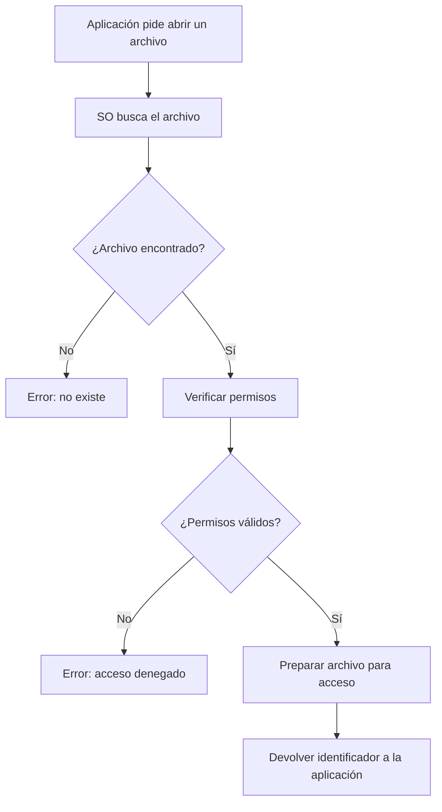

Uno de los aspectos más comunes en la programación es el manejo de archivos. Python nos facilita la interacción con archivos mediante su módulo incorporado `open()`, que permite abrir, leer, escribir y modificar archivos fácilmente.

En este artículo, nos enfocaremos en cómo __leer y escribir archivos de texto__, como los que se crean con un editor. Más adelante veremos cómo manejar archivos más complejos, como bases de datos, que son archivos binarios diseñados específicamente para ser usados por sistemas especializados.

## __¿Por qué es importante el manejo de archivos?__

El manejo de archivos es una de las habilidades más prácticas y necesarias cuando __pasas de escribir scripts simples a desarrollar aplicaciones reales en Python__. Si bien al inicio puedes resolver problemas en memoria, tarde o temprano vas a necesitar __guardar información de forma persistente__.

El manejo de archivo nos permite abrirnos a las siguientes posibilidades:

### 📁 __1. Persistencia de datos__

Guardar información para que esté disponible incluso después de cerrar el programa. Esto es clave en aplicaciones como:

- Gestores de tareas
- Juegos que necesitan guardar el progreso
- Formularios o encuestas donde se guardan respuestas
- Carritos de compras en tienda online

### 🔁 __2. Automatización de tareas__

Muchos scripts automatizados trabajan leyendo y escribiendo archivos.

- Descargar y procesar archivos de una web o API
- Renombrar archivos por lote
- Generar reportes en PDF, TXT o CSV automáticamente

### 🔗 __3. Integración con otras herramientas y sistemas__

Los archivos `.csv`, `.json`, `.xml` y `.txt` son formatos comunes para intercambiar datos:

- Abrir datos exportados desde Excel o una base de datos
- Leer archivos de configuración o logs generados por otros programas
- Escribir archivos que puedan ser leídos por herramientas externas

### 📊 __4. Análisis de grandes volúmenes de información__

En data science, los datos suelen venir en archivos planos. Python permite:

- Leer y procesar archivos de texto de gigabytes
- Transformar y limpiar información
- Convertir archivos entre distintos formatos

### 🛠️ __5. Registro y trazabilidad__

Guardar el comportamiento del programa o de los usuarios en un archivo log es fundamental para:

- Auditar acciones
- Rastrear errores
- Generar estadísticas internas

## __¿Cómo funciona la apertura de archivos?__

Para abrir un archivo, una aplicación solicita al sistema operativo el acceso y el sistema operativo gestiona su apertura. El proceso se realiza de la siguiente manera:



## __📝 Abrir archivos con Python__

La manera más habitual de trabajar con archivos en Python utilizando la función incorporada `open()`. Esta función permite abrir un archivo y especificar el __modo de apertura__, lo que determina qué tipo de operaciones se pueden realizar sobre él (leer, escribir, agregar contenido, etc).

> Es importante dominar los conceptos de **ruta relativa** y **ruta absoluta** para trabajar con archivos. Te recomiendo este artículo: <https://phoenixnap.com/kb/absolute-path-vs-relative-path>
{: .prompt-warning }

La función `open()` recipe como primer argumento la **ruta del archivo** que se desea manejar, proporcionada como una cadena de texto ( `string` ). El segundo argumento es el **modo de apertura**, también especificado como una cadena de texto, y define cómo se interactuará con el archivo.

__Sintaxis Básica - open__

```python
archivo = open("ruta/del/archivo.txt", "modo", encoding="utf-8")
```
{: .nolineno }

__Argumentos__:

- `"ruta/del/archivo.txt"`: es la ubicación del archivo que deseas abrir. Puede ser una ruta relativa (como "archivo.txt") o una ruta absoluta (como "/home/usuario/documentos/archivo.txt").

- `"modo"`: es el tipo de operación que deseas realizar en el archivo. Dependiendo del modo, podrás leer, escribir o agregar contenido al archivo.

- `encoding="utf-8"`: es opcional, pero se recomienda para evitar problemas con caracteres especiales, especialmente si estás trabajando con textos que contienen acentos, eñes, o caracteres no latinos.

__Modos de apertura__

- `"r"`: solo lectura (el archivo debe existir).
- `"w"`: solo escritura (sobrescribe el archivo si ya existe, o lo crea si no).
- `"a"`: agregar contenido al final del archivo (sin borrar lo que ya tiene).
- `"x"`: creación exclusiva (solo crea el archivo si no existe).
- `"r+"`: lectura y escritura (el archivo debe existir).

### __¿Qué es un manejador de archivo?__

Cuando usas la función `open()`, Python no abre el archivo directamente como un objeto "normal". En su lugar, __crea un objeto de tipo `TextIOWrapper`__ que sirve como __manejador__ ( o "handler" ) del archivo. Este manejador actúa como un intermediario entre tu programa y el archivo, permitiéndote leer, escribir o manipular su contenido a través de dirversos métodos.

Podemos realizar algunas pruebas en una sesión interactiva de Python:


Python 3.10.2 (main, Feb 14 2024, 23:15:40) [Clang 14.0.0 (clang-1400.0.29.202)] on darwin
Type "help", "copyright", "credits" or "license" for more information.
<span class="hl">&gt;&gt;&gt; manejador = open('mi_archivo.txt')</span>
&gt;&gt;&gt; manejador
<span class="hl">&lt;_io.TextIOWrapper name=&quot;mi_archivo.txt&quot; mode=&quot;r&quot; encoding=&quot;cp65001&quot;&gt;
</span>
&gt;&gt;&gt; type(manejador)
<span class="hl">&lt;class &quot;_io.TextIOWrapper&quot;&gt;</span>




Si el resultado de la función `open()` es exitoso, el sistema operativo nos devuelve una instancia de `TextIOWrapper` que es una clase en el módulo `io` de Python que se utiliza para manejar flujos de entrada/salida de texto, que en este caso lo estamos asignando a una variable llamada `manejador`. El **manejador de archivo** no son los datos contenidos en el archivo, sino un manejador que podemos usar para leer los datos.

## __Leer Archivo - Modo lectura ( "r" )__

Para leer un archivo sabemos que lo primero es abrir el respectivo archivo usando la función `open()`, si nos ponemos a pensar en una lista de amigos que tenemos en un archivo de texto llamado `amigos.txt` con el siguiente contenido:

```
Marco
Luis
Gabriel
Alejandro
Pedro
```
{: file='amigos.txt' }

Luego de usar la función `open`, abrimos el archivo en modo lectura (si no le pasamos un segundo argumento a la función `open()` por defecto es modo lectura) y usamos el método `read()` del manejador:


&gt;&gt;&gt; manejador = open('amigos.txt')
<span class="hl">&gt;&gt;&gt; manejador.read()</span>
&quot;Marco\nLuis\nGabriel\nAlejandro\nPedro&quot;




Este método `read()` lee todo el contenido del archivo como una sola cadena de texto. Puede ser útil para archivos pequeños.

> Una vez ejecutado el método `read()` del manejador si no se guarda el resultado en una variable, se debe volver a posicionar el puntero al inicio (usando el método `seek(0)` del maneajor).
{: .prompt-info }

### __Leer por cantidades__

El método `read()` si se le pasa el argumento `size` lee esa cantidad de bytes. Si se omite lee todo el el contenido restante del archivo.


&gt;&gt;&gt; manejador = open('amigos.txt')
<span class="hl">&gt;&gt;&gt; manejador.read(10)</span>
&quot;Marco\nLuis&quot;
<span class="hl">&gt;&gt;&gt; manejador.read()</span>
&quot;\nGabriel\nAlejandro\nPedro&quot;




### __Leer línea por línea__

El método `readline()` lee una sola línea del archivo. Es útil para leer archivos línea por línea

```py
>>> manejador = "amigos.txt"
>>> manejador.readline()
'Marco\n'
>>> manejador.readline()
'Luis\n'
>>> manejador.readline()
'Gabriel\n'
```
{: .nolineno .noheader }

### __Leer todo y separar__

El método `readlines()` lee todas las líneas del archivo y las devuelve como una lista de cadenas, donde cada línea es un elemento de la lista.

```py
>>> manejador = "amigos.txt"
>>> manejador.readlines()
['Marco\n', 'Luis\n', 'Gabriel\n', 'Alejandro']
```
{: .nolineno .noheader }


## __Escritura de un archivo - Modo lectura ( "w" )__

Para escribir texto en un archivo en Python, es necesario abrir el archivo en el **modo escritura**:

```python
manejador = open('amigos.txt', 'w')
```
{: .nolineno }

### __Escribir una sola cadena__

El método `write()` se utiliza para escribir una única cadena de texto en un archivo. Es importante destacar que __no añade automáticamente saltos de línea__. Por lo tanto, si deseas que cada entrada aparezca en una línea separada, debes incluir explícitamente el carácter de nueva línea (`\n`) al final de cada cadena.

```python
manejador = open('amigos.txt', 'w')
manejador.write("Juan")
```
{: .nolineno .noheader }

Si revisamos el archivo `amigos.txt` nos encontraremos con la sorpresa de que se sobreescribio el contenido:

```
Juan
```
{: file='amigos.txt' }

Esto sucede porque el segundo argumento `'w'` se refiere al modo de **solo escritura**, por lo que los datos existentes en el archivo de modifican y sobrescriben y si el archivo aún no existe, se crea uno nuevo. Por otro lado no podemos leer el archivo usando el método `read()` si quisieramos leer el archivo debemos usar `'w+'` para cambiar al modo de **escritura y lectura**.

### __Escribir al final de un archivo__

Tenemos entonces ahora el modo de **solo agregar** (*append*) `'a'` que nos permite abrir el archivo para escritura y de la misma forma que `'w'` si el archivo aún no existe, se crea uno nuevo. La diferencia es que en este modo el cursor del manejador se establece al final del archivo y así los datos recíen escritos se agregarán al final, manteniendo los datos escritos anteriormente:

```python
manejador = open('amigos.txt', 'a')
manejador.write("\nJuan") # '\n' es para generar un salto de línea 
```
{: .nolineno }

Al igual que en el caso anterior, si queremos además leer el archivo debemos cambiar al modificador `'a+'`.

### writelines()

El método `writelines()` nos permite escribir múltiples líneas a la vez. Ejemplo:


```py
>>> lineas = ['Primera línea\n', 'Segunda línea\n', 'Tercera línea\n']
>>> with open('archivo.txt', 'w') as archivo:
...     archivo.writelines(lineas)
```
{: .nolineno .noheader }

## __Propiedades del objeto file__

Además de los diferentes métodos que podemos acceder desde el **objeto File**, también podemos acceder a diferentes propiedades para conocer más sobre el objeto que estamos utilizando.

Se pueden acceder a las siguientes **propiedades**:

- `closed`: retorna **True** si el archivo se ha cerrado, en caso contrario será **False**.
- `mode`: retorna el modo en el que fue abierto el archivo.
- `name`: retorna el nombre del archivo.
- `encoding`: retorna la codificación de caracteres del archivo.


{:class='fs-5'}
Podemos ver un ejemplo

```py
manejador = open("amigos.txt", "a+")
content = manejador.read()
nombre = manejador.name # 'amigos.txt'
modo = manejador.mode # a+
encoding = manejador.encoding # cp1252
manejador.close()
manejador.closed # True
```
{: .nolineno .noheader }

## **Consideraciones adicionales**

### **Manejo de excepciones**

Siempre es buena práctica manejar posibles excepciones cuando se trabaja con archivos. Puedes usar `try` y `except` para capturar errores como `FileNotFoundError` o `IOError`.

### **Codificación de archivos**

Cuando trabajas con archivos de texto, es importante tener en cuenta la codificación de los datos. Python usa por defecto la codificación **UTF-8**, pero si el archivo está en otro formato, como **ISO-8859-1** (que abarca idiomas de Europa occidental) o **ASCII** (que solo abarcaba caracteres del inglés), debemos especificar la codificación al abrir el archivo:

```py
with open("archivo.txt", "r", encoding="utf-8") as archivo:
    contenido = archivo.read()
    print(contenido)
```
{: .nolineno }

### **Verificación de la existencia del archivo**

Antes de intentar abrir un archivo, especialmente si estás trabajando con archivos que podrían no existir, es recomendable verificar si el archivo existe primero. Esto evita posibles excepciones, como un `FileNotFoundError`:

```py
import os

archivo = "archivo.txt"

if os.path.exists(archivo): # Verificación con os.path:
    with open(archivo, "r") as f:
        contenido = f.read()
        print(contenido)
else:
    print("El archivo no existe.")
```
{: .nolineno }

> Esto también puede ser útil cuando estás realizando operaciones de escritura y no deseas sobrescribir un archivo accidentalmente.
{: .prompt-tip }

### __Permisos de Archivos__

En sistemas operativos como **Linux** o **MacOS**, los archivos pueden tener permisos restrictivos. Por eso debemos estar seguros si ese archivo tiene los permisos adecuados para leer o escribir en él. Por ejemplo:

```py
import os

archivo = "archivo.txt"

if os.access(archivo, os.R_OK):  # Verifica si se puede leer
    archivo = open(archivo, "r")
    print(archivo.read())
    archivo.close()
else:
    print("No tienes permiso para leer este archivo.")
```
{: .nolineno }



El manejo de archivos en Python es esencial para almacenar y recuperar datos de manera persistente. La función `open()` permite abrir archivos en diversos modos (lectura, escritura, adición) y se debe cerrar adecuadamente para liberar recursos.

Además, los métodos `write()` y `writelines()` permiten escribir datos en archivos, siendo `write()` adecuado para una única cadena y `writelines()` para listas de cadenas. Es importante recordar que ninguno de estos métodos añade saltos de línea automáticamente; por lo tanto, se debe incluir explícitamente `\n` si se desea separar las líneas en el archivo.