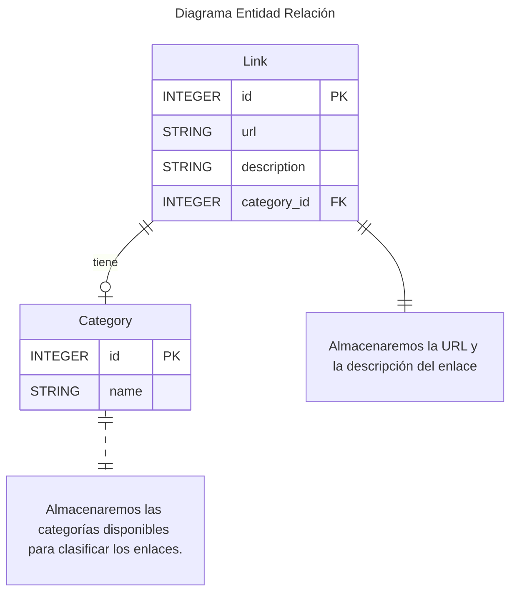

Vamos a desarrollar una sencilla aplicación de consola para gestionar enlaces, con dos tablas. La aplicación permitirá **agregar**, **listar**, **actualizar** y **eliminar** categorías y enlaces en la base de datos. Podemos visualizar esa relación en el siguiente diagrama:



### **Conexión y configuración de la base de datos**

Creamos el archivo `db.py` que se encargará de la conexión a la base de datos y la creación de las tablas:



```terminal
touch db.py
```


```terminal
type null > db.py
```



{: .nolineno }

El código que escribamos en este módulo tiene como objetivo **conectarse a la base de datos SQLite**, **ejecutar consultas SQL** y **crear la estructura de la base de datos a partir de un archivo SQL externo**. Es una forma más modular y limpia de manejar las conexiones y consultas.

#### **Importarciones**

Lo primero que necesitamos es importar las librerías que nos ayudarán a conectar con SQLite, gestionar las rutas de los archivos y utilidades para las anotaciones de los tipos:

```py
import sqlite3, os
from sqlite3 import Error
from typing import Optional, List, Any
```
{: .nolineno file="db.py" }

- `sqlite3`: El módulo que proporciona la interfaz de Python para interactuar con bases de datos SQLite.
- `Error`: Importamos la clase `Error` para manejar excepciones relacionadas con errores en la base de datos.
- `os`: Este módulo nos permite gestionar rutas de archivos y directorios. En este caso, es útil para encontrar la ruta del archivo SQL que contiene la estructura de la base de datos.
- `typing`: Es un módulo que proporciona herramientas para mejorar la claridad del código mediante anotaciones de tipo. Estas anotaciones ayudan a los desarrolladores y herramientas automáticas (como linters y IDEs) a entender los tipos esperados.

#### **Declaración de Constantes**

A continuación, declaramos algunas constantes que utilizaremos para gestionar las rutas de los archivos de nuestra base de datos. Usamos **mayúsculas** para indicar que estas variables son constantes (esto es una convención), lo que significa que su valor no cambiará durante la ejecución del programa:

```py
CURDIR = os.path.dirname(os.path.abspath(__file__))
FILENAME = "schema.sql"
FILE = os.path.join(CURDIR, "db", FILENAME)
```
{: .nolineno file="db.py" }

- `CURDIR`: Utilizamos `os.path.abspath(__file__)` para obtener la ruta del archivo que se está ejecutando. Después, con `os.path.dirname()`, extraemos solo el directorio, sin incluir el nombre del archivo. Así obtenemos el **directorio donde se encuentra el script**. Esto es útil si queremos ubicar otros archivos en el mismo directorio o en subcarpetas sin depender de la ubicación desde la que ejecutemos el script.
- `FILENAME`: Es el nombre del archivo SQL que contiene las instrucciones para crear las tablas y la estructura de la base de datos. En nuestro caso, llamamos a este archivo `schema.sql`.
- `FILE`: Aquí estamos utilizando `os.path.join()` para generar la **ruta completa** del archivo `schema.sql` que se encuentra dentro de una subcarpeta llamada `db`. Usar `os.path.join()` asegura que las rutas se generen correctamente en cualquier sistema operativo, sin preocuparnos de las barras (`\` o `/`) que puedan variar.

#### **Conectar a la Base de Datos**

Ahora, creamos una función que se encargará de **abrir la conexión a la base de datos**. Esta es una de las primeras cosas que necesitamos hacer cuando interactuamos con una base de datos. La razón de crear esta función es para **centralizar la conexión a la base de datos**. Al hacerlo, evitamos tener que escribir varias veces el mismo código para conectarnos a la base de datos cada vez que queramos hacer una operación. Además, si en el futuro necesitamos cambiar el tipo de base de datos o ajustar la conexión, solo tendríamos que modificar esta función.

Aquí tienes el código de la función:

```py
def open_db() -> Optional[sqlite3.Connection]:
    try:
        con = sqlite3.connect('gestion_links.db')
        return con

    except Error as e:
        print('Error: ', e)
        return None
```
{: .nolineno file="db.py" }

- `open_db() -> Optional[sqlite3.Connection]`: Esto indica que la función puede devolver un objeto de tipo `sqlite3.Connection` o puede devolver `None` si la conexión no se establece correctamente.
- `sqlite3.connect('gestion_links.db')`: Con esta línea intentamos abrir la base de datos `gestion_links.db`. Si no existe, SQLite la creará automáticamente.
- `return con`: Si la conexión es exitosa, devolvemos el objeto de conexión para usarlo más tarde en operaciones con la base de datos.
- `except Error as e`: Si ocurre un error al intentar conectarse, lo capturamos y mostramos el mensaje de error.

#### **Ejecutar Consultas SQL**

Una vez tenemos la conexión, necesitamos una función que ejecute las consultas SQL. Es importante que esta función sea lo suficientemente flexible para ejecutar tanto consultas **simples** como **múltiples**. Creamos una función `run_query()` que nos permite **modularizar las consultas SQL**, evitando la repitición de código. Además, con esta función centralizamos el manejo de errores de las consultas SQL, lo que hace que el código sea más robusto y fácil de mantener.

Aquí tienes el código de la función:

```py
def run_query(sql: str = '', params: Optional[List[Any]] = None, multiple: bool = False) -> sqlite3.Cursor:
    if params is None:
        params = []

    try:
        with open_db() as con:
            cursor = con.cursor()
                if multiple:
                    cursor.executemany(sql, params)
                else:
                    cursor.execute(sql, params)
                
                if sql.strip().lower().startswith("select"):
                    return cursor
                con.commit()

    except Error as e:
        print("Error al ejecutar la consulta:", e)
        raise
```
{: .nolineno file="db.py" }

**Parámetros de la Función:**

- `sql`: Es la consulta SQL que se va a ejecutar. Si no se pasa, por defecto es una cadena vacía.
- `params`: Es una lista opcional de parámetros que se pasará a la consulta SQL, como los valores en una sentencia `INSERT`, `UPDATE`, o `SELECT`. Si no se pasa, la función crea una lista vacía.
- `multiple`: Un parámetro booleano que indica si se deben ejecutar múltiples consultas al mismo tiempo (por ejemplo, cuando usamos `executemany()` para insertar muchos registros de una vez). Si es `False`, solo se ejecutará una consulta.

#### **Crear la Estructura de la Base de Datos**

Una vez tenemos la capacidad de ejecutar consultas, necesitamos una función que nos ayude a crear la **estructura inicial** de la base de datos, es decir, las tablas, relaciones y demás elementos necesarios. Esta función `create_schema()` tiene el próposito de leer el archivo `schema.sql` (que contiene las instrucciones SQL para crear las tablas) y lo ejecuta.

Aquí tienes el código de la función:

```py
def create_schema() -> bool:
    try:
        with open(FILE, 'r') as sql_file:
            sql_script = sql_file.read() 

        with open_db() as con:
            con.executescript(sql_script)

        print("Base de datos creada exitosamente.")
        return True

    except (FileNotFoundError, IOError) as e:
        print(f"Error al abrir o leer el archivo {FILE}: {e}")
        return False
```
{: .nolineno file="db.py" }

- `with open(FILE, 'r') as sql_file`: Aquí utilizamos la función `open()` para abrir archivos dentro el **context manager** `with`, `FILE` es la constante que apunta a la ubicación del archivo SQL que contiene el esquema de la base de datos.
- `sql_file.read()`: Lee completamente el archivo y se guarda en la variable `sql_script`.
- `with open_db() as con`: La función que mencionamos antes que abre la conexión y las contenemos en la variable `con`.
- `con.executescript(sql_script)`: Es un método de la conexión (`con`) en SQLite que se utiliza para ejecutar múltiples sentencias SQL.
- `(FileNotFoundError, IOError) as e`: Capturamos tanto los errores de "archivo no encontrado" (`FileNotFound`) como errores generales de entrada/salida (`IOError`).


### **Definición de Entidades**

Aunque en SQLite no es estrictamente necesario usar clases de modelos como en un ORM, podemos hacer representaciones de nuestras tablas como clases para tener una estructura clara.

Aquí tienes el código completo para nuestro módulo `models.py`:

```py
class Category:
    """Modelo de la tabla Category."""
    def __init__(self, id: int, name: str):
        self.id = id
        self.name = name

    def __repr__(self):
        return f"Category(id={self.id}, name={self.name})"

class Link:
    """Modelo de la tabla Link."""
    def __init__(self, id: int, url: str, description: str, category_id: int):
        self.id = id
        self.url = url
        self.description = description
        self.category_id = category_id

    def __repr__(self):
        return f"Link(id={self.id}, url={self.url}, description={self.description}, category_id={self.category_id})"
```
{: file="models.py" }

### **Crear el script de arranque**

Para ello creamos un nuevo archivo `main.py`



```terminal
touch main.py
```


```terminal
type null > main.py
```



Este archivo actuará como el script principal, desde donde puedes probar la funcionalidad de todo el sistema.
