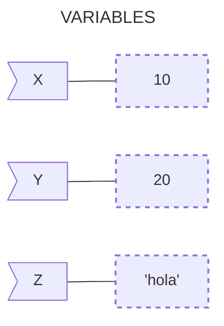

En el mundo de la programación, las variables son conceptos fundamentales que actúan como contenedores para almacenar datos. En Python, las variables son sencillas de usar y entender, lo que hace que sea un lenguaje amigable para quienes están comenzando a programar. En este artículo, exploraremos qué son las variables en Python, cómo se usan, y algunas de las características más interesantes sobre las variables.

## **¿Qué es una Variable?**

### **Variables en Matemáticas**

El concepto de "variable" proviene de las Matemáticas. En Matemáticas, una variable es un símbolo que forma parte de una expresión o formula. Normalmente las variables se representan mediante letras del alfabeto latino (x, y, z, n, j, etc). Dependiendo del contexto, las variables significan cosas distintas. Por ejemplo en el caso del Álgebra, una variable representa una cantidad desconocida que se relaciona con otras y que en algunos casos podemos averiguar. Consideremos por ejemplo la siguiente ecuación:

$$ x + 3 = 4 $$
{: .fs-1 }

En este caso, la variable `x` representa una cantidad desconocida pero de la que se sabe si se le suma 3 obtiene 4. Resolviendo la ecuación, entendemos inmediatamente que la variable `x` estaba representando realmente el número 1.


### **Variables en Programación**

En Programación también existe el concepto de "variable", parecido pero no idéntico al concepto matemático. En términos simples, una variable en programación es un nombre que se asocia a un valor y que se almacena en la memoria principal de tu computadora. Este valor puede ser cualquier cosa: un **número**, una **cadena de texto**, una **lista**, y cualquier tipo de dato que sea válido en el lenguaje de programación específico. En algunos lenguajes de programación, las variables se pueden entender como "cajas" en las que se guardan datos, pero cuando estamos aprendiendo Python es mejor pensar en las variables como si fueran "etiquetas" que le das a los datos para que puedas referenciarlos y que se guardan en "cajas" llamadas objetos.



## **Declaración y Asignación de Variables en Python**

En Python, puedes declarar una variable simplemente asignándole un valor. No necesitas especificar el tipo de dato de la variable, ya que Python lo infiere automáticamente. Para asignar un valor a una variable se utiliza el operador de igualdad (`=`). A la izquierda se escribe el nombre de la variable y a la derecha el valor que se quiere dar a la variable.


<span class="hl">$ python3</span>
Python 3.9.1 (main, Dec 27 2022, 14:58:32) [Clang 14.0.0 (clang-1400.0.29.202)] on darwin
Type "help", "copyright", "credits" or "license" for more information.
<span class="hl">&gt;&gt;&gt; edad = 33</span>
<span class="hl">&gt;&gt;&gt; nombre = "Marco"</span>
<span class="hl">&gt;&gt;&gt; altura = 1.80</span>



En el ejemplo anterior ingresamos al intérprete de Python con el comando `python3` y asignamos 3 variables:
- `edad` almacena un número entero.
- `nombre` almacena una cadena de texto.
- `altura` almacena un número de punto flotante.

Si una variable no se ha definido previamente, si tratamos de referenciarla se genera un error:


<span class="hl">&gt;&gt;&gt; peso</span>
Traceback (most recent call last):
  File "&lt;python-input-3&gt;", line 1, in &lt;module&gt;
    peso
<span class="hl">NameError: name 'peso' is not defined</span>



> Siempre debes ser consciente de inicializar las variables antes de usarlas para evitar errores y mantener el código limpio y comprensible.
{: .prompt-tip }

## **Tipos de Datos**

Python maneja varios tipos de datos básicos que puedes almacenar en variables. Algunos de esos tipos de datos ya fueron definidos en los ejemplos anteriores, entre los tipos de datos más comunes se incluyen:

- **`int` (Números Enteros)**: `5`, `42`, `1000`
- **`float` (Números de Punto Flotante)**: `3.14`, `0.99`, `1.0`
- **`str` (Cadenas de Texto)**: `"Hola"`, `"Python"`, `"123"`
- **`bool` (Booleanos)**: `True`, `False` (En contextos booleanos, Python también trata `1` como `True` y `0` como `False`)

Una variable además puede almacenar estructuras más complicadas (que se verán más adelante). Si se va a almacenar texto, el texto debe escribirse entre comillas simples (`'`) o dobles (`''`). A las variables que almacenan texto se les suele llamar cadenas (de texto).


<span class="hl">&gt;&gt;&gt; nombre = "Marco Contreras"</span>
&gt;&gt;&gt; nombre
<span class="hl">'Marco Contreras'</span>



Si no se escriben comillas, Python supone que estamos haciendo referencia a otra variable (que, si no está definida, genera un mensaje de error):


<span class="hl">&gt;&gt;&gt; nombre = Javier</span>
Traceback (most recent call last):
  File "&lt;python-input-2&gt;", line 1, in &lt;module&gt;
    <span class="hl">nombre = Javier</span>
             ^^^^^^
<span class="hl">NameError: name 'Javier' is not defined</span>




Puedes convertir entre estos tipos de datos usando funciones integradas como `int()`, `float()`, y `str()`.
```python
numero = 5
texto = str(numero)  # Convierte el número 5 a la cadena "5"
```
{: .nolineno }


## **Reglas para Nombrar Variables**

Aunque no es obligatorio, en Python, se recomienda seguir algunas reglas y convenciones para nombrar variables:

**1. Empezar con una letra o un guion bajo**

Los nombres de las variables deben comenzar con una letra (a-z, A-Z) o un guion bajo (`_`). No pueden comenzar con un número. Ej:


&gt;&gt;&gt; _variable = "valor"
&gt;&gt;&gt; variable1 = "valor"



**2. Usar solo caracteres alfanuméricos y guiones bajos**

  Después del primer carácter, puedes usar letras, números y guiones bajos.


&gt;&gt;&gt; mi_variable = "valor"
&gt;&gt;&gt; variable_2 = "valor"




**3. No uses palabras reservadas**

Evita usar palabras que son reservadas por Python (como `if`, `for`, `while`, etc.) como nombres de variables.



<span class="hl">&gt;&gt;&gt; for = "valor"</span>
  File "&lt;python-input-5&gt;", line 1
    for = "valor"
        ^
<span class="hl">SyntaxError: invalid syntax</span>




**4. Usa nombres descriptivos**

Es una buena práctica usar nombres de variables que sean descriptivos para hacer que tu código sea más legible.

```python
usuario = 'john_doe'
autenticado = False
creditos = 99.0
```
{: .nolineno }


## **Actualización y Eliminación de Variables**

Una vez que una variable ha sido creada, puedes actualizar su valor simplemente asignándole un nuevo valor.


<span class="hl">&gt;&gt;&gt; edad = 30</span>
<span class="hl">&gt;&gt;&gt; edad = 31</span> # Actualiza el valor de la variable edad




Si necesitas eliminar una variable, puedes usar la instrucción `del` que borra completamente una variable.


<span class="hl">&gt;&gt;&gt; del edad</span>
<span class="hl">&gt;&gt;&gt; edad</span> # Actualiza el valor de la variable edad
Traceback (most recent call last):
  File "&lt;python-input-14&gt;", line 1, in &lt;module&gt;
    edad
NameError: name 'edad' is not defined



```python
del edad  # Elimina la variable edad
```

### Variables Globales y Locales

En Python, una variable puede ser global o local. Las variables globales son accesibles desde cualquier parte del código, mientras que las variables locales solo son accesibles dentro de la función o bloque de código en el que se definen.

```python
variable_global = "Soy global"

def mi_funcion():
    variable_local = "Soy local"
    print(variable_global)  # Accede a la variable global
    print(variable_local)   # Accede a la variable local

mi_funcion()
print(variable_global)  # Funciona
print(variable_local)   # Esto causará un error, ya que variable_local no está definida fuera de la función
```
{: .nolineno }

```py
Traceback (most recent call last):
  File "main.py", line 10, in <module>
    print(variable_local)
NameError: name 'variable_local' is not defined
```
{: .nolineno .noheader }


Las variables son la base de la programación en Python. Son simples pero poderosas, permitiéndote almacenar y manipular datos de manera eficiente. Entender cómo funcionan las variables y cómo usarlas correctamente es esencial para escribir código limpio y funcional.

¡Ahora que conoces lo básico sobre las variables en Python, estás listo para comenzar a experimentar y a desarrollar tus propios programas! Sigue explorando y practicando, y verás cómo estas pequeñas herramientas se convierten en grandes aliados en tu camino.