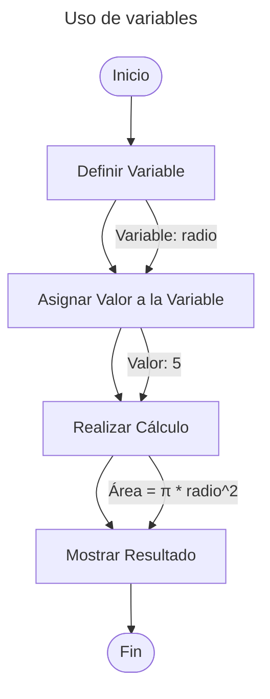

En el mundo de la programación, las variables son conceptos fundamentales que actúan como contenedores para almacenar datos. En Python, las variables son sencillas de usar y entender, lo que hace que sea un lenguaje amigable para quienes están comenzando a programar. En este artículo, exploraremos qué son las variables en Python, cómo se usan, y algunas de las características más interesantes sobre las variables.

## **¿Qué es una Variable?**

En términos simples, una variable es un nombre que se asocia a un valor en la memoria de tu computadora. Este valor puede ser cualquier cosa: un **número**, una **cadena de texto**, una **lista**, y cualquier tipo de dato que sea válido en Python. Piensa en las variables como etiquetas que le das a los datos para que puedas referenciarlos y manipularlos fácilmente en tu código.

{: .light }
{: .dark }

## **Tipos de Datos**

Python maneja varios tipos de datos básicos que puedes almacenar en variables. Algunos de los tipos de datos más comunes incluyen:

- **`int` (Números Enteros)**: `5`, `42`, `1000`
- **`float` (Números de Punto Flotante)**: `3.14`, `0.99`, `1.0`
- **`str` (Cadenas de Texto)**: `"Hola"`, `"Python"`, `"123"`
- **`bool` (Booleanos)**: `True`, `False` (En contextos booleanos, Python también trata `1` como `True` y `0` como `False`)

Puedes convertir entre estos tipos de datos usando funciones integradas como `int()`, `float()`, y `str()`.
```python
numero = 5
texto = str(numero)  # Convierte el número 5 a la cadena "5"
```
{: .nolineno }


El siguiente diagrama de flujo ilustra cómo se define una variable, se realiza un cálculo usando esa variable, y luego se muestra el resultado.



## **Declaración y Asignación de Variables**

En Python, puedes declarar una variable simplemente asignándole un valor. No necesitas especificar el tipo de dato de la variable, ya que Python lo infiere automáticamente. Esto hace que la sintaxis sea muy sencilla.

```python
# Declaración y asignación de una variable
edad = 33
nombre = "Marco"
altura = 1.80
```

En el ejemplo anterior:
- `edad` almacena un número entero.
- `nombre` almacena una cadena de texto.
- `altura` almacena un número de punto flotante.

### **Reglas para Nombrar Variables**

En Python, existen algunas reglas y convenciones para nombrar variables:

1. **Empieza con una letra o un guion bajo**: Los nombres de las variables deben comenzar con una letra (a-z, A-Z) o un guion bajo (`_`). No pueden comenzar con un número.

```python
_variable = "valor"
variable1 = "valor"
```
{: .nolineno }

{: start="2" }
2. **Usa solo caracteres alfanuméricos y guiones bajos**: Después del primer carácter, puedes usar letras, números y guiones bajos.

```python
mi_variable = "valor"
variable_2 = "valor"
```
{: .nolineno }

{: start="3" }
3. **No uses palabras reservadas**: Evita usar palabras que son reservadas por Python (como `if`, `for`, `while`, etc.) como nombres de variables.

{: start="4" }
4. **Usa nombres descriptivos**: Es una buena práctica usar nombres de variables que sean descriptivos para hacer que tu código sea más legible.

```python
usuario = 'john_doe'
autenticado = False
creditos = 99.0
```
{: .nolineno }


### **Actualización y Eliminación de Variables**

Una vez que una variable ha sido creada, puedes actualizar su valor simplemente asignándole un nuevo valor.
```python
edad = 30
edad = 31  # Actualiza el valor de la variable edad
```

Si necesitas eliminar una variable, puedes usar el comando `del`.
```python
del edad  # Elimina la variable edad
```

### Variables Globales y Locales

En Python, una variable puede ser global o local. Las variables globales son accesibles desde cualquier parte del código, mientras que las variables locales solo son accesibles dentro de la función o bloque de código en el que se definen.

```python
variable_global = "Soy global"

def mi_funcion():
    variable_local = "Soy local"
    print(variable_global)  # Accede a la variable global
    print(variable_local)   # Accede a la variable local

mi_funcion()
print(variable_global)  # Funciona
print(variable_local)   # Esto causará un error, ya que variable_local no está definida fuera de la función
```
{: .nolineno }

```py
Traceback (most recent call last):
  File "main.py", line 10, in <module>
    print(variable_local)
NameError: name 'variable_local' is not defined
```
{: .nolineno .noheader }


Las variables son la base de la programación en Python. Son simples pero poderosas, permitiéndote almacenar y manipular datos de manera eficiente. Entender cómo funcionan las variables y cómo usarlas correctamente es esencial para escribir código limpio y funcional.

¡Ahora que conoces lo básico sobre las variables en Python, estás listo para comenzar a experimentar y a desarrollar tus propios programas! Sigue explorando y practicando, y verás cómo estas pequeñas herramientas se convierten en grandes aliados en tu camino.