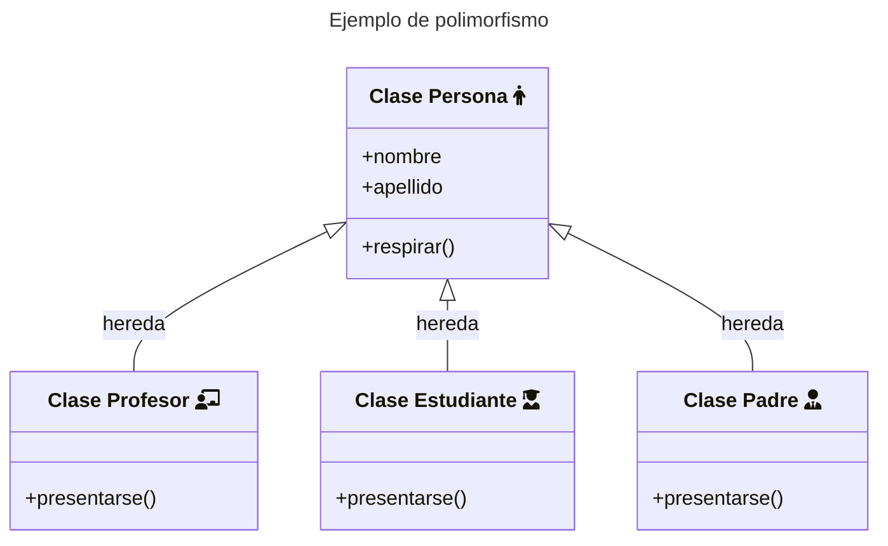

En artículos anteriores mencionaba de una forma breve el concepto de **polimorfismo**. Aquí vamos a ver no solo código sino que también su representación en los **diagramas de clases**. El polimorfismo es una técnica que nos posibilita que al invocar un determinado método de un objeto, pueden obtenerse distintos resultados según su clase. En otras palabras podemos crear distintos objetos de diferentes clases y que todas compartan un método con el mismo nombre, pero que realice acciones diferentes.

Un ejemplo de esto en un diagrama de clases podría ser la siguiente: **profesor**, **padre**, **estudiante** son **personas**:



En este ejemplo, las tres clases (**Profesor**, **Padre**, **Estudiante**) podrán utilizar el **método respirar**, ya que lo **heredan** de la **clase persona**, pero podemos ver que tanto la clase **Profesor**, la clase **Estudiante** y la clase **Padre** tienen el método `presentarse()`.


Si queremos llevar el ejemplo a código, tendríamos que comenzar definiendo la clase **Persona** y luego el resto:

```py
class Persona:

    def __init__(self, nombre, apellido):
        self.nombre = nombre
        self.apellido = apellido

    def respirar(self):
      print("respirando")

class Profesor(Persona):
  def presentarse():
    pass

class Estudiante(Persona):
  def presentarse():
    pass

class Padre(Persona):
  def presentarse():
    pass
```
{: .nolineno }

Hasta aquí podemos ver como efectivamente las clases (**Profesor**, **Estudiante**, **Padre**) son subclases de **Persona**:



```python
print(Profesor.__bases__)
print(Estudiante.__bases__)
print(Padre.__bases__)
```
{: .nolineno }


```
(<class '__main__.Persona'>,)
(<class '__main__.Persona'>,)
(<class '__main__.Persona'>,)
```
{: .nolineno .noheader }



Y de forma análoga podemos ver que clases descienden de una en concreto:



```
print(Persona.__subclasses__())
```
{: .nolineno }


```
[<class '__main__.Profesor'>, <class '__main__.Estudiante'>, <class '__main__.Padre'>]
```
{: .nolineno .noheader }




*[POO]: Programación orientada a objetos
*[DRY]: Don't Repeat Yourself
