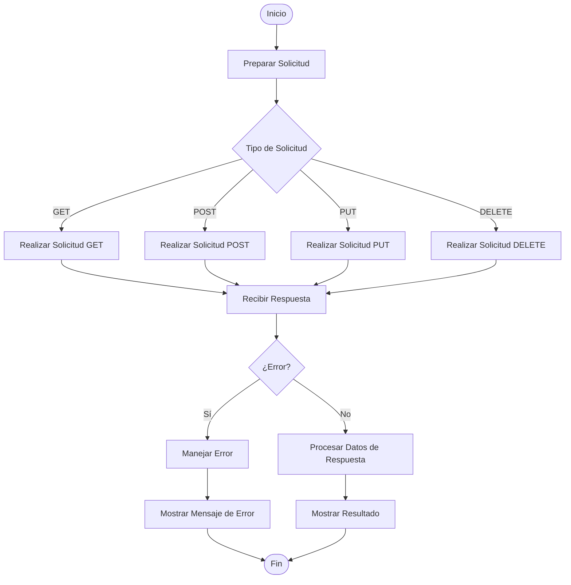

## Introducción al Módulo requests en Python:<br>Cómo Hacer Solicitudes HTTP de Forma Sencilla

En el mundo de la programación web, interactuar con APIs y servicios en línea a menudo implica enviar solicitudes HTTP. Python, ofrece varias maneras de hacer esto, pero el módulo `requests` es ampliamente reconocido por su simplicidad y potencia. En este artículo, exploraremos cómo usar el módulo `requests` para realizar solicitudes HTTP en Python, cubriendo lo básico y proporcionando ejemplos prácticos para que puedas comenzar a usarlo en tus proyectos.

### ¿Qué es el Módulo requests?

El módulo `requests` es una biblioteca de Python que facilita la realización de solicitudes HTTP. Proporciona una interfaz sencilla y legible para enviar solicitudes HTTP/1.1 y manejar respuestas, lo que simplifica significativamente la tarea de interactuar con servicios web y APIs.

### Instalación

Para comenzar a usar `requests`, primero debes instalarlo. Puedes hacerlo fácilmente usando `pip`, el gestor de paquetes de Python:

```bash
pip install requests
```
{: .nolineno }

### Hacer Solicitudes HTTP Básicas

El módulo `requests` permite realizar diversos tipos de solicitudes HTTP.

A continuación vemos un diagrama de flujo que ilustra el proceso general de hacer solicitudes HTTP usando el módulo `requests` en Python. Este diagrama muestra los pasos clave, desde la preparación de la solicitud hasta el manejo de la respuesta.




Ahora veremos algunos ejemplos básicos.

#### Solicitud GET

La solicitud `GET` se utiliza para obtener datos de un servidor. Aquí tienes un ejemplo de cómo hacer una solicitud `GET` para obtener datos de una API:

```python
import requests

# URL del recurso
url = 'https://jsonplaceholder.typicode.com/posts/1'

# Realizar la solicitud GET
response = requests.get(url)

# Imprimir el contenido de la respuesta
print(response.status_code)  # Código de estado HTTP
print(response.json())       # Contenido de la respuesta en formato JSON
```

En este ejemplo:
- `requests.get(url)` realiza la solicitud `GET` a la URL proporcionada.
- `response.status_code` muestra el código de estado HTTP (por ejemplo, 200 para éxito).
- `response.json()` convierte el contenido de la respuesta en un objeto Python (si es JSON).


Cuando realizas solicitudes HTTP en Python utilizando el módulo `requests`, a menudo la respuesta del servidor viene en formato JSON. El módulo `requests` facilita el manejo de estas respuestas y te permite trabajar con datos JSON de manera sencilla.

Aquí te muestro cómo formatear y trabajar con respuestas JSON en Python usando el módulo `requests`.


1. **Convertir la Respuesta a JSON**

   Si el código de estado indica éxito, puedes convertir la respuesta en formato JSON utilizando el método `.json()` del objeto de respuesta.

   ```python
   data = response.json()
   ```

2. **Formatear el JSON para su Lectura**

   Para imprimir el JSON de manera legible, puedes usar el módulo `json` de Python para formatear el contenido. Aquí hay un ejemplo de cómo hacerlo:

   ```python
   import json

   # Convertir la respuesta a JSON
   data = response.json()

   # Formatear el JSON
   formatted_json = json.dumps(data, indent=4)
   print(formatted_json)
   ```

   En este ejemplo:
   - `json.dumps()` convierte el objeto Python a una cadena JSON.
   - El parámetro `indent=4` agrega sangrías para que el JSON sea más legible.


Aquí tienes el código completo que realiza una solicitud, verifica el estado, convierte la respuesta a JSON, y luego la formatea para su lectura:

```python
import requests
import json

# URL del recurso
url = 'https://jsonplaceholder.typicode.com/posts/1'

# Realizar la solicitud GET
response = requests.get(url)

# Verificar el código de estado
if response.status_code == 200:
    print("Solicitud exitosa.")

    # Convertir la respuesta a JSON
    data = response.json()

    # Formatear el JSON para su lectura
    formatted_json = json.dumps(data, indent=4)
    print(formatted_json)
else:
    print(f"Error: {response.status_code}")
```

#### 2. Solicitud POST

La solicitud `POST` se utiliza para enviar datos al servidor. Aquí tienes un ejemplo de cómo enviar datos usando una solicitud `POST`:

```python
import requests

# URL del recurso
url = 'https://jsonplaceholder.typicode.com/posts'

# Datos a enviar
data = {
    'title': 'foo',
    'body': 'bar',
    'userId': 1
}

# Realizar la solicitud POST
response = requests.post(url, json=data)

# Imprimir el contenido de la respuesta
print(response.status_code)
print(response.json())
```

En este ejemplo:
- `requests.post(url, json=data)` realiza la solicitud `POST` con datos en formato JSON.
- El servidor recibe los datos y responde con el resultado.

#### 3. Solicitud PUT

La solicitud `PUT` se usa para actualizar un recurso existente. Aquí tienes un ejemplo:

```python
import requests

# URL del recurso
url = 'https://jsonplaceholder.typicode.com/posts/1'

# Datos a actualizar
data = {
    'title': 'foo updated',
    'body': 'bar updated',
    'userId': 1
}

# Realizar la solicitud PUT
response = requests.put(url, json=data)

# Imprimir el contenido de la respuesta
print(response.status_code)
print(response.json())
```

En este ejemplo:
- `requests.put(url, json=data)` envía datos actualizados al servidor.

#### 4. Solicitud DELETE

La solicitud `DELETE` se usa para eliminar un recurso:

```python
import requests

# URL del recurso
url = 'https://jsonplaceholder.typicode.com/posts/1'

# Realizar la solicitud DELETE
response = requests.delete(url)

# Imprimir el código de estado
print(response.status_code)
```

En este ejemplo:
- `requests.delete(url)` realiza la solicitud para eliminar el recurso en la URL proporcionada.

### Manejo de Parámetros y Encabezados

El módulo `requests` permite agregar parámetros y encabezados a tus solicitudes.

#### Parámetros de Consulta:

Para enviar parámetros en la URL (como en una solicitud `GET`), puedes usar el argumento `params`:

```python
import requests

# URL del recurso
url = 'https://jsonplaceholder.typicode.com/posts'

# Parámetros de consulta
params = {
    'userId': 1
}

# Realizar la solicitud GET con parámetros
response = requests.get(url, params=params)

# Imprimir el contenido de la respuesta
print(response.status_code)
print(response.json())
```

#### Encabezados:

Puedes agregar encabezados personalizados a tus solicitudes usando el argumento `headers`:

```python
import requests

# URL del recurso
url = 'https://jsonplaceholder.typicode.com/posts'

# Encabezados personalizados
headers = {
    'Content-Type': 'application/json',
    'Authorization': 'Bearer tu_token_aqui'
}

# Realizar la solicitud GET con encabezados
response = requests.get(url, headers=headers)

# Imprimir el contenido de la respuesta
print(response.status_code)
print(response.json())
```

### Manejo de Errores

El módulo `requests` también te permite manejar errores de manera efectiva. Puedes verificar si una solicitud fue exitosa utilizando `response.raise_for_status()`:

```python
import requests

try:
    response = requests.get('https://jsonplaceholder.typicode.com/invalid-url')
    response.raise_for_status()  # Lanza una excepción para códigos de estado 4xx/5xx
except requests.exceptions.HTTPError as err:
    print(f'Error HTTP: {err}')
except Exception as err:
    print(f'Error: {err}')
```

En este ejemplo:
- `response.raise_for_status()` lanza una excepción si el código de estado HTTP indica un error.

### Conclusión

El módulo `requests` simplifica enormemente la interacción con servicios web en Python, proporcionando una API fácil de usar para realizar solicitudes HTTP. Ya sea que necesites obtener datos, enviar información, actualizar recursos o eliminar datos, `requests` facilita la tarea con una sintaxis intuitiva y poderosa.

Con los ejemplos y técnicas descritos en este artículo, ahora tienes una base sólida para comenzar a utilizar `requests` en tus proyectos de Python. ¡Explora, experimenta y disfruta del poder de las solicitudes HTTP en tu código!

---

Espero que este artículo te haya proporcionado una comprensión clara de cómo usar el módulo `requests` en Python y te inspire a integrarlo en tus proyectos de programación. ¡Feliz codificación!
