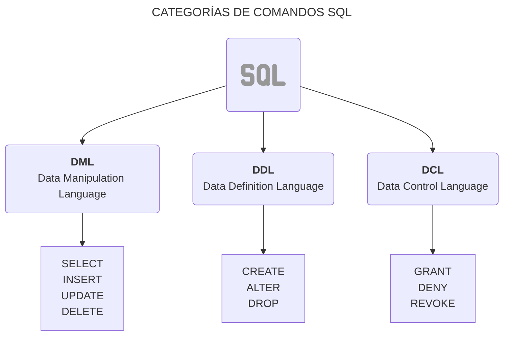

Como sabemos **SQL** (Structured Query Language) es un lenguaje estándar para gestionar bases de datos. Sin embargo, SQL es un conjunto de comandos que se organizan en diferentes **sublenguajes** que cumplen roles específicos.

A continución tenemos un diagrama que nos muestra esos **sublenguajes**:



## **¿Qué son las operaciones CRUD?**

Las operaciones **CRUD** son los cuatros pilares fundamentales en la gestión de datos en una base de datos. CRUD es un acrónimo de las siguientes acciones:

- **C**reate (Crear): Insertar nuevos datos en una tabla.
- **R**ead (Leer): Consultar y obtener datos de una tabla.
- **U**pdate (Actualizar): Modificar los datos existentes.
- **D**elete (Eliminar): ELiminar datos de una tabla.

Antes de poder realizar cualquier operación CRUD, debemos crear una base de datos y definir la estructura de nuestras tablas.

Para crear una base de datos, usamos el comando `CREATE DATABASE`. A continuación, se muestra el ejemplo:

```sql
CREATE DATABASE empresa;
````
{: .nolineno }

Este comando crea una base de datos llamada `empresa`. Para comenzar a usarla, debemos **seleccionarla** con el comando `USE`:

```sql
USE empresa;
```
{: .nolineno }

> Para que el **prompt de MySQL** muestre el nombre de la base de datos a la que estás conectado, puedes ejecutar el siguiente comando en la terminal `prompt \u@\h [\d]>\_`.
{: .prompt-tip }

Ahora que tenemos nuestra base de datos, podemos crear tablas dentro de ella. Vamos a crear una tabla de empleados, donde almacenaremos información como el nombre, puesto, fecha de ingreso y su estado:

```sql
CREATE TABLE empleados (
    id INT AUTO_INCREMENT PRIMARY KEY,  -- ID único para cada empleado (auto incrementable)
    nombre VARCHAR(100) NOT NULL,       -- Nombre del empleado
    puesto VARCHAR(50),                 -- Puesto o cargo
    fecha_ingreso DATE,                 -- Fecha de ingreso del empleado
    activo BOOLEAN DEFAULT TRUE         -- Estado del empleado (activo o no)
);
```
{: .nolineno }

### **1. Crear Datos (Insertar Registros)**

La operación de **crear** datos en MySQL se realiza mediante el comando `INSERT INTO`. A continuación, tenemos ejemplos de cómo insertar datos en la table `empleados` que creamos previamente.

**Insertar un solo registro**

```sql
INSERT INTO empleados (nombre, puesto, fecha_ingreso)
VALUES ('Juan Pérez', 'Desarrollador', '2022-01-15');
```
{: .nolineno }

En este caso, estamos insertando un registro en la tabla `empleados` con los siguientes valores:

- **nombre**: Juan Pérez
- **puesto**: Desarrollador
- **fecha_ingreso**: 2022-01-15

El campo `id` se autoincrementa automáticamente y el campo `activo` se establece en `TRUE` por defecto.

**Insertar múltiples registros**

También es posible insertar múltiples en una sola consulta:

```sql
INSERT INTO empleados (nombre, puesto, fecha_ingreso)
VALUES
  ('Ana Gómez', 'Gerente', '2019-03-22'),
  ('Luis Díaz', 'Diseñador', '2021-07-10');
```
{: .nolineno }

### **2. Leer Datos**

La operación de **leer** datos se realiza mediante el comando `SELECT`. Podemos usar este comando para consultar toda la tabla o solo una parte de los datos.

**Consultar todos los registros**

Si queremos ver todos los registros de la tabla `empleados`, podemos usar la siguiente consulta:

```sql
SELECT * FROM empleados;
```
{: .nolineno }

> El (`*`) se utiliza para seleccionar todas las columnas de la tabla. El resultado incluirá todas las filas y columnas de la tabla `empleados`.
{: .prompt-info }

**Consultar columnas específicas**

Si solo necesitamos algunos datos, como el nombre y el puesto de los empleados, podemos especificar las columnas que queremos en la consulta:

```sql
SELECT nombre, puesto FROM empleados;
```
{: .nolineno }

**Filtrar resultados con WHERE**

La cláusula `WHERE` nos permite filtrar los resultados según una condición específica. Por ejemplo, si queremos ver solo los empleados que tengas el puesto de "`Desarrollador`", para ello podemos hacer lo siguiente:

```sql
SELECT nombre, puesto FROM empleados WHERE puesto = 'Desarrollador';
```
{: .nolineno }
