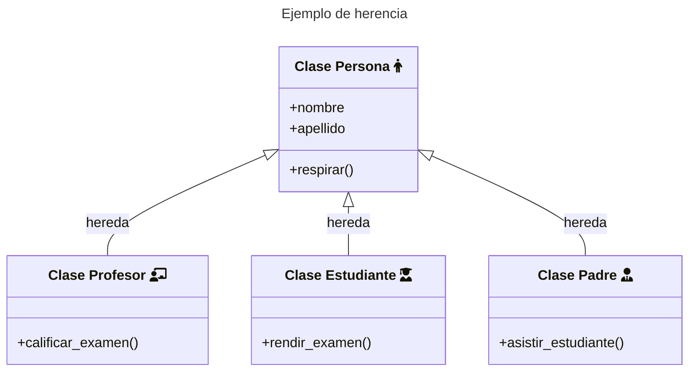

En artículos anteriores mencionaba de una forma breve el concepto de **herencia**. Aquí vamos a ver no solo código sino que también su representación en los **diagramas de clases**. En este tipo de relaciones permiten que una clase (**hija** o **subclase**) **reciba atributos y métodos** de otra clase (**padre** o **superclase**). Estos **atributos** y **métodos** recibidos **se suman** a los que la clase tiene po si misma.

Un ejemplo de esto en un diagrama de clases podría ser la siguiente: **profesor**, **padre**, **estudiante** son **personas**:



En este ejemplo, las tres clases (**Profesor**, **Padre**, **Estudiante**) podrán utilizar el **método respirar**, ya que lo **heredan** de la **clase persona**, pero solamente la clase **Profesor** podrá **calificar exámenes**, la clase **Estudiante** podrá **rendir exámentes** y la clase **Padre** podrá **asistir a reuniones del estudiante**.


Si queremos llevar el ejemplo a código, tendríamos que comenzar definiendo la clase **Persona** y luego el resto:

```py
class Persona:

    def __init__(self, nombre, apellido):
        self.nombre = nombre
        self.apellido = apellido

    def respirar(self):
      print("respirando")

class Profesor(Persona):
  pass

class Estudiante(Persona):
  pass

class Padre(Persona):
  pass
```
{: .nolineno }

Hasta aquí podemos ver como efectivamente las clases (**Profesor**, **Estudiante**, **Padre**) son subclases de **Persona**:



```python
print(Profesor.__bases__)
print(Estudiante.__bases__)
print(Padre.__bases__)
```
{: .nolineno }


```
(<class '__main__.Persona'>,)
(<class '__main__.Persona'>,)
(<class '__main__.Persona'>,)
```
{: .nolineno .noheader }



Y de forma análoga podemos ver que clases descienden de una en concreto:



```
print(Persona.__subclasses__())
```
{: .nolineno }


```
[<class '__main__.Profesor'>, <class '__main__.Estudiante'>, <class '__main__.Padre'>]
```
{: .nolineno .noheader }



Dado que una clase hija o subclase hereda los atributos y métodos de la clase padre, nos resulta útil cuando tengamos clases que se parecen entre sí. En este caso en vez de definir varias clases de diferentes entidades, podemos tomar los elementos comunes y crear una clase superior de la que puedan heredar y de esta forma estamos respetando la filosofía **DRY**.

## Uso de la función super()

La función `super()` es una función incorporada (*Built-in Functions*) en Python que se utiliza precisamente para **llamar a un método de la clase padre** desde una **clase hija**.

En otras palabras, `super()` nos permite acceder a los **métodos** y **atributos** de la superclase en la subclase.


Siguiendo con el ejemplo anterior, podemos usar `super()` para llamar al método `__init__` de la clase **padre** que ya acepta como parámetros **nombre** y **apellido**, y sólo asignar un nuevo atributo a través de un nuevo parámetro que sea la **asignatura**:



```py
class Profesor(Persona):

  def __init__(self, nombre, apellido, asignatura):
    super().__init__(nombre, apellido)
    self.asignatura = asignatura

class Estudiante(Persona):
  pass

class Padre(Persona):
  pass

o_profesor = Profesor('Marco', 'Contreras', 'historia')
print(o_profesor.respirar()) # respirando
print(o_profesor.nombre) # Marco
print(o_profesor.apellido) # Contretras
print(o_profesor.asignatura) # 33
```
{: .nolineno }


```python
class Persona:

    def __init__(self, nombre, apellido):
        self.nombre = nombre
        self.apellido = apellido

    def respirar(self):
      print("respirando")
```
{: .nolineno }




*[POO]: Programación orientada a objetos
*[DRY]: Don't Repeat Yourself
