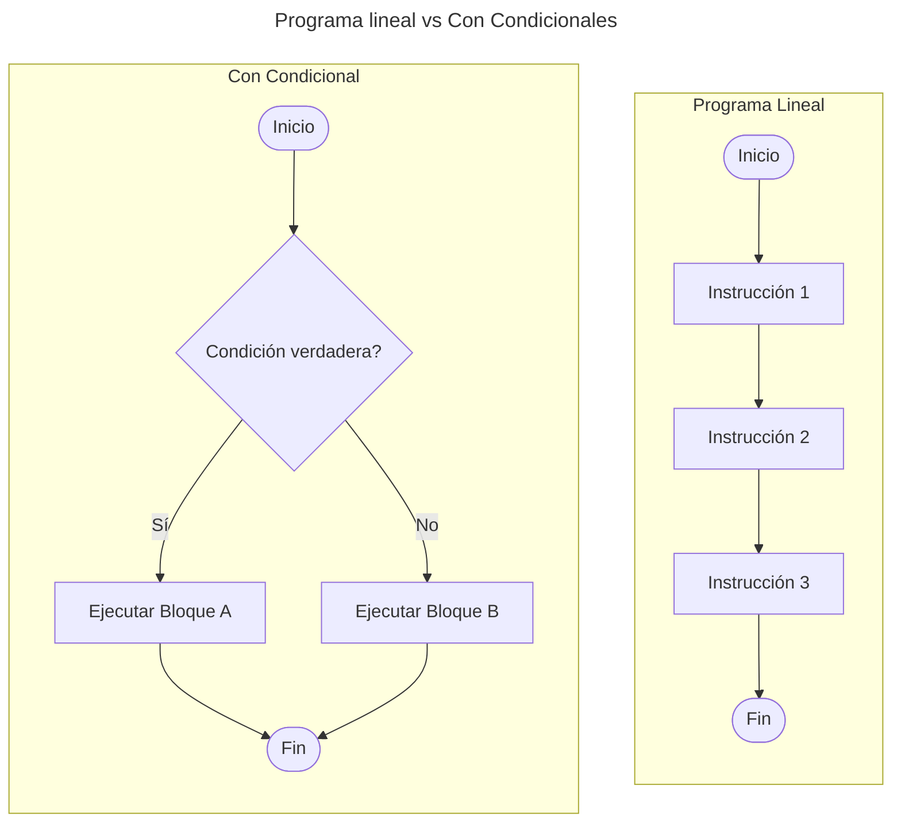

## ¿Qué es PSeInt?

PSeInt es un programa diseñado para aprender y practicar programación utilizando [pseudocódigo](https://es.wikipedia.org/wiki/Pseudoc%C3%B3digo){:target='_blank'}. Es muy útil para iniciarse en la lógica de programación sin necesidad de conocer un lenguaje de programación complejo. El pseudocódigo es una forma de describir algoritmos usando un lenguaje cercano al humano, con estructuras y convenciones de programación simples.

### ¿Por qué usar PSeInt?

PSeInt te ayuda a:
- [x] Entender la lógica detrás de los algoritmos.
- [x] Escribir y visualizar algoritmos sin tener que preocuparte por la sintaxis específica de un lenguaje de programación.
- [x] Aprender **conceptos fundamentales de programación**, como condicionales, bucles, y variables.

## Instalación PSeInt

PSeInt lo puedes conseguir desde su sitio web oficial, siguiendo unos sencillos pasos:

### 1. Descargar PSeInt

1. **Descargar PSeInt:**
   - Ve al sitio de descargas de PSeInt: [https://pseint.sourceforge.io](https://pseint.sourceforge.io){:target='_blank'}.
   - Selecciona la versión que corresponde a tu sistema operativo (Windows, Linux, o macOS).

2. **Instalar PSeInt:**
   - Una vez descargado el archivo, sigue las instrucciones de instalación.
   - Si estás en Windows, solo haz doble clic en el archivo `.exe` descargado y sigue las indicaciones.

3. **Abrir el programa:**
   - Después de la instalación, abre PSeInt desde el acceso directo que se crea en tu escritorio o desde el menú de inicio.

### 2. Conocer su Interfaz

La interfaz de PSeInt es sencilla e intuitiva, al abrir PSeInt, encontraremos varios elementos comunes en su interfaz:

**Área de trabajo**
: Es el espacio principal donde escribimos nuestro pseudocódigo. Aquí es donde definimos las instrucciones de un algoritmo.


**Barra de Herramientas**
: Justo encima del área de trabajo, se encuentra la barra de herramientas, esta barra proporciona accesos rápidos a funciones importantes, como crear un nuevo archivo, guardar, ejecutar un algoritmo o depurarlo paso a paso, etc.


### 3. Crear un Nuevo Algoritmo en PSeInt

1. **Iniciar un nuevo archivo:**
   - Cuando abras PSeInt, selecciona **Archivo** en la barra de menú y luego haz clic en **Nuevo** para crear un nuevo algoritmo.

2. **Escribir el pseudocódigo:**
   - Ahora puedes empezar a escribir tu pseudocódigo en el área de trabajo. PSeInt tiene una interfaz sencilla que te permitirá escribir de manera intuitiva.

### __Paso 4: Estructura Básica de un Algoritmo en PSeInt__

En PSeInt, la estructura básica de un algoritmo está definida entre dos palabras principales:

```
Algoritmo primerAlgoritmo
    // Instrucciones del algoritmo
FinAlgoritmo
```
{:file="demo.psc"}

En el área de trabajo, todo el código necesario debe ir entre las palabras claves como lo muestra la siguiente ilustración:


Otra cosa importante es el nombre que le des a un algoritmo. **Este nombre debe ser descriptivo**, ya que esto permitirá entender lo que intentas resolver y, además, te servirá para que al guardar el archivo, se respete ese nombre.

A continuación te explico las estructuras más comunes que usarás:

#### 1. **Declaración de Variables**

Las variables se declaran usando la palabra clave `Definir`. Ejemplo:

```
Definir nombre, apellido Como Texto
Definir edad, sueldo Como Entero
```
{:file="demo.psc"}

En el área de trabajo, puedes comenzar definiendo algunas variables y acostumbrate a escribir respetando la indentación como lo muestra la siguiente ilustración:


#### 2. **Entrada de Datos**

Anteriormente, ya hemos definido algunas variables. Ahora, si queremos almacenar información que ingrese un usuario, debemos utilizar la instrucción `Leer`. Ejemplo:

```
Escribir "¿Cuál es su nombre?: "
Leer nombre
Escribir "¿Cuál es su apellido?: "
Leer apellido
```
{:file="demo.psc"}

Cuando queremos que el usuario ingrese información desde el teclado, utilizamos la instrucción `Leer`, como se muestra en la ilustración:


#### 3. **Salida de Datos**

Para mostrar la información por pantalla, utilizamos la instrucción `Escribir`. En el ejemplo anterior, la utilizamos para dar indicaciones al usuario antes de solicitarle los datos. Sin embargo, `Escribir` también nos permite mostrar los valores de variables o resultados de operaciones.

Ahora, podemos usarla también para mostrar los valores ingresados y generar una respuesta personalizada. Ejemplo:

```
Escribir "Hola ", nombre, " ", apellido, ", bienvenido a nuestro programa."
```
{:file="demo.psc"}

De esta forma, proporcionamos un saludo personalizado al usuario, como se muestra en la siguiente ilustración:


#### 4. __Condicionales__

Sin las estructuras condicionales, un código escrito en cualquier lenguaje de programación se ejecutaría línea por línea de manera secuencial hasta finalizar. Veamos el siguiente diagrama:



> En palabras simples, los condicionales permiten ejecutar bloques de código según una condición. Para ello, se usa `Si` para evaluar una condición y `Sino` para la alternativa.
{: .prompt-info }

Continuando con nuestro pseudocódigo, podemos definir una variable `edad` para almacenar este dato que ingresará el usuario, luego vamos a evaluar este dato usando un condicional. Ejemplo:

```
Definir edad Como Entero

Escribir "Ingrese su edad: "
Leer edad

Si edad >= 18 Entonces
   Escribir "Eres mayor de edad"
Sino
   Escribir "Eres menor de edad"
FinSi
```
{:file="demo.psc"}

> Aunque PSeInt infiere el tipo de dato ingresado por el usuario automáticamente, es una **buena práctica** definirlo explícitamente con anterioridad utilizando `Definir`.
{: .prompt-info }


#### 5. **Bucles (Ciclos)**

Los bucles permiten repetir un bloque de código. Existen varios tipos de bucles. A continuación te explico como funciona cada uno.

- **Ciclo `Mientras`**{: .fs-5 }
   - El ciclo `Mientras` se utiliza para ejecutar un bloque de instrucciones repetidamente mientras se cumpla una condición lógica. Se trata de una estructura de control de tipo **bucle condicional**, lo que significa que la repetición depende de una condición que se evalúa antes de cada iteración. Ejemplo:

```
Si edad >= 18
   Escribir "Eres mayor de edad"
SiNo
   Mientras edad < 18 Hacer
      Escribir "Aún eres menor de edad."
      Escribir "Ingrese su edad: "
      Leer edad
   FinMientras
FinSi
```
{: file="demo.psc" }

Continuando con el pseudocódigo, utilizamos el ciclo mientras `Mientras` para mantener al usuario ingresando su edad hasta que sea mayor a 18, como lo muestra la siguiente ilustración:


- **Ciclo `Para`**{: .fs-5 }
   - El ciclo `Para` es una estructura de control de tipo **bucle controlado por un contador**. A diferencia del ciclo `Mientras`, que depende de una condición, el ciclo `Para` se ejecuta un número específico de veces. Ejemplo:

```
Para i Desde 1 Hasta 10 Paso 1 Hacer
   Escribir i
FinPara
```
{: file="demo.psc" }

### __Paso 5: Ejecutar el Algoritmo__
Una vez que hayas escrito el pseudocódigo, es hora de probarlo.

**Sigue estos pasos:**

- Haz clic en el botón **Ejecutar** <span id="run_pseint" style="display: inline-block; background-image: url(buttons/pseint_run.webp);height: 20px; width: 20px; background-size: contain;"></span> o presiona <kbd>F7</kbd> en tu teclado.
- PSeInt te pedirá que ingreses datos (si es necesario), y luego mostrará los resultados de tu algoritmo.
- El programa mostrará las salidas de tu pseudocódigo en la ventana de salida o consola.

### __Paso 5: Guardar el Algoritmo__
Es importante guardar tu trabajo para poder modificarlo o revisarlo más tarde.

1. **Guardar archivo:**
   - Ve a **Archivo** → **Guardar** o usa el atajo de teclado <kbd>Ctrl</kbd> + <kbd>S</kbd>.
   - Elige una ubicación y ponle un nombre a tu archivo.

### __Ejemplo Completo de un Algoritmo en PSeInt__

Aquí tienes un ejemplo completo de un algoritmo en PSeInt:

```pseudocode
Algoritmo calculo_promedio
   Definir nota1, nota2, nota3, promedio Como Real

   Escribir "Ingrese la primera nota: "
   Leer nota1
   Escribir "Ingrese la segunda nota: "
   Leer nota2
   Escribir "Ingrese la tercera nota: "
   Leer nota3

   promedio = (nota1 + nota2 + nota3) / 3

   Escribir "El promedio es: ", promedio

   Si promedio >= 6 Entonces
      Escribir "¡Aprobaste!"
   Sino
      Escribir "No aprobaste."
   FinSi
FinAlgoritmo
```

### **Explicación del Algoritmo:**
1. Se piden tres notas al usuario.
2. Se calcula el promedio de las tres notas.
3. Se imprime el resultado del promedio.
4. Se muestra si el promedio es suficiente para aprobar (6 o más).


### __Consejos para Usar PSeInt__
1. **Comenta tu código:** Aunque no es obligatorio, es recomendable comentar el pseudocódigo para explicar qué hace cada parte. Puedes hacerlo con el comando `Comentario`:
   ```pseudocode
   Comentario "Este es un comentario explicativo"
   ```

2. **Usa la indentación adecuada:** Aunque el pseudocódigo en PSeInt no es sensible a la indentación, es una buena práctica para hacer el código más legible.

3. **Experimenta con más estructuras:** PSeInt tiene muchas más funcionalidades como funciones, procedimientos, y estructuras de datos. No dudes en explorar más allá de las estructuras básicas.


## __Ejercicio Prácticos__

### __Terminar con tu novia__

Cuando nos enfrentamos a un problema en la vida cotidiana, su resolución también requiere seguir una serie de pasos como si fuera un algoritmo. Por ejemplo, un problema puede ser terminar con tu novia 😞. Para ello, es necesario llevar a cabo ciertos pasos organizados. Supongamos que este díficil proceso se resolverá de la siguiente manera:

- [x] **Paso 1**: Llamar a la novia:
   - Decirle que es solicitada para hablarle de algo importante.
- [x] **Paso 2**: Ponerle una hora de encuentro:
   - Decirle a las 6:00 PM, eso es para que por lo menos llegue a las 7:00 PM.
- [x] **Paso 3**: Esperar a la novia:
   - Si no ha llegado a las 7:00 PM, pero si llega, pone cara seria. 
- [x] **Paso 4**: Esperar a que pregunte:
   - *"¿Qué pasa?"*.
   - Si no pregunta, soltar un suspiro profundo y decir: *"Tenemos que hablar..."*.
- [x] **Paso 5**: Hacer una pausa:
   - Hacer una pausa dramática de **3 a 5 segundos** para aumentar la tensión.
- [x] **Paso 6**: Decir con voz firme:
   - *"He estado pensando en nosotros, y creo que lo mejor es que terminemos"*.
- [x] **Paso 7**: Esperar su reacción:
   - **Si se enoja**, mantener la calma y decir: *"Entiendo que esto te moleste, pero es lo mejor"*.
   - **Si llora**, ofrecele un pañuelo (si no tienes, improvisar con una servilleta).
   - **Si pregunta por qué**, responder con sinceridad pero sin detalles innecesarios.
- [x] **Paso 8**: Responder con sinceridad:
   - Evitar frases como: *"No eres tú, soy yo"*, *"Necesito encontrarme a mí mismo"*.
- [x] **Paso 9**: Confirmar tu decisión:
   - Si intenta convencerte de no terminar, repetir con determinación:
   - *"Lo he pensado bien y mi decisión es definitiva"*.
- [x] **Paso 10**: Despedirse:
   - Despedirse con respeto. Si se va enojada, dejarla ir. Si se queda en silencio, esperar unos segundos y luego retirarse.


Veamos el ejemplo en PSeInt:






PSeInt es una excelente herramienta para comenzar a entender la programación y la lógica detrás de los algoritmos y el pseudocódigo. Con su interfaz simple y su lenguaje cercano al español, puedes concentrarte en aprender conceptos fundamentales sin preocuparte demasiado por la sintaxis de lenguajes más complejos.
